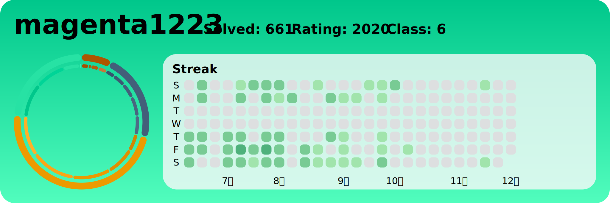

# BOJ-Archive 
 
## 날짜 순 정렬
| 번호 | 이름 | 링크 | 코드 | 날짜 |
| --- | --- | --- | --- | --- |
| 1826 번 |  연료 채우기 | [문제링크](https://boj.kr/1826) | [소스코드](./problems/1826번：%20연료%20채우기/1826번：%20연료%20채우기.py) | 2024-07-18 |
| 1911 번 |  흙길 보수하기 | [문제링크](https://boj.kr/1911) | [소스코드](./problems/1911번：%20흙길%20보수하기/1911번：%20흙길%20보수하기.py) | 2024-07-18 |
| 1781 번 |  컵라면 | [문제링크](https://boj.kr/1781) | [소스코드](./problems/1781번：%20컵라면/1781번：%20컵라면.py) | 2024-07-18 |
| 2668 번 |  숫자고르기 | [문제링크](https://boj.kr/2668) | [소스코드](./problems/2668번：%20숫자고르기/2668번：%20숫자고르기.py) | 2024-07-18 |
| 11280 번 |  2-SAT - 3 | [문제링크](https://boj.kr/11280) | [소스코드](./problems/11280번：%202-SAT%20-%203/11280번：%202-SAT%20-%203.py) | 2024-07-17 |
| 1027 번 |  고층 건물 | [문제링크](https://boj.kr/1027) | [소스코드](./problems/1027번：%20고층%20건물/1027번：%20고층%20건물.py) | 2024-07-16 |
| 20188 번 |  등산 마니아 | [문제링크](https://boj.kr/20188) | [소스코드](./problems/20188번：%20등산%20마니아/20188번：%20등산%20마니아.py) | 2024-07-16 |
| 14719 번 |  빗물 | [문제링크](https://boj.kr/14719) | [소스코드](./problems/14719번：%20빗물/14719번：%20빗물.py) | 2024-07-16 |
| 31948 번 |  문자열 지우기 | [문제링크](https://boj.kr/31948) | [소스코드](./problems/31948번：%20문자열%20지우기/31948번：%20문자열%20지우기.py) | 2024-07-11 |
| 31938 번 |  현대모비스 트럭 군집주행 | [문제링크](https://boj.kr/31938) | [소스코드](./problems/31938번：%20현대모비스%20트럭%20군집주행/31938번：%20현대모비스%20트럭%20군집주행.py) | 2024-07-11 |
| 31937 번 |  로그프레소 마에스트로 | [문제링크](https://boj.kr/31937) | [소스코드](./problems/31937번：%20로그프레소%20마에스트로/31937번：%20로그프레소%20마에스트로.py) | 2024-07-11 |
| 31945 번 |  정육면체의 네 꼭짓점 | [문제링크](https://boj.kr/31945) | [소스코드](./problems/31945번：%20정육면체의%20네%20꼭짓점/31945번：%20정육면체의%20네%20꼭짓점.py) | 2024-07-11 |
| 1001 번 |  A-B | [문제링크](https://boj.kr/1001) | [소스코드](./problems/1001번：%20A-B/1001번：%20A-B.py) | 2024-07-10 |
| 1000 번 |  A+B | [문제링크](https://boj.kr/1000) | [소스코드](./problems/1000번：%20A+B/1000번：%20A+B.py) | 2024-07-10 |
| 1525 번 |  퍼즐 | [문제링크](https://boj.kr/1525) | [소스코드](./problems/1525번：%20퍼즐/1525번：%20퍼즐.py) | 2024-07-10 |
| 2835 번 |  인기도 조사 | [문제링크](https://boj.kr/2835) | [소스코드](./problems/2835번：%20인기도%20조사/2835번：%20인기도%20조사.py) | 2024-07-10 |
| 1517 번 |  버블 소트 | [문제링크](https://boj.kr/1517) | [소스코드](./problems/1517번：%20버블%20소트/1517번：%20버블%20소트.py) | 2024-07-10 |
| 2820 번 |  자동차 공장 | [문제링크](https://boj.kr/2820) | [소스코드](./problems/2820번：%20자동차%20공장/2820번：%20자동차%20공장.py) | 2024-07-09 |
| 16975 번 |  수열과 쿼리 21 | [문제링크](https://boj.kr/16975) | [소스코드](./problems/16975번：%20수열과%20쿼리%2021/16975번：%20수열과%20쿼리%2021.py) | 2024-07-09 |
| 11658 번 |  구간 합 구하기 3 | [문제링크](https://boj.kr/11658) | [소스코드](./problems/11658번：%20구간%20합%20구하기%203/11658번：%20구간%20합%20구하기%203.py) | 2024-07-09 |
| 7578 번 |  공장 | [문제링크](https://boj.kr/7578) | [소스코드](./problems/7578번：%20공장/7578번：%20공장.py) | 2024-07-09 |
| 10999 번 |  구간 합 구하기 2 | [문제링크](https://boj.kr/10999) | [소스코드](./problems/10999번：%20구간%20합%20구하기%202/10999번：%20구간%20합%20구하기%202.py) | 2024-07-09 |
| 1939 번 |  중량제한 | [문제링크](https://boj.kr/1939) | [소스코드](./problems/1939번：%20중량제한/1939번：%20중량제한.py) | 2024-07-09 |
| 2665 번 |  미로만들기 | [문제링크](https://boj.kr/2665) | [소스코드](./problems/2665번：%20미로만들기/2665번：%20미로만들기.py) | 2024-07-09 |
| 1261 번 |  알고스팟 | [문제링크](https://boj.kr/1261) | [소스코드](./problems/1261번：%20알고스팟/1261번：%20알고스팟.py) | 2024-07-09 |
| 10800 번 |  컬러볼 | [문제링크](https://boj.kr/10800) | [소스코드](./problems/10800번：%20컬러볼/10800번：%20컬러볼.py) | 2024-07-08 |
| 3025 번 |  돌 던지기 | [문제링크](https://boj.kr/3025) | [소스코드](./problems/3025번：%20돌%20던지기/3025번：%20돌%20던지기.py) | 2024-07-08 |
| 1135 번 |  뉴스 전하기 | [문제링크](https://boj.kr/1135) | [소스코드](./problems/1135번：%20뉴스%20전하기/1135번：%20뉴스%20전하기.py) | 2024-07-08 |
| 3176 번 |  도로 네트워크 | [문제링크](https://boj.kr/3176) | [소스코드](./problems/3176번：%20도로%20네트워크/3176번：%20도로%20네트워크.py) | 2024-07-05 |
| 1069 번 |  집으로 | [문제링크](https://boj.kr/1069) | [소스코드](./problems/1069번：%20집으로/1069번：%20집으로.py) | 2024-07-05 |
| 25308 번 |  방사형 그래프 | [문제링크](https://boj.kr/25308) | [소스코드](./problems/25308번：%20방사형%20그래프/25308번：%20방사형%20그래프.py) | 2024-07-05 |
| 2933 번 |  미네랄 | [문제링크](https://boj.kr/2933) | [소스코드](./problems/2933번：%20미네랄/2933번：%20미네랄.py) | 2024-07-04 |
| 2310 번 |  어드벤처 게임 | [문제링크](https://boj.kr/2310) | [소스코드](./problems/2310번：%20어드벤처%20게임/2310번：%20어드벤처%20게임.py) | 2024-07-03 |
| 1917 번 |  정육면체 전개도 | [문제링크](https://boj.kr/1917) | [소스코드](./problems/1917번：%20정육면체%20전개도/1917번：%20정육면체%20전개도.py) | 2024-07-03 |
| 2179 번 |  비슷한 단어 | [문제링크](https://boj.kr/2179) | [소스코드](./problems/2179번：%20비슷한%20단어/2179번：%20비슷한%20단어.py) | 2024-07-03 |
| 18809 번 |  Gaaaaaaaaaarden | [문제링크](https://boj.kr/18809) | [소스코드](./problems/18809번：%20Gaaaaaaaaaarden/18809번：%20Gaaaaaaaaaarden.py) | 2024-07-02 |
| 4256 번 |  트리 | [문제링크](https://boj.kr/4256) | [소스코드](./problems/4256번：%20트리/4256번：%20트리.py) | 2024-07-02 |
| 3109 번 |  빵집 | [문제링크](https://boj.kr/3109) | [소스코드](./problems/3109번：%20빵집/3109번：%20빵집.py) | 2024-07-02 |
| 4179 번 |  불! | [문제링크](https://boj.kr/4179) | [소스코드](./problems/4179번：%20불!/4179번：%20불!.py) | 2024-07-01 |
| 7453 번 |  합이 0인 네 정수 | [문제링크](https://boj.kr/7453) | [소스코드](./problems/7453번：%20합이%200인%20네%20정수/7453번：%20합이%200인%20네%20정수.py) | 2024-07-01 |
| 2146 번 |  다리 만들기 | [문제링크](https://boj.kr/2146) | [소스코드](./problems/2146번：%20다리%20만들기/2146번：%20다리%20만들기.py) | 2024-07-01 |
| 2493 번 |  탑 | [문제링크](https://boj.kr/2493) | [소스코드](./problems/2493번：%20탑/2493번：%20탑.py) | 2024-07-01 |
| 1011 번 |  Fly me to the Alpha Centauri | [문제링크](https://boj.kr/1011) | [소스코드](./problems/1011번：%20Fly%20me%20to%20the%20Alpha%20Centauri/1011번：%20Fly%20me%20to%20the%20Alpha%20Centauri.py) | 2024-07-01 |
| 2259 번 |  두더지 잡기 | [문제링크](https://boj.kr/2259) | [소스코드](./problems/2259번：%20두더지%20잡기/2259번：%20두더지%20잡기.py) | 2024-06-18 |
| 1955 번 |  수식 표현 | [문제링크](https://boj.kr/1955) | [소스코드](./problems/1955번：%20수식%20표현/1955번：%20수식%20표현.py) | 2024-06-18 |
| 17420 번 |  깊콘이 넘쳐흘러 | [문제링크](https://boj.kr/17420) | [소스코드](./problems/17420번：%20깊콘이%20넘쳐흘러/17420번：%20깊콘이%20넘쳐흘러.py) | 2024-06-18 |
| 12040 번 |  Password Security (Small1) | [문제링크](https://boj.kr/12040) | [소스코드](./problems/12040번：%20Password%20Security%20(Small1)/12040번：%20Password%20Security%20(Small1).py) | 2024-06-17 |
| 2550 번 |  전구 | [문제링크](https://boj.kr/2550) | [소스코드](./problems/2550번：%20전구/2550번：%20전구.py) | 2024-06-17 |
| 31792 번 |  한빛미디어 (Hard) | [문제링크](https://boj.kr/31792) | [소스코드](./problems/31792번：%20한빛미디어%20(Hard)/31792번：%20한빛미디어%20(Hard).py) | 2024-06-17 |
| 20913 번 |  Mixtape Management | [문제링크](https://boj.kr/20913) | [소스코드](./problems/20913번：%20Mixtape%20Management/20913번：%20Mixtape%20Management.py) | 2024-06-17 |
| 18111 번 |  마인크래프트 | [문제링크](https://boj.kr/18111) | [소스코드](./problems/18111번：%20마인크래프트/18111번：%20마인크래프트.py) | 2024-06-14 |
| 1071 번 |  소트 | [문제링크](https://boj.kr/1071) | [소스코드](./problems/1071번：%20소트/1071번：%20소트.py) | 2024-06-14 |
| 1022 번 |  소용돌이 예쁘게 출력하기 | [문제링크](https://boj.kr/1022) | [소스코드](./problems/1022번：%20소용돌이%20예쁘게%20출력하기/1022번：%20소용돌이%20예쁘게%20출력하기.py) | 2024-06-14 |
| 15243 번 |  Tiling | [문제링크](https://boj.kr/15243) | [소스코드](./problems/15243번：%20Tiling/15243번：%20Tiling.py) | 2024-06-13 |
| 11256 번 |  사탕 | [문제링크](https://boj.kr/11256) | [소스코드](./problems/11256번：%20사탕/11256번：%20사탕.py) | 2024-06-13 |
| 20833 번 |  Kuber | [문제링크](https://boj.kr/20833) | [소스코드](./problems/20833번：%20Kuber/20833번：%20Kuber.py) | 2024-06-13 |
| 2056 번 |  작업 | [문제링크](https://boj.kr/2056) | [소스코드](./problems/2056번：%20작업/2056번：%20작업.py) | 2024-06-13 |
| 7869 번 |  두 원 | [문제링크](https://boj.kr/7869) | [소스코드](./problems/7869번：%20두%20원/7869번：%20두%20원.py) | 2024-06-13 |
| 1050 번 |  물약 | [문제링크](https://boj.kr/1050) | [소스코드](./problems/1050번：%20물약/1050번：%20물약.py) | 2024-06-13 |
| 1311 번 |  할 일 정하기 1 | [문제링크](https://boj.kr/1311) | [소스코드](./problems/1311번：%20할%20일%20정하기%201/1311번：%20할%20일%20정하기%201.py) | 2024-06-12 |
| 9372 번 |  상근이의 여행 | [문제링크](https://boj.kr/9372) | [소스코드](./problems/9372번：%20상근이의%20여행/9372번：%20상근이의%20여행.py) | 2024-06-12 |
| 6497 번 |  전력난 | [문제링크](https://boj.kr/6497) | [소스코드](./problems/6497번：%20전력난/6497번：%20전력난.py) | 2024-06-12 |
| 17472 번 |  다리 만들기 2 | [문제링크](https://boj.kr/17472) | [소스코드](./problems/17472번：%20다리%20만들기%202/17472번：%20다리%20만들기%202.py) | 2024-06-12 |
| 4803 번 |  트리 | [문제링크](https://boj.kr/4803) | [소스코드](./problems/4803번：%20트리/4803번：%20트리.py) | 2024-06-12 |
| 10158 번 |  개미 | [문제링크](https://boj.kr/10158) | [소스코드](./problems/10158번：%20개미/10158번：%20개미.py) | 2024-06-12 |
| 16637 번 |  괄호 추가하기 | [문제링크](https://boj.kr/16637) | [소스코드](./problems/16637번：%20괄호%20추가하기/16637번：%20괄호%20추가하기.py) | 2024-06-11 |
| 1007 번 |  벡터 매칭 | [문제링크](https://boj.kr/1007) | [소스코드](./problems/1007번：%20벡터%20매칭/1007번：%20벡터%20매칭.py) | 2024-06-11 |
| 1033 번 |  칵테일 | [문제링크](https://boj.kr/1033) | [소스코드](./problems/1033번：%20칵테일/1033번：%20칵테일.py) | 2024-06-11 |
| 9661 번 |  돌 게임 7 | [문제링크](https://boj.kr/9661) | [소스코드](./problems/9661번：%20돌%20게임%207/9661번：%20돌%20게임%207.py) | 2024-06-10 |
| 1943 번 |  동전 분배 | [문제링크](https://boj.kr/1943) | [소스코드](./problems/1943번：%20동전%20분배/1943번：%20동전%20분배.py) | 2024-06-10 |
| 1915 번 |  가장 큰 정사각형 | [문제링크](https://boj.kr/1915) | [소스코드](./problems/1915번：%20가장%20큰%20정사각형/1915번：%20가장%20큰%20정사각형.py) | 2024-06-10 |
| 1016 번 |  제곱 ㄴㄴ 수 | [문제링크](https://boj.kr/1016) | [소스코드](./problems/1016번：%20제곱%20ㄴㄴ%20수/1016번：%20제곱%20ㄴㄴ%20수.py) | 2024-06-10 |
| 1765 번 |  닭싸움 팀 정하기 | [문제링크](https://boj.kr/1765) | [소스코드](./problems/1765번：%20닭싸움%20팀%20정하기/1765번：%20닭싸움%20팀%20정하기.py) | 2024-06-05 |
| 17412 번 |  도시 왕복하기 1 | [문제링크](https://boj.kr/17412) | [소스코드](./problems/17412번：%20도시%20왕복하기%201/17412번：%20도시%20왕복하기%201.py) | 2024-06-05 |
| 8895 번 |  막대 배치 | [문제링크](https://boj.kr/8895) | [소스코드](./problems/8895번：%20막대%20배치/8895번：%20막대%20배치.py) | 2024-06-04 |
| 15678 번 |  연세워터파크 | [문제링크](https://boj.kr/15678) | [소스코드](./problems/15678번：%20연세워터파크/15678번：%20연세워터파크.py) | 2024-06-04 |
| 2515 번 |  전시장 | [문제링크](https://boj.kr/2515) | [소스코드](./problems/2515번：%20전시장/2515번：%20전시장.py) | 2024-06-04 |
| 27651 번 |  벌레컷 | [문제링크](https://boj.kr/27651) | [소스코드](./problems/27651번：%20벌레컷/27651번：%20벌레컷.py) | 2024-06-04 |
| 16287 번 |  Parcel | [문제링크](https://boj.kr/16287) | [소스코드](./problems/16287번：%20Parcel/16287번：%20Parcel.py) | 2024-06-03 |
| 5719 번 |  거의 최단 경로 | [문제링크](https://boj.kr/5719) | [소스코드](./problems/5719번：%20거의%20최단%20경로/5719번：%20거의%20최단%20경로.py) | 2024-06-03 |
| 14865 번 |  곡선 자르기 | [문제링크](https://boj.kr/14865) | [소스코드](./problems/14865번：%20곡선%20자르기/14865번：%20곡선%20자르기.py) | 2024-05-31 |
| 1014 번 |  컨닝 | [문제링크](https://boj.kr/1014) | [소스코드](./problems/1014번：%20컨닝/1014번：%20컨닝.py) | 2024-05-31 |
| 2616 번 |  소형기관차 | [문제링크](https://boj.kr/2616) | [소스코드](./problems/2616번：%20소형기관차/2616번：%20소형기관차.py) | 2024-05-29 |
| 1351 번 |  무한 수열 | [문제링크](https://boj.kr/1351) | [소스코드](./problems/1351번：%20무한%20수열/1351번：%20무한%20수열.py) | 2024-05-29 |
| 1102 번 |  발전소 | [문제링크](https://boj.kr/1102) | [소스코드](./problems/1102번：%20발전소/1102번：%20발전소.py) | 2024-05-28 |
| 1516 번 |  게임 개발 | [문제링크](https://boj.kr/1516) | [소스코드](./problems/1516번：%20게임%20개발/1516번：%20게임%20개발.py) | 2024-05-28 |
| 1030 번 |  프렉탈 평면 | [문제링크](https://boj.kr/1030) | [소스코드](./problems/1030번：%20프렉탈%20평면/1030번：%20프렉탈%20평면.py) | 2024-05-27 |
| 1036 번 |  36진수 | [문제링크](https://boj.kr/1036) | [소스코드](./problems/1036번：%2036진수/1036번：%2036진수.py) | 2024-05-27 |
| 1162 번 |  도로포장 | [문제링크](https://boj.kr/1162) | [소스코드](./problems/1162번：%20도로포장/1162번：%20도로포장.py) | 2024-05-27 |
| 1103 번 |  게임 | [문제링크](https://boj.kr/1103) | [소스코드](./problems/1103번：%20게임/1103번：%20게임.py) | 2024-05-27 |
| 1099 번 |  알 수 없는 문장 | [문제링크](https://boj.kr/1099) | [소스코드](./problems/1099번：%20알%20수%20없는%20문장/1099번：%20알%20수%20없는%20문장.py) | 2024-05-27 |
| 1029 번 |  그림 교환 | [문제링크](https://boj.kr/1029) | [소스코드](./problems/1029번：%20그림%20교환/1029번：%20그림%20교환.py) | 2024-05-24 |
| 1082 번 |  방 번호 | [문제링크](https://boj.kr/1082) | [소스코드](./problems/1082번：%20방%20번호/1082번：%20방%20번호.py) | 2024-05-24 |
| 1041 번 |  주사위 | [문제링크](https://boj.kr/1041) | [소스코드](./problems/1041번：%20주사위/1041번：%20주사위.py) | 2024-05-24 |
| 11000 번 |  강의실 배정 | [문제링크](https://boj.kr/11000) | [소스코드](./problems/11000번：%20강의실%20배정/11000번：%20강의실%20배정.py) | 2024-05-23 |
| 1744 번 |  수 묶기 | [문제링크](https://boj.kr/1744) | [소스코드](./problems/1744번：%20수%20묶기/1744번：%20수%20묶기.py) | 2024-05-23 |
| 2457 번 |  공주님의 정원 | [문제링크](https://boj.kr/2457) | [소스코드](./problems/2457번：%20공주님의%20정원/2457번：%20공주님의%20정원.py) | 2024-05-23 |
| 2217 번 |  로프 | [문제링크](https://boj.kr/2217) | [소스코드](./problems/2217번：%20로프/2217번：%20로프.py) | 2024-05-23 |
| 8980 번 |  택배 | [문제링크](https://boj.kr/8980) | [소스코드](./problems/8980번：%20택배/8980번：%20택배.py) | 2024-05-23 |
| 2170 번 |  선 긋기 | [문제링크](https://boj.kr/2170) | [소스코드](./problems/2170번：%20선%20긋기/2170번：%20선%20긋기.py) | 2024-05-22 |
| 13334 번 |  철로 | [문제링크](https://boj.kr/13334) | [소스코드](./problems/13334번：%20철로/13334번：%20철로.py) | 2024-05-22 |
| 1761 번 |  정점들의 거리 | [문제링크](https://boj.kr/1761) | [소스코드](./problems/1761번：%20정점들의%20거리/1761번：%20정점들의%20거리.py) | 2024-05-22 |
| 14517 번 |  팰린드롬 개수 구하기 (Large) | [문제링크](https://boj.kr/14517) | [소스코드](./problems/14517번：%20팰린드롬%20개수%20구하기%20(Large)/14517번：%20팰린드롬%20개수%20구하기%20(Large).py) | 2024-05-22 |
| 14428 번 |  수열과 쿼리 16 | [문제링크](https://boj.kr/14428) | [소스코드](./problems/14428번：%20수열과%20쿼리%2016/14428번：%20수열과%20쿼리%2016.py) | 2024-05-22 |
| 20149 번 |  선분 교차 3 | [문제링크](https://boj.kr/20149) | [소스코드](./problems/20149번：%20선분%20교차%203/20149번：%20선분%20교차%203.py) | 2024-05-21 |
| 17386 번 |  선분 교차 1 | [문제링크](https://boj.kr/17386) | [소스코드](./problems/17386번：%20선분%20교차%201/17386번：%20선분%20교차%201.py) | 2024-05-21 |
| 1194 번 |  달이 차오른다, 가자. | [문제링크](https://boj.kr/1194) | [소스코드](./problems/1194번：%20달이%20차오른다,%20가자./1194번：%20달이%20차오른다,%20가자..py) | 2024-05-21 |
| 5425 번 |  자리합 | [문제링크](https://boj.kr/5425) | [소스코드](./problems/5425번：%20자리합/5425번：%20자리합.py) | 2024-05-21 |
| 2632 번 |  피자판매 | [문제링크](https://boj.kr/2632) | [소스코드](./problems/2632번：%20피자판매/2632번：%20피자판매.py) | 2024-05-21 |
| 8972 번 |  미친 아두이노 | [문제링크](https://boj.kr/8972) | [소스코드](./problems/8972번：%20미친%20아두이노/8972번：%20미친%20아두이노.py) | 2024-05-20 |
| 10875 번 |  뱀 | [문제링크](https://boj.kr/10875) | [소스코드](./problems/10875번：%20뱀/10875번：%20뱀.py) | 2024-05-20 |
| 3015 번 |  오아시스 재결합 | [문제링크](https://boj.kr/3015) | [소스코드](./problems/3015번：%20오아시스%20재결합/3015번：%20오아시스%20재결합.py) | 2024-05-17 |
| 22954 번 |  그래프 트리 분할 | [문제링크](https://boj.kr/22954) | [소스코드](./problems/22954번：%20그래프%20트리%20분할/22954번：%20그래프%20트리%20분할.py) | 2024-05-17 |
| 1948 번 |  임계경로 | [문제링크](https://boj.kr/1948) | [소스코드](./problems/1948번：%20임계경로/1948번：%20임계경로.py) | 2024-05-17 |
| 2573 번 |  빙산 | [문제링크](https://boj.kr/2573) | [소스코드](./problems/2573번：%20빙산/2573번：%20빙산.py) | 2024-05-16 |
| 10868 번 |  최솟값 | [문제링크](https://boj.kr/10868) | [소스코드](./problems/10868번：%20최솟값/10868번：%20최솟값.py) | 2024-05-16 |
| 1700 번 |  멀티탭 스케줄링 | [문제링크](https://boj.kr/1700) | [소스코드](./problems/1700번：%20멀티탭%20스케줄링/1700번：%20멀티탭%20스케줄링.py) | 2024-05-16 |
| 14238 번 |  출근 기록 | [문제링크](https://boj.kr/14238) | [소스코드](./problems/14238번：%20출근%20기록/14238번：%20출근%20기록.py) | 2024-05-14 |
| 11025 번 |  요세푸스 문제 3 | [문제링크](https://boj.kr/11025) | [소스코드](./problems/11025번：%20요세푸스%20문제%203/11025번：%20요세푸스%20문제%203.py) | 2024-05-14 |
| 13398 번 |  연속합 2 | [문제링크](https://boj.kr/13398) | [소스코드](./problems/13398번：%20연속합%202/13398번：%20연속합%202.py) | 2024-05-14 |
| 1113 번 |  수영장 만들기 | [문제링크](https://boj.kr/1113) | [소스코드](./problems/1113번：%20수영장%20만들기/1113번：%20수영장%20만들기.py) | 2024-05-13 |
| 11967 번 |  불켜기 | [문제링크](https://boj.kr/11967) | [소스코드](./problems/11967번：%20불켜기/11967번：%20불켜기.py) | 2024-05-13 |
| 23288 번 |  주사위 굴리기 2 | [문제링크](https://boj.kr/23288) | [소스코드](./problems/23288번：%20주사위%20굴리기%202/23288번：%20주사위%20굴리기%202.py) | 2024-05-13 |
| 3687 번 |  성냥개비 | [문제링크](https://boj.kr/3687) | [소스코드](./problems/3687번：%20성냥개비/3687번：%20성냥개비.py) | 2024-05-13 |
| 21921 번 |  블로그 | [문제링크](https://boj.kr/21921) | [소스코드](./problems/21921번：%20블로그/21921번：%20블로그.py) | 2024-05-10 |
| 24042 번 |  횡단보도 | [문제링크](https://boj.kr/24042) | [소스코드](./problems/24042번：%20횡단보도/24042번：%20횡단보도.py) | 2024-05-10 |
| 24337 번 |  가희와 탑 | [문제링크](https://boj.kr/24337) | [소스코드](./problems/24337번：%20가희와%20탑/24337번：%20가희와%20탑.py) | 2024-05-10 |
| 2169 번 |  로봇 조종하기 | [문제링크](https://boj.kr/2169) | [소스코드](./problems/2169번：%20로봇%20조종하기/2169번：%20로봇%20조종하기.py) | 2024-05-09 |
| 22866 번 |  탑 보기 | [문제링크](https://boj.kr/22866) | [소스코드](./problems/22866번：%20탑%20보기/22866번：%20탑%20보기.py) | 2024-05-09 |
| 12919 번 |  A와 B 2 | [문제링크](https://boj.kr/12919) | [소스코드](./problems/12919번：%20A와%20B%202/12919번：%20A와%20B%202.py) | 2024-05-09 |
| 2075 번 |  N번째 큰 수 | [문제링크](https://boj.kr/2075) | [소스코드](./problems/2075번：%20N번째%20큰%20수/2075번：%20N번째%20큰%20수.py) | 2024-05-09 |
| 1515 번 |  수 이어 쓰기 | [문제링크](https://boj.kr/1515) | [소스코드](./problems/1515번：%20수%20이어%20쓰기/1515번：%20수%20이어%20쓰기.py) | 2024-05-09 |
| 10431 번 |  줄세우기 | [문제링크](https://boj.kr/10431) | [소스코드](./problems/10431번：%20줄세우기/10431번：%20줄세우기.py) | 2024-05-09 |
| 14658 번 |  하늘에서 별똥별이 빗발친다 | [문제링크](https://boj.kr/14658) | [소스코드](./problems/14658번：%20하늘에서%20별똥별이%20빗발친다/14658번：%20하늘에서%20별똥별이%20빗발친다.py) | 2024-05-09 |
| 4485 번 |  녹색 옷 입은 애가 젤다지？ | [문제링크](https://boj.kr/4485) | [소스코드](./problems/4485번：%20녹색%20옷%20입은%20애가%20젤다지？/4485번：%20녹색%20옷%20입은%20애가%20젤다지？.py) | 2024-05-08 |
| 11689 번 |  GCD(n, k) = 1 | [문제링크](https://boj.kr/11689) | [소스코드](./problems/11689번：%20GCD(n,%20k)%20=%201/11689번：%20GCD(n,%20k)%20=%201.py) | 2024-05-07 |
| 1800 번 |  인터넷 설치 | [문제링크](https://boj.kr/1800) | [소스코드](./problems/1800번：%20인터넷%20설치/1800번：%20인터넷%20설치.py) | 2024-05-07 |
| 16639 번 |  괄호 추가하기 3 | [문제링크](https://boj.kr/16639) | [소스코드](./problems/16639번：%20괄호%20추가하기%203/16639번：%20괄호%20추가하기%203.py) | 2024-05-07 |
| 17780 번 |  새로운 게임 | [문제링크](https://boj.kr/17780) | [소스코드](./problems/17780번：%20새로운%20게임/17780번：%20새로운%20게임.py) | 2024-05-07 |
| 18500 번 |  미네랄 2 | [문제링크](https://boj.kr/18500) | [소스코드](./problems/18500번：%20미네랄%202/18500번：%20미네랄%202.py) | 2024-05-07 |
| 1256 번 |  사전 | [문제링크](https://boj.kr/1256) | [소스코드](./problems/1256번：%20사전/1256번：%20사전.py) | 2024-05-03 |
| 14916 번 |  거스름돈 | [문제링크](https://boj.kr/14916) | [소스코드](./problems/14916번：%20거스름돈/14916번：%20거스름돈.py) | 2024-05-03 |
| 1937 번 |  욕심쟁이 판다 | [문제링크](https://boj.kr/1937) | [소스코드](./problems/1937번：%20욕심쟁이%20판다/1937번：%20욕심쟁이%20판다.py) | 2024-05-03 |
| 9655 번 |  돌 게임 | [문제링크](https://boj.kr/9655) | [소스코드](./problems/9655번：%20돌%20게임/9655번：%20돌%20게임.py) | 2024-05-03 |
| 11722 번 |  가장 긴 감소하는 부분 수열 | [문제링크](https://boj.kr/11722) | [소스코드](./problems/11722번：%20가장%20긴%20감소하는%20부분%20수열/11722번：%20가장%20긴%20감소하는%20부분%20수열.py) | 2024-05-03 |
| 11051 번 |  이항 계수 2 | [문제링크](https://boj.kr/11051) | [소스코드](./problems/11051번：%20이항%20계수%202/11051번：%20이항%20계수%202.py) | 2024-05-03 |
| 1699 번 |  제곱수의 합 | [문제링크](https://boj.kr/1699) | [소스코드](./problems/1699번：%20제곱수의%20합/1699번：%20제곱수의%20합.py) | 2024-05-03 |
| 11055 번 |  가장 큰 증가하는 부분 수열 | [문제링크](https://boj.kr/11055) | [소스코드](./problems/11055번：%20가장%20큰%20증가하는%20부분%20수열/11055번：%20가장%20큰%20증가하는%20부분%20수열.py) | 2024-05-03 |
| 11057 번 |  오르막 수 | [문제링크](https://boj.kr/11057) | [소스코드](./problems/11057번：%20오르막%20수/11057번：%20오르막%20수.py) | 2024-05-03 |
| 2748 번 |  피보나치 수 2 | [문제링크](https://boj.kr/2748) | [소스코드](./problems/2748번：%20피보나치%20수%202/2748번：%20피보나치%20수%202.py) | 2024-05-03 |
| 2775 번 |  부녀회장이 될테야 | [문제링크](https://boj.kr/2775) | [소스코드](./problems/2775번：%20부녀회장이%20될테야/2775번：%20부녀회장이%20될테야.py) | 2024-05-03 |
| 11052 번 |  카드 구매하기 | [문제링크](https://boj.kr/11052) | [소스코드](./problems/11052번：%20카드%20구매하기/11052번：%20카드%20구매하기.py) | 2024-05-02 |
| 11502 번 |  세 개의 소수 문제 | [문제링크](https://boj.kr/11502) | [소스코드](./problems/11502번：%20세%20개의%20소수%20문제/11502번：%20세%20개의%20소수%20문제.py) | 2024-05-02 |
| 2193 번 |  이친수 | [문제링크](https://boj.kr/2193) | [소스코드](./problems/2193번：%20이친수/2193번：%20이친수.py) | 2024-05-02 |
| 1146 번 |  지그재그 서기 | [문제링크](https://boj.kr/1146) | [소스코드](./problems/1146번：%20지그재그%20서기/1146번：%20지그재그%20서기.py) | 2024-04-30 |
| 2176 번 |  합리적인 이동경로 | [문제링크](https://boj.kr/2176) | [소스코드](./problems/2176번：%20합리적인%20이동경로/2176번：%20합리적인%20이동경로.py) | 2024-04-30 |
| 1028 번 |  다이아몬드 광산 | [문제링크](https://boj.kr/1028) | [소스코드](./problems/1028번：%20다이아몬드%20광산/1028번：%20다이아몬드%20광산.py) | 2024-04-27 |
| 1480 번 |  보석 모으기 | [문제링크](https://boj.kr/1480) | [소스코드](./problems/1480번：%20보석%20모으기/1480번：%20보석%20모으기.py) | 2024-04-25 |
| 1796 번 |  신기한 키보드 | [문제링크](https://boj.kr/1796) | [소스코드](./problems/1796번：%20신기한%20키보드/1796번：%20신기한%20키보드.py) | 2024-04-25 |
| 2357 번 |  최솟값과 최댓값 | [문제링크](https://boj.kr/2357) | [소스코드](./problems/2357번：%20최솟값과%20최댓값/2357번：%20최솟값과%20최댓값.py) | 2024-04-24 |
| 2042 번 |  구간 합 구하기 | [문제링크](https://boj.kr/2042) | [소스코드](./problems/2042번：%20구간%20합%20구하기/2042번：%20구간%20합%20구하기.py) | 2024-04-24 |
| 11505 번 |  구간 곱 구하기 | [문제링크](https://boj.kr/11505) | [소스코드](./problems/11505번：%20구간%20곱%20구하기/11505번：%20구간%20곱%20구하기.py) | 2024-04-24 |
| 6549 번 |  히스토그램에서 가장 큰 직사각형 | [문제링크](https://boj.kr/6549) | [소스코드](./problems/6549번：%20히스토그램에서%20가장%20큰%20직사각형/6549번：%20히스토그램에서%20가장%20큰%20직사각형.py) | 2024-04-24 |
| 2305 번 |  자리 배치 | [문제링크](https://boj.kr/2305) | [소스코드](./problems/2305번：%20자리%20배치/2305번：%20자리%20배치.py) | 2024-04-23 |
| 4196 번 |  도미노 | [문제링크](https://boj.kr/4196) | [소스코드](./problems/4196번：%20도미노/4196번：%20도미노.py) | 2024-04-16 |
| 17435 번 |  합성함수와 쿼리 | [문제링크](https://boj.kr/17435) | [소스코드](./problems/17435번：%20합성함수와%20쿼리/17435번：%20합성함수와%20쿼리.py) | 2024-04-16 |
| 19237 번 |  어른 상어 | [문제링크](https://boj.kr/19237) | [소스코드](./problems/19237번：%20어른%20상어/19237번：%20어른%20상어.py) | 2024-04-16 |
| 10266 번 |  시계 사진들 | [문제링크](https://boj.kr/10266) | [소스코드](./problems/10266번：%20시계%20사진들/10266번：%20시계%20사진들.py) | 2024-04-15 |
| 4354 번 |  문자열 제곱 | [문제링크](https://boj.kr/4354) | [소스코드](./problems/4354번：%20문자열%20제곱/4354번：%20문자열%20제곱.py) | 2024-04-15 |
| 1786 번 |  찾기 | [문제링크](https://boj.kr/1786) | [소스코드](./problems/1786번：%20찾기/1786번：%20찾기.py) | 2024-04-14 |
| 1701 번 |  Cubeditor | [문제링크](https://boj.kr/1701) | [소스코드](./problems/1701번：%20Cubeditor/1701번：%20Cubeditor.py) | 2024-04-13 |
| 3665 번 |  최종 순위 | [문제링크](https://boj.kr/3665) | [소스코드](./problems/3665번：%20최종%20순위/3665번：%20최종%20순위.py) | 2024-04-12 |
| 14725 번 |  개미굴 | [문제링크](https://boj.kr/14725) | [소스코드](./problems/14725번：%20개미굴/14725번：%20개미굴.py) | 2024-04-12 |
| 13511 번 |  트리와 쿼리 2 | [문제링크](https://boj.kr/13511) | [소스코드](./problems/13511번：%20트리와%20쿼리%202/13511번：%20트리와%20쿼리%202.py) | 2024-04-12 |
| 12781 번 |  PIZZA ALVOLOC | [문제링크](https://boj.kr/12781) | [소스코드](./problems/12781번：%20PIZZA%20ALVOLOC/12781번：%20PIZZA%20ALVOLOC.py) | 2024-04-12 |
| 11758 번 |  CCW | [문제링크](https://boj.kr/11758) | [소스코드](./problems/11758번：%20CCW/11758번：%20CCW.py) | 2024-04-12 |
| 2533 번 |  사회망 서비스(SNS) | [문제링크](https://boj.kr/2533) | [소스코드](./problems/2533번：%20사회망%20서비스(SNS)/2533번：%20사회망%20서비스(SNS).py) | 2024-04-12 |
| 15681 번 |  트리와 쿼리 | [문제링크](https://boj.kr/15681) | [소스코드](./problems/15681번：%20트리와%20쿼리/15681번：%20트리와%20쿼리.py) | 2024-04-12 |
| 14939 번 |  불 끄기 | [문제링크](https://boj.kr/14939) | [소스코드](./problems/14939번：%20불%20끄기/14939번：%20불%20끄기.py) | 2024-04-11 |
| 1202 번 |  보석 도둑 | [문제링크](https://boj.kr/1202) | [소스코드](./problems/1202번：%20보석%20도둑/1202번：%20보석%20도둑.py) | 2024-04-11 |
| 16566 번 |  카드 게임 | [문제링크](https://boj.kr/16566) | [소스코드](./problems/16566번：%20카드%20게임/16566번：%20카드%20게임.py) | 2024-04-11 |
| 2568 번 |  전깃줄 - 2 | [문제링크](https://boj.kr/2568) | [소스코드](./problems/2568번：%20전깃줄%20-%202/2568번：%20전깃줄%20-%202.py) | 2024-04-11 |
| 16724 번 |  피리 부는 사나이 | [문제링크](https://boj.kr/16724) | [소스코드](./problems/16724번：%20피리%20부는%20사나이/16724번：%20피리%20부는%20사나이.py) | 2024-04-11 |
| 20040 번 |  사이클 게임 | [문제링크](https://boj.kr/20040) | [소스코드](./problems/20040번：%20사이클%20게임/20040번：%20사이클%20게임.py) | 2024-04-11 |
| 20303 번 |  할로윈의 양아치 | [문제링크](https://boj.kr/20303) | [소스코드](./problems/20303번：%20할로윈의%20양아치/20303번：%20할로윈의%20양아치.py) | 2024-04-11 |
| 2162 번 |  선분 그룹 | [문제링크](https://boj.kr/2162) | [소스코드](./problems/2162번：%20선분%20그룹/2162번：%20선분%20그룹.py) | 2024-04-09 |
| 12850 번 |  본대 산책2 | [문제링크](https://boj.kr/12850) | [소스코드](./problems/12850번：%20본대%20산책2/12850번：%20본대%20산책2.py) | 2024-04-09 |
| 1799 번 |  비숍 | [문제링크](https://boj.kr/1799) | [소스코드](./problems/1799번：%20비숍/1799번：%20비숍.py) | 2024-04-09 |
| 9527 번 |  1의 개수 세기 | [문제링크](https://boj.kr/9527) | [소스코드](./problems/9527번：%201의%20개수%20세기/9527번：%201의%20개수%20세기.py) | 2024-04-08 |
| 2143 번 |  두 배열의 합 | [문제링크](https://boj.kr/2143) | [소스코드](./problems/2143번：%20두%20배열의%20합/2143번：%20두%20배열의%20합.py) | 2024-04-08 |
| 1647 번 |  도시 분할 계획 | [문제링크](https://boj.kr/1647) | [소스코드](./problems/1647번：%20도시%20분할%20계획/1647번：%20도시%20분할%20계획.py) | 2024-04-08 |
| 1766 번 |  문제집 | [문제링크](https://boj.kr/1766) | [소스코드](./problems/1766번：%20문제집/1766번：%20문제집.py) | 2024-04-08 |
| 9466 번 |  텀 프로젝트 | [문제링크](https://boj.kr/9466) | [소스코드](./problems/9466번：%20텀%20프로젝트/9466번：%20텀%20프로젝트.py) | 2024-04-08 |
| 2623 번 |  음악프로그램 | [문제링크](https://boj.kr/2623) | [소스코드](./problems/2623번：%20음악프로그램/2623번：%20음악프로그램.py) | 2024-04-08 |
| 2473 번 |  세 용액 | [문제링크](https://boj.kr/2473) | [소스코드](./problems/2473번：%20세%20용액/2473번：%20세%20용액.py) | 2024-04-08 |
| 2467 번 |  용액 | [문제링크](https://boj.kr/2467) | [소스코드](./problems/2467번：%20용액/2467번：%20용액.py) | 2024-04-05 |
| 2252 번 |  줄 세우기 | [문제링크](https://boj.kr/2252) | [소스코드](./problems/2252번：%20줄%20세우기/2252번：%20줄%20세우기.py) | 2024-04-05 |
| 2239 번 |  스도쿠 | [문제링크](https://boj.kr/2239) | [소스코드](./problems/2239번：%20스도쿠/2239번：%20스도쿠.py) | 2024-04-05 |
| 2166 번 |  다각형의 면적 | [문제링크](https://boj.kr/2166) | [소스코드](./problems/2166번：%20다각형의%20면적/2166번：%20다각형의%20면적.py) | 2024-04-05 |
| 9328 번 |  열쇠 | [문제링크](https://boj.kr/9328) | [소스코드](./problems/9328번：%20열쇠/9328번：%20열쇠.py) | 2024-04-04 |
| 10866 번 |  덱 | [문제링크](https://boj.kr/10866) | [소스코드](./problems/10866번：%20덱/10866번：%20덱.py) | 2024-04-04 |
| 10845 번 |  큐 | [문제링크](https://boj.kr/10845) | [소스코드](./problems/10845번：%20큐/10845번：%20큐.py) | 2024-04-04 |
| 10828 번 |  스택 | [문제링크](https://boj.kr/10828) | [소스코드](./problems/10828번：%20스택/10828번：%20스택.py) | 2024-04-04 |
| 4153 번 |  직각삼각형 | [문제링크](https://boj.kr/4153) | [소스코드](./problems/4153번：%20직각삼각형/4153번：%20직각삼각형.py) | 2024-04-04 |
| 2609 번 |  최대공약수와 최소공배수 | [문제링크](https://boj.kr/2609) | [소스코드](./problems/2609번：%20최대공약수와%20최소공배수/2609번：%20최대공약수와%20최소공배수.py) | 2024-04-04 |
| 1259 번 |  팰린드롬수 | [문제링크](https://boj.kr/1259) | [소스코드](./problems/1259번：%20팰린드롬수/1259번：%20팰린드롬수.py) | 2024-04-04 |
| 17070 번 |  파이프 옮기기 1 | [문제링크](https://boj.kr/17070) | [소스코드](./problems/17070번：%20파이프%20옮기기%201/17070번：%20파이프%20옮기기%201.py) | 2024-04-04 |
| 16953 번 |  A → B | [문제링크](https://boj.kr/16953) | [소스코드](./problems/16953번：%20A%20→%20B/16953번：%20A%20→%20B.py) | 2024-04-04 |
| 15666 번 |  N과 M (12) | [문제링크](https://boj.kr/15666) | [소스코드](./problems/15666번：%20N과%20M%20(12)/15666번：%20N과%20M%20(12).py) | 2024-04-04 |
| 15657 번 |  N과 M (8) | [문제링크](https://boj.kr/15657) | [소스코드](./problems/15657번：%20N과%20M%20(8)/15657번：%20N과%20M%20(8).py) | 2024-04-04 |
| 14938 번 |  서강그라운드 | [문제링크](https://boj.kr/14938) | [소스코드](./problems/14938번：%20서강그라운드/14938번：%20서강그라운드.py) | 2024-04-04 |
| 13172 번 |  Σ | [문제링크](https://boj.kr/13172) | [소스코드](./problems/13172번：%20Σ/13172번：%20Σ.py) | 2024-04-04 |
| 12851 번 |  숨바꼭질 2 | [문제링크](https://boj.kr/12851) | [소스코드](./problems/12851번：%20숨바꼭질%202/12851번：%20숨바꼭질%202.py) | 2024-04-04 |
| 5639 번 |  이진 검색 트리 | [문제링크](https://boj.kr/5639) | [소스코드](./problems/5639번：%20이진%20검색%20트리/5639번：%20이진%20검색%20트리.py) | 2024-04-03 |
| 2448 번 |  별 찍기 - 11 | [문제링크](https://boj.kr/2448) | [소스코드](./problems/2448번：%20별%20찍기%20-%2011/2448번：%20별%20찍기%20-%2011.py) | 2024-04-02 |
| 1987 번 |  알파벳 | [문제링크](https://boj.kr/1987) | [소스코드](./problems/1987번：%20알파벳/1987번：%20알파벳.py) | 2024-04-02 |
| 1916 번 |  최소비용 구하기 | [문제링크](https://boj.kr/1916) | [소스코드](./problems/1916번：%20최소비용%20구하기/1916번：%20최소비용%20구하기.py) | 2024-04-02 |
| 2887 번 |  행성 터널 | [문제링크](https://boj.kr/2887) | [소스코드](./problems/2887번：%20행성%20터널/2887번：%20행성%20터널.py) | 2024-04-02 |
| 1774 번 |  우주신과의 교감 | [문제링크](https://boj.kr/1774) | [소스코드](./problems/1774번：%20우주신과의%20교감/1774번：%20우주신과의%20교감.py) | 2024-04-02 |
| 10282 번 |  해킹 | [문제링크](https://boj.kr/10282) | [소스코드](./problems/10282번：%20해킹/10282번：%20해킹.py) | 2024-04-02 |
| 1197 번 |  최소 스패닝 트리 | [문제링크](https://boj.kr/1197) | [소스코드](./problems/1197번：%20최소%20스패닝%20트리/1197번：%20최소%20스패닝%20트리.py) | 2024-04-02 |
| 1600 번 |  말이 되고픈 원숭이 | [문제링크](https://boj.kr/1600) | [소스코드](./problems/1600번：%20말이%20되고픈%20원숭이/1600번：%20말이%20되고픈%20원숭이.py) | 2024-04-01 |
| 1062 번 |  가르침 | [문제링크](https://boj.kr/1062) | [소스코드](./problems/1062번：%20가르침/1062번：%20가르침.py) | 2024-04-01 |
| 1018 번 |  체스판 다시 칠하기 | [문제링크](https://boj.kr/1018) | [소스코드](./problems/1018번：%20체스판%20다시%20칠하기/1018번：%20체스판%20다시%20칠하기.py) | 2024-04-01 |
| 17136 번 |  색종이 붙이기 | [문제링크](https://boj.kr/17136) | [소스코드](./problems/17136번：%20색종이%20붙이기/17136번：%20색종이%20붙이기.py) | 2024-04-01 |
| 17135 번 |  캐슬 디펜스 | [문제링크](https://boj.kr/17135) | [소스코드](./problems/17135번：%20캐슬%20디펜스/17135번：%20캐슬%20디펜스.py) | 2024-04-01 |
| 15486 번 |  퇴사 2 | [문제링크](https://boj.kr/15486) | [소스코드](./problems/15486번：%20퇴사%202/15486번：%20퇴사%202.py) | 2024-04-01 |
| 1967 번 |  트리의 지름 | [문제링크](https://boj.kr/1967) | [소스코드](./problems/1967번：%20트리의%20지름/1967번：%20트리의%20지름.py) | 2024-03-30 |
| 1991 번 |  트리 순회 | [문제링크](https://boj.kr/1991) | [소스코드](./problems/1991번：%20트리%20순회/1991번：%20트리%20순회.py) | 2024-03-30 |
| 11725 번 |  트리의 부모 찾기 | [문제링크](https://boj.kr/11725) | [소스코드](./problems/11725번：%20트리의%20부모%20찾기/11725번：%20트리의%20부모%20찾기.py) | 2024-03-29 |
| 15654 번 |  N과 M (5) | [문제링크](https://boj.kr/15654) | [소스코드](./problems/15654번：%20N과%20M%20(5)/15654번：%20N과%20M%20(5).py) | 2024-03-29 |
| 15663 번 |  N과 M (9) | [문제링크](https://boj.kr/15663) | [소스코드](./problems/15663번：%20N과%20M%20(9)/15663번：%20N과%20M%20(9).py) | 2024-03-29 |
| 1865 번 |  웜홀 | [문제링크](https://boj.kr/1865) | [소스코드](./problems/1865번：%20웜홀/1865번：%20웜홀.py) | 2024-03-29 |
| 1238 번 |  파티 | [문제링크](https://boj.kr/1238) | [소스코드](./problems/1238번：%20파티/1238번：%20파티.py) | 2024-03-29 |
| 21736 번 |  헌내기는 친구가 필요해 | [문제링크](https://boj.kr/21736) | [소스코드](./problems/21736번：%20헌내기는%20친구가%20필요해/21736번：%20헌내기는%20친구가%20필요해.py) | 2024-03-29 |
| 20529 번 |  가장 가까운 세 사람의 심리적 거리 | [문제링크](https://boj.kr/20529) | [소스코드](./problems/20529번：%20가장%20가까운%20세%20사람의%20심리적%20거리/20529번：%20가장%20가까운%20세%20사람의%20심리적%20거리.py) | 2024-03-29 |
| 17626 번 |  Four Squares | [문제링크](https://boj.kr/17626) | [소스코드](./problems/17626번：%20Four%20Squares/17626번：%20Four%20Squares.py) | 2024-03-29 |
| 17219 번 |  비밀번호 찾기 | [문제링크](https://boj.kr/17219) | [소스코드](./problems/17219번：%20비밀번호%20찾기/17219번：%20비밀번호%20찾기.py) | 2024-03-29 |
| 11727 번 |  2×n 타일링 2 | [문제링크](https://boj.kr/11727) | [소스코드](./problems/11727번：%202×n%20타일링%202/11727번：%202×n%20타일링%202.py) | 2024-03-29 |
| 11403 번 |  경로 찾기 | [문제링크](https://boj.kr/11403) | [소스코드](./problems/11403번：%20경로%20찾기/11403번：%20경로%20찾기.py) | 2024-03-29 |
| 10026 번 |  적록색약 | [문제링크](https://boj.kr/10026) | [소스코드](./problems/10026번：%20적록색약/10026번：%20적록색약.py) | 2024-03-29 |
| 9375 번 |  패션왕 신해빈 | [문제링크](https://boj.kr/9375) | [소스코드](./problems/9375번：%20패션왕%20신해빈/9375번：%20패션왕%20신해빈.py) | 2024-03-29 |
| 7662 번 |  이중 우선순위 큐 | [문제링크](https://boj.kr/7662) | [소스코드](./problems/7662번：%20이중%20우선순위%20큐/7662번：%20이중%20우선순위%20큐.py) | 2024-03-29 |
| 2066 번 |  카드놀이 | [문제링크](https://boj.kr/2066) | [소스코드](./problems/2066번：%20카드놀이/2066번：%20카드놀이.py) | 2024-03-29 |
| 2253 번 |  점프 | [문제링크](https://boj.kr/2253) | [소스코드](./problems/2253번：%20점프/2253번：%20점프.py) | 2024-03-29 |
| 1315 번 |  RPG | [문제링크](https://boj.kr/1315) | [소스코드](./problems/1315번：%20RPG/1315번：%20RPG.py) | 2024-03-29 |
| 1750 번 |  서로소의 개수 | [문제링크](https://boj.kr/1750) | [소스코드](./problems/1750번：%20서로소의%20개수/1750번：%20서로소의%20개수.py) | 2024-03-28 |
| 2092 번 |  집합의 개수 | [문제링크](https://boj.kr/2092) | [소스코드](./problems/2092번：%20집합의%20개수/2092번：%20집합의%20개수.py) | 2024-03-28 |
| 2248 번 |  이진수 찾기 | [문제링크](https://boj.kr/2248) | [소스코드](./problems/2248번：%20이진수%20찾기/2248번：%20이진수%20찾기.py) | 2024-03-28 |
| 1983 번 |  숫자 박스 | [문제링크](https://boj.kr/1983) | [소스코드](./problems/1983번：%20숫자%20박스/1983번：%20숫자%20박스.py) | 2024-03-27 |
| 1577 번 |  도로의 개수 | [문제링크](https://boj.kr/1577) | [소스코드](./problems/1577번：%20도로의%20개수/1577번：%20도로의%20개수.py) | 2024-03-27 |
| 2216 번 |  문자열과 점수 | [문제링크](https://boj.kr/2216) | [소스코드](./problems/2216번：%20문자열과%20점수/2216번：%20문자열과%20점수.py) | 2024-03-27 |
| 1513 번 |  경로 찾기 | [문제링크](https://boj.kr/1513) | [소스코드](./problems/1513번：%20경로%20찾기/1513번：%20경로%20찾기.py) | 2024-03-26 |
| 2213 번 |  트리의 독립집합 | [문제링크](https://boj.kr/2213) | [소스코드](./problems/2213번：%20트리의%20독립집합/2213번：%20트리의%20독립집합.py) | 2024-03-25 |
| 2159 번 |  케익 배달 | [문제링크](https://boj.kr/2159) | [소스코드](./problems/2159번：%20케익%20배달/2159번：%20케익%20배달.py) | 2024-03-25 |
| 2281 번 |  데스노트 | [문제링크](https://boj.kr/2281) | [소스코드](./problems/2281번：%20데스노트/2281번：%20데스노트.py) | 2024-03-25 |
| 1947 번 |  선물 전달 | [문제링크](https://boj.kr/1947) | [소스코드](./problems/1947번：%20선물%20전달/1947번：%20선물%20전달.py) | 2024-03-25 |
| 2263 번 |  트리의 순회 | [문제링크](https://boj.kr/2263) | [소스코드](./problems/2263번：%20트리의%20순회/2263번：%20트리의%20순회.py) | 2024-03-25 |
| 2098 번 |  외판원 순회 | [문제링크](https://boj.kr/2098) | [소스코드](./problems/2098번：%20외판원%20순회/2098번：%20외판원%20순회.py) | 2024-03-25 |
| 21611 번 |  마법사 상어와 블리자드 | [문제링크](https://boj.kr/21611) | [소스코드](./problems/21611번：%20마법사%20상어와%20블리자드/21611번：%20마법사%20상어와%20블리자드.py) | 2024-03-25 |
| 1949 번 |  우수 마을 | [문제링크](https://boj.kr/1949) | [소스코드](./problems/1949번：%20우수%20마을/1949번：%20우수%20마을.py) | 2024-03-19 |
| 2229 번 |  조 짜기 | [문제링크](https://boj.kr/2229) | [소스코드](./problems/2229번：%20조%20짜기/2229번：%20조%20짜기.py) | 2024-03-18 |
| 2157 번 |  여행 | [문제링크](https://boj.kr/2157) | [소스코드](./problems/2157번：%20여행/2157번：%20여행.py) | 2024-03-18 |
| 2666 번 |  벽장문의 이동 | [문제링크](https://boj.kr/2666) | [소스코드](./problems/2666번：%20벽장문의%20이동/2666번：%20벽장문의%20이동.py) | 2024-03-18 |
| 2302 번 |  극장 좌석 | [문제링크](https://boj.kr/2302) | [소스코드](./problems/2302번：%20극장%20좌석/2302번：%20극장%20좌석.py) | 2024-03-18 |
| 1309 번 |  동물원 | [문제링크](https://boj.kr/1309) | [소스코드](./problems/1309번：%20동물원/1309번：%20동물원.py) | 2024-03-18 |
| 1965 번 |  상자넣기 | [문제링크](https://boj.kr/1965) | [소스코드](./problems/1965번：%20상자넣기/1965번：%20상자넣기.py) | 2024-03-18 |
| 2228 번 |  구간 나누기 | [문제링크](https://boj.kr/2228) | [소스코드](./problems/2228번：%20구간%20나누기/2228번：%20구간%20나누기.py) | 2024-03-18 |
| 1562 번 |  계단 수 | [문제링크](https://boj.kr/1562) | [소스코드](./problems/1562번：%20계단%20수/1562번：%20계단%20수.py) | 2024-03-15 |
| 1328 번 |  고층 빌딩 | [문제링크](https://boj.kr/1328) | [소스코드](./problems/1328번：%20고층%20빌딩/1328번：%20고층%20빌딩.py) | 2024-03-15 |
| 2631 번 |  줄세우기 | [문제링크](https://boj.kr/2631) | [소스코드](./problems/2631번：%20줄세우기/2631번：%20줄세우기.py) | 2024-03-15 |
| 2096 번 |  내려가기 | [문제링크](https://boj.kr/2096) | [소스코드](./problems/2096번：%20내려가기/2096번：%20내려가기.py) | 2024-03-15 |
| 2011 번 |  암호코드 | [문제링크](https://boj.kr/2011) | [소스코드](./problems/2011번：%20암호코드/2011번：%20암호코드.py) | 2024-03-15 |
| 2225 번 |  합분해 | [문제링크](https://boj.kr/2225) | [소스코드](./problems/2225번：%20합분해/2225번：%20합분해.py) | 2024-03-15 |
| 1890 번 |  점프 | [문제링크](https://boj.kr/1890) | [소스코드](./problems/1890번：%20점프/1890번：%20점프.py) | 2024-03-15 |
| 5582 번 |  공통 부분 문자열 | [문제링크](https://boj.kr/5582) | [소스코드](./problems/5582번：%20공통%20부분%20문자열/5582번：%20공통%20부분%20문자열.py) | 2024-03-13 |
| 2294 번 |  동전 2 | [문제링크](https://boj.kr/2294) | [소스코드](./problems/2294번：%20동전%202/2294번：%20동전%202.py) | 2024-03-13 |
| 9465 번 |  스티커 | [문제링크](https://boj.kr/9465) | [소스코드](./problems/9465번：%20스티커/9465번：%20스티커.py) | 2024-03-13 |
| 14442 번 |  벽 부수고 이동하기 2 | [문제링크](https://boj.kr/14442) | [소스코드](./problems/14442번：%20벽%20부수고%20이동하기%202/14442번：%20벽%20부수고%20이동하기%202.py) | 2024-03-13 |
| 7682 번 |  틱택토 | [문제링크](https://boj.kr/7682) | [소스코드](./problems/7682번：%20틱택토/7682번：%20틱택토.py) | 2024-03-13 |
| 4195 번 |  친구 네트워크 | [문제링크](https://boj.kr/4195) | [소스코드](./problems/4195번：%20친구%20네트워크/4195번：%20친구%20네트워크.py) | 2024-03-13 |
| 2133 번 |  타일 채우기 | [문제링크](https://boj.kr/2133) | [소스코드](./problems/2133번：%20타일%20채우기/2133번：%20타일%20채우기.py) | 2024-03-12 |
| 2410 번 |  2의 멱수의 합 | [문제링크](https://boj.kr/2410) | [소스코드](./problems/2410번：%202의%20멱수의%20합/2410번：%202의%20멱수의%20합.py) | 2024-03-12 |
| 2306 번 |  유전자 | [문제링크](https://boj.kr/2306) | [소스코드](./problems/2306번：%20유전자/2306번：%20유전자.py) | 2024-03-12 |
| 1670 번 |  정상 회담 2 | [문제링크](https://boj.kr/1670) | [소스코드](./problems/1670번：%20정상%20회담%202/1670번：%20정상%20회담%202.py) | 2024-03-12 |
| 4386 번 |  별자리 만들기 | [문제링크](https://boj.kr/4386) | [소스코드](./problems/4386번：%20별자리%20만들기/4386번：%20별자리%20만들기.py) | 2024-03-12 |
| 1637 번 |  날카로운 눈 | [문제링크](https://boj.kr/1637) | [소스코드](./problems/1637번：%20날카로운%20눈/1637번：%20날카로운%20눈.py) | 2024-03-12 |
| 11812 번 |  K진 트리 | [문제링크](https://boj.kr/11812) | [소스코드](./problems/11812번：%20K진%20트리/11812번：%20K진%20트리.py) | 2024-03-12 |
| 5022 번 |  연결 | [문제링크](https://boj.kr/5022) | [소스코드](./problems/5022번：%20연결/5022번：%20연결.py) | 2024-03-12 |
| 9177 번 |  단어 섞기 | [문제링크](https://boj.kr/9177) | [소스코드](./problems/9177번：%20단어%20섞기/9177번：%20단어%20섞기.py) | 2024-03-12 |
| 16933 번 |  벽 부수고 이동하기 3 | [문제링크](https://boj.kr/16933) | [소스코드](./problems/16933번：%20벽%20부수고%20이동하기%203/16933번：%20벽%20부수고%20이동하기%203.py) | 2024-03-11 |
| 17387 번 |  선분 교차 2 | [문제링크](https://boj.kr/17387) | [소스코드](./problems/17387번：%20선분%20교차%202/17387번：%20선분%20교차%202.py) | 2024-03-11 |
| 1019 번 |  책 페이지 | [문제링크](https://boj.kr/1019) | [소스코드](./problems/1019번：%20책%20페이지/1019번：%20책%20페이지.py) | 2024-03-08 |
| 5213 번 |  과외맨 | [문제링크](https://boj.kr/5213) | [소스코드](./problems/5213번：%20과외맨/5213번：%20과외맨.py) | 2024-03-08 |
| 2482 번 |  색상환 | [문제링크](https://boj.kr/2482) | [소스코드](./problems/2482번：%20색상환/2482번：%20색상환.py) | 2024-03-08 |
| 6064 번 |  카잉 달력 | [문제링크](https://boj.kr/6064) | [소스코드](./problems/6064번：%20카잉%20달력/6064번：%20카잉%20달력.py) | 2024-03-07 |
| 5525 번 |  IOIOI | [문제링크](https://boj.kr/5525) | [소스코드](./problems/5525번：%20IOIOI/5525번：%20IOIOI.py) | 2024-03-07 |
| 3108 번 |  로고 | [문제링크](https://boj.kr/3108) | [소스코드](./problems/3108번：%20로고/3108번：%20로고.py) | 2024-03-07 |
| 3830 번 |  교수님은 기다리지 않는다 | [문제링크](https://boj.kr/3830) | [소스코드](./problems/3830번：%20교수님은%20기다리지%20않는다/3830번：%20교수님은%20기다리지%20않는다.py) | 2024-03-06 |
| 2638 번 |  치즈 | [문제링크](https://boj.kr/2638) | [소스코드](./problems/2638번：%20치즈/2638번：%20치즈.py) | 2024-03-06 |
| 1918 번 |  후위 표기식 | [문제링크](https://boj.kr/1918) | [소스코드](./problems/1918번：%20후위%20표기식/1918번：%20후위%20표기식.py) | 2024-03-06 |
| 1167 번 |  트리의 지름 | [문제링크](https://boj.kr/1167) | [소스코드](./problems/1167번：%20트리의%20지름/1167번：%20트리의%20지름.py) | 2024-03-06 |
| 1043 번 |  거짓말 | [문제링크](https://boj.kr/1043) | [소스코드](./problems/1043번：%20거짓말/1043번：%20거짓말.py) | 2024-03-06 |
| 2342 번 |  Dance Dance Revolution | [문제링크](https://boj.kr/2342) | [소스코드](./problems/2342번：%20Dance%20Dance%20Revolution/2342번：%20Dance%20Dance%20Revolution.py) | 2024-03-06 |
| 1005 번 |  ACM Craft | [문제링크](https://boj.kr/1005) | [소스코드](./problems/1005번：%20ACM%20Craft/1005번：%20ACM%20Craft.py) | 2024-03-06 |
| 27172 번 |  수 나누기 게임 | [문제링크](https://boj.kr/27172) | [소스코드](./problems/27172번：%20수%20나누기%20게임/27172번：%20수%20나누기%20게임.py) | 2024-03-05 |
| 1208 번 |  부분수열의 합 2 | [문제링크](https://boj.kr/1208) | [소스코드](./problems/1208번：%20부분수열의%20합%202/1208번：%20부분수열의%20합%202.py) | 2024-03-05 |
| 1509 번 |  팰린드롬 분할 | [문제링크](https://boj.kr/1509) | [소스코드](./problems/1509번：%20팰린드롬%20분할/1509번：%20팰린드롬%20분할.py) | 2024-03-05 |
| 9376 번 |  탈옥 | [문제링크](https://boj.kr/9376) | [소스코드](./problems/9376번：%20탈옥/9376번：%20탈옥.py) | 2024-03-05 |
| 2186 번 |  문자판 | [문제링크](https://boj.kr/2186) | [소스코드](./problems/2186번：%20문자판/2186번：%20문자판.py) | 2024-03-05 |
| 10217 번 |  KCM Travel | [문제링크](https://boj.kr/10217) | [소스코드](./problems/10217번：%20KCM%20Travel/10217번：%20KCM%20Travel.py) | 2024-03-05 |
| 14940 번 |  쉬운 최단거리 | [문제링크](https://boj.kr/14940) | [소스코드](./problems/14940번：%20쉬운%20최단거리/14940번：%20쉬운%20최단거리.py) | 2024-03-05 |
| 11726 번 |  2×n 타일링 | [문제링크](https://boj.kr/11726) | [소스코드](./problems/11726번：%202×n%20타일링/11726번：%202×n%20타일링.py) | 2024-03-05 |
| 11724 번 |  연결 요소의 개수 | [문제링크](https://boj.kr/11724) | [소스코드](./problems/11724번：%20연결%20요소의%20개수/11724번：%20연결%20요소의%20개수.py) | 2024-03-05 |
| 11723 번 |  집합 | [문제링크](https://boj.kr/11723) | [소스코드](./problems/11723번：%20집합/11723번：%20집합.py) | 2024-03-05 |
| 9095 번 |  1, 2, 3 더하기 | [문제링크](https://boj.kr/9095) | [소스코드](./problems/9095번：%201,%202,%203%20더하기/9095번：%201,%202,%203%20더하기.py) | 2024-03-05 |
| 5430 번 |  AC | [문제링크](https://boj.kr/5430) | [소스코드](./problems/5430번：%20AC/5430번：%20AC.py) | 2024-03-05 |
| 1389 번 |  케빈 베이컨의 6단계 법칙 | [문제링크](https://boj.kr/1389) | [소스코드](./problems/1389번：%20케빈%20베이컨의%206단계%20법칙/1389번：%20케빈%20베이컨의%206단계%20법칙.py) | 2024-03-04 |
| 1107 번 |  리모컨 | [문제링크](https://boj.kr/1107) | [소스코드](./problems/1107번：%20리모컨/1107번：%20리모컨.py) | 2024-03-04 |
| 1074 번 |  Z | [문제링크](https://boj.kr/1074) | [소스코드](./problems/1074번：%20Z/1074번：%20Z.py) | 2024-03-04 |
| 1003 번 |  피보나치 함수 | [문제링크](https://boj.kr/1003) | [소스코드](./problems/1003번：%20피보나치%20함수/1003번：%20피보나치%20함수.py) | 2024-03-04 |
| 1981 번 |  배열에서 이동 | [문제링크](https://boj.kr/1981) | [소스코드](./problems/1981번：%20배열에서%20이동/1981번：%20배열에서%20이동.py) | 2024-03-04 |
| 10775 번 |  공항 | [문제링크](https://boj.kr/10775) | [소스코드](./problems/10775번：%20공항/10775번：%20공항.py) | 2024-03-04 |
| 1976 번 |  여행 가자 | [문제링크](https://boj.kr/1976) | [소스코드](./problems/1976번：%20여행%20가자/1976번：%20여행%20가자.py) | 2024-03-04 |
| 1717 번 |  집합의 표현 | [문제링크](https://boj.kr/1717) | [소스코드](./problems/1717번：%20집합의%20표현/1717번：%20집합의%20표현.py) | 2024-03-04 |
| 17404 번 |  RGB거리 2 | [문제링크](https://boj.kr/17404) | [소스코드](./problems/17404번：%20RGB거리%202/17404번：%20RGB거리%202.py) | 2024-03-03 |
| 16946 번 |  벽 부수고 이동하기 4 | [문제링크](https://boj.kr/16946) | [소스코드](./problems/16946번：%20벽%20부수고%20이동하기%204/16946번：%20벽%20부수고%20이동하기%204.py) | 2024-02-29 |
| 3584 번 |  가장 가까운 공통 조상 | [문제링크](https://boj.kr/3584) | [소스코드](./problems/3584번：%20가장%20가까운%20공통%20조상/3584번：%20가장%20가까운%20공통%20조상.py) | 2024-02-29 |
| 16954 번 |  움직이는 미로 탈출 | [문제링크](https://boj.kr/16954) | [소스코드](./problems/16954번：%20움직이는%20미로%20탈출/16954번：%20움직이는%20미로%20탈출.py) | 2024-02-29 |
| 2151 번 |  거울 설치 | [문제링크](https://boj.kr/2151) | [소스코드](./problems/2151번：%20거울%20설치/2151번：%20거울%20설치.py) | 2024-02-29 |
| 4991 번 |  로봇 청소기 | [문제링크](https://boj.kr/4991) | [소스코드](./problems/4991번：%20로봇%20청소기/4991번：%20로봇%20청소기.py) | 2024-02-29 |
| 6087 번 |  레이저 통신 | [문제링크](https://boj.kr/6087) | [소스코드](./problems/6087번：%20레이저%20통신/6087번：%20레이저%20통신.py) | 2024-02-29 |
| 12886 번 |  돌 그룹 | [문제링크](https://boj.kr/12886) | [소스코드](./problems/12886번：%20돌%20그룹/12886번：%20돌%20그룹.py) | 2024-02-29 |
| 2931 번 |  가스관 | [문제링크](https://boj.kr/2931) | [소스코드](./problems/2931번：%20가스관/2931번：%20가스관.py) | 2024-02-29 |
| 1039 번 |  교환 | [문제링크](https://boj.kr/1039) | [소스코드](./problems/1039번：%20교환/1039번：%20교환.py) | 2024-02-28 |
| 1086 번 |  박성원 | [문제링크](https://boj.kr/1086) | [소스코드](./problems/1086번：%20박성원/1086번：%20박성원.py) | 2024-02-28 |
| 11438 번 |  LCA 2 | [문제링크](https://boj.kr/11438) | [소스코드](./problems/11438번：%20LCA%202/11438번：%20LCA%202.py) | 2024-02-28 |
| 11437 번 |  LCA | [문제링크](https://boj.kr/11437) | [소스코드](./problems/11437번：%20LCA/11437번：%20LCA.py) | 2024-02-28 |
| 10942 번 |  팰린드롬？ | [문제링크](https://boj.kr/10942) | [소스코드](./problems/10942번：%20팰린드롬？/10942번：%20팰린드롬？.py) | 2024-02-28 |
| 2749 번 |  피보나치 수 3 | [문제링크](https://boj.kr/2749) | [소스코드](./problems/2749번：%20피보나치%20수%203/2749번：%20피보나치%20수%203.py) | 2024-02-27 |
| 1655 번 |  가운데를 말해요 | [문제링크](https://boj.kr/1655) | [소스코드](./problems/1655번：%20가운데를%20말해요/1655번：%20가운데를%20말해요.py) | 2024-02-27 |
| 12865 번 |  평범한 배낭 | [문제링크](https://boj.kr/12865) | [소스코드](./problems/12865번：%20평범한%20배낭/12865번：%20평범한%20배낭.py) | 2024-02-27 |
| 3197 번 |  백조의 호수 | [문제링크](https://boj.kr/3197) | [소스코드](./problems/3197번：%20백조의%20호수/3197번：%20백조의%20호수.py) | 2024-02-27 |
| 5373 번 |  큐빙 | [문제링크](https://boj.kr/5373) | [소스코드](./problems/5373번：%20큐빙/5373번：%20큐빙.py) | 2024-02-26 |
| 23291 번 |  어항 정리 | [문제링크](https://boj.kr/23291) | [소스코드](./problems/23291번：%20어항%20정리/23291번：%20어항%20정리.py) | 2024-02-26 |
| 23289 번 |  온풍기 안녕! | [문제링크](https://boj.kr/23289) | [소스코드](./problems/23289번：%20온풍기%20안녕!/23289번：%20온풍기%20안녕!.py) | 2024-02-26 |
| 21609 번 |  상어 중학교 | [문제링크](https://boj.kr/21609) | [소스코드](./problems/21609번：%20상어%20중학교/21609번：%20상어%20중학교.py) | 2024-02-22 |
| 21608 번 |  상어 초등학교 | [문제링크](https://boj.kr/21608) | [소스코드](./problems/21608번：%20상어%20초등학교/21608번：%20상어%20초등학교.py) | 2024-02-22 |
| 20058 번 |  마법사 상어와 파이어스톰 | [문제링크](https://boj.kr/20058) | [소스코드](./problems/20058번：%20마법사%20상어와%20파이어스톰/20058번：%20마법사%20상어와%20파이어스톰.py) | 2024-02-21 |
| 20057 번 |  마법사 상어와 토네이도 | [문제링크](https://boj.kr/20057) | [소스코드](./problems/20057번：%20마법사%20상어와%20토네이도/20057번：%20마법사%20상어와%20토네이도.py) | 2024-02-21 |
| 20056 번 |  마법사 상어와 파이어볼 | [문제링크](https://boj.kr/20056) | [소스코드](./problems/20056번：%20마법사%20상어와%20파이어볼/20056번：%20마법사%20상어와%20파이어볼.py) | 2024-02-21 |
| 20055 번 |  컨베이어 벨트 위의 로봇 | [문제링크](https://boj.kr/20055) | [소스코드](./problems/20055번：%20컨베이어%20벨트%20위의%20로봇/20055번：%20컨베이어%20벨트%20위의%20로봇.py) | 2024-02-21 |
| 19238 번 |  스타트 택시 | [문제링크](https://boj.kr/19238) | [소스코드](./problems/19238번：%20스타트%20택시/19238번：%20스타트%20택시.py) | 2024-02-20 |
| 19236 번 |  청소년 상어 | [문제링크](https://boj.kr/19236) | [소스코드](./problems/19236번：%20청소년%20상어/19236번：%20청소년%20상어.py) | 2024-02-20 |
| 20061 번 |  모노미노도미노 2 | [문제링크](https://boj.kr/20061) | [소스코드](./problems/20061번：%20모노미노도미노%202/20061번：%20모노미노도미노%202.py) | 2024-02-20 |
| 17825 번 |  주사위 윷놀이 | [문제링크](https://boj.kr/17825) | [소스코드](./problems/17825번：%20주사위%20윷놀이/17825번：%20주사위%20윷놀이.py) | 2024-02-20 |
| 17822 번 |  원판 돌리기 | [문제링크](https://boj.kr/17822) | [소스코드](./problems/17822번：%20원판%20돌리기/17822번：%20원판%20돌리기.py) | 2024-02-20 |
| 17837 번 |  새로운 게임 2 | [문제링크](https://boj.kr/17837) | [소스코드](./problems/17837번：%20새로운%20게임%202/17837번：%20새로운%20게임%202.py) | 2024-02-19 |
| 17779 번 |  게리맨더링 2 | [문제링크](https://boj.kr/17779) | [소스코드](./problems/17779번：%20게리맨더링%202/17779번：%20게리맨더링%202.py) | 2024-02-19 |
| 17142 번 |  연구소 3 | [문제링크](https://boj.kr/17142) | [소스코드](./problems/17142번：%20연구소%203/17142번：%20연구소%203.py) | 2024-02-19 |
| 17140 번 |  이차원 배열과 연산 | [문제링크](https://boj.kr/17140) | [소스코드](./problems/17140번：%20이차원%20배열과%20연산/17140번：%20이차원%20배열과%20연산.py) | 2024-02-18 |
| 17143 번 |  낚시왕 | [문제링크](https://boj.kr/17143) | [소스코드](./problems/17143번：%20낚시왕/17143번：%20낚시왕.py) | 2024-02-18 |
| 17144 번 |  미세먼지 안녕! | [문제링크](https://boj.kr/17144) | [소스코드](./problems/17144번：%20미세먼지%20안녕!/17144번：%20미세먼지%20안녕!.py) | 2024-02-18 |
| 16236 번 |  아기 상어 | [문제링크](https://boj.kr/16236) | [소스코드](./problems/16236번：%20아기%20상어/16236번：%20아기%20상어.py) | 2024-02-15 |
| 16235 번 |  나무 재테크 | [문제링크](https://boj.kr/16235) | [소스코드](./problems/16235번：%20나무%20재테크/16235번：%20나무%20재테크.py) | 2024-02-15 |
| 16234 번 |  인구 이동 | [문제링크](https://boj.kr/16234) | [소스코드](./problems/16234번：%20인구%20이동/16234번：%20인구%20이동.py) | 2024-02-15 |
| 15686 번 |  치킨 배달 | [문제링크](https://boj.kr/15686) | [소스코드](./problems/15686번：%20치킨%20배달/15686번：%20치킨%20배달.py) | 2024-02-14 |
| 15685 번 |  드래곤 커브 | [문제링크](https://boj.kr/15685) | [소스코드](./problems/15685번：%20드래곤%20커브/15685번：%20드래곤%20커브.py) | 2024-02-14 |
| 15684 번 |  사다리 조작 | [문제링크](https://boj.kr/15684) | [소스코드](./problems/15684번：%20사다리%20조작/15684번：%20사다리%20조작.py) | 2024-02-14 |
| 15683 번 |  감시 | [문제링크](https://boj.kr/15683) | [소스코드](./problems/15683번：%20감시/15683번：%20감시.py) | 2024-02-13 |
| 14891 번 |  톱니바퀴 | [문제링크](https://boj.kr/14891) | [소스코드](./problems/14891번：%20톱니바퀴/14891번：%20톱니바퀴.py) | 2024-02-13 |
| 14890 번 |  경사로 | [문제링크](https://boj.kr/14890) | [소스코드](./problems/14890번：%20경사로/14890번：%20경사로.py) | 2024-02-13 |
| 14503 번 |  로봇 청소기 | [문제링크](https://boj.kr/14503) | [소스코드](./problems/14503번：%20로봇%20청소기/14503번：%20로봇%20청소기.py) | 2024-02-12 |
| 14502 번 |  연구소 | [문제링크](https://boj.kr/14502) | [소스코드](./problems/14502번：%20연구소/14502번：%20연구소.py) | 2024-02-12 |
| 14501 번 |  퇴사 | [문제링크](https://boj.kr/14501) | [소스코드](./problems/14501번：%20퇴사/14501번：%20퇴사.py) | 2024-02-11 |
| 14500 번 |  테트로미노 | [문제링크](https://boj.kr/14500) | [소스코드](./problems/14500번：%20테트로미노/14500번：%20테트로미노.py) | 2024-02-11 |
| 14499 번 |  주사위 굴리기 | [문제링크](https://boj.kr/14499) | [소스코드](./problems/14499번：%20주사위%20굴리기/14499번：%20주사위%20굴리기.py) | 2024-02-08 |
| 13458 번 |  시험 감독 | [문제링크](https://boj.kr/13458) | [소스코드](./problems/13458번：%20시험%20감독/13458번：%20시험%20감독.py) | 2024-02-08 |
| 3190 번 |  뱀 | [문제링크](https://boj.kr/3190) | [소스코드](./problems/3190번：%20뱀/3190번：%20뱀.py) | 2024-02-08 |
| 12100 번 |  2048 (Easy) | [문제링크](https://boj.kr/12100) | [소스코드](./problems/12100번：%202048%20(Easy)/12100번：%202048%20(Easy).py) | 2024-02-07 |
| 11780 번 |  플로이드 2 | [문제링크](https://boj.kr/11780) | [소스코드](./problems/11780번：%20플로이드%202/11780번：%20플로이드%202.py) | 2024-02-07 |
| 11779 번 |  최소비용 구하기 2 | [문제링크](https://boj.kr/11779) | [소스코드](./problems/11779번：%20최소비용%20구하기%202/11779번：%20최소비용%20구하기%202.py) | 2024-02-07 |
| 9019 번 |  DSLR | [문제링크](https://boj.kr/9019) | [소스코드](./problems/9019번：%20DSLR/9019번：%20DSLR.py) | 2024-02-07 |
| 13913 번 |  숨바꼭질 4 | [문제링크](https://boj.kr/13913) | [소스코드](./problems/13913번：%20숨바꼭질%204/13913번：%20숨바꼭질%204.py) | 2024-02-07 |
| 2618 번 |  경찰차 | [문제링크](https://boj.kr/2618) | [소스코드](./problems/2618번：%20경찰차/2618번：%20경찰차.py) | 2024-02-07 |
| 9252 번 |  LCS 2 | [문제링크](https://boj.kr/9252) | [소스코드](./problems/9252번：%20LCS%202/9252번：%20LCS%202.py) | 2024-02-06 |
| 14003 번 |  가장 긴 증가하는 부분 수열 5 | [문제링크](https://boj.kr/14003) | [소스코드](./problems/14003번：%20가장%20긴%20증가하는%20부분%20수열%205/14003번：%20가장%20긴%20증가하는%20부분%20수열%205.py) | 2024-02-06 |
| 14002 번 |  가장 긴 증가하는 부분 수열 4 | [문제링크](https://boj.kr/14002) | [소스코드](./problems/14002번：%20가장%20긴%20증가하는%20부분%20수열%204/14002번：%20가장%20긴%20증가하는%20부분%20수열%204.py) | 2024-02-05 |
| 12852 번 |  1로 만들기 2 | [문제링크](https://boj.kr/12852) | [소스코드](./problems/12852번：%201로%20만들기%202/12852번：%201로%20만들기%202.py) | 2024-02-05 |
| 1450 번 |  냅색문제 | [문제링크](https://boj.kr/1450) | [소스코드](./problems/1450번：%20냅색문제/1450번：%20냅색문제.py) | 2024-02-05 |
| 1644 번 |  소수의 연속합 | [문제링크](https://boj.kr/1644) | [소스코드](./problems/1644번：%20소수의%20연속합/1644번：%20소수의%20연속합.py) | 2024-02-05 |
| 13460 번 |  구슬 탈출 2 | [문제링크](https://boj.kr/13460) | [소스코드](./problems/13460번：%20구슬%20탈출%202/13460번：%20구슬%20탈출%202.py) | 2024-01-31 |
| 1806 번 |  부분합 | [문제링크](https://boj.kr/1806) | [소스코드](./problems/1806번：%20부분합/1806번：%20부분합.py) | 2024-01-31 |
| 2470 번 |  두 용액 | [문제링크](https://boj.kr/2470) | [소스코드](./problems/2470번：%20두%20용액/2470번：%20두%20용액.py) | 2024-01-31 |
| 3273 번 |  두 수의 합 | [문제링크](https://boj.kr/3273) | [소스코드](./problems/3273번：%20두%20수의%20합/3273번：%20두%20수의%20합.py) | 2024-01-31 |
| 1956 번 |  운동 | [문제링크](https://boj.kr/1956) | [소스코드](./problems/1956번：%20운동/1956번：%20운동.py) | 2024-01-31 |
| 11404 번 |  플로이드 | [문제링크](https://boj.kr/11404) | [소스코드](./problems/11404번：%20플로이드/11404번：%20플로이드.py) | 2024-01-30 |
| 11657 번 |  타임머신 | [문제링크](https://boj.kr/11657) | [소스코드](./problems/11657번：%20타임머신/11657번：%20타임머신.py) | 2024-01-30 |
| 9370 번 |  미확인 도착지 | [문제링크](https://boj.kr/9370) | [소스코드](./problems/9370번：%20미확인%20도착지/9370번：%20미확인%20도착지.py) | 2024-01-29 |
| 13549 번 |  숨바꼭질 3 | [문제링크](https://boj.kr/13549) | [소스코드](./problems/13549번：%20숨바꼭질%203/13549번：%20숨바꼭질%203.py) | 2024-01-29 |
| 1504 번 |  특정한 최단 경로 | [문제링크](https://boj.kr/1504) | [소스코드](./problems/1504번：%20특정한%20최단%20경로/1504번：%20특정한%20최단%20경로.py) | 2024-01-29 |
| 1753 번 |  최단경로 | [문제링크](https://boj.kr/1753) | [소스코드](./problems/1753번：%20최단경로/1753번：%20최단경로.py) | 2024-01-29 |
| 1707 번 |  이분 그래프 | [문제링크](https://boj.kr/1707) | [소스코드](./problems/1707번：%20이분%20그래프/1707번：%20이분%20그래프.py) | 2024-01-26 |
| 2206 번 |  벽 부수고 이동하기 | [문제링크](https://boj.kr/2206) | [소스코드](./problems/2206번：%20벽%20부수고%20이동하기/2206번：%20벽%20부수고%20이동하기.py) | 2024-01-26 |
| 16928 번 |  뱀과 사다리 게임 | [문제링크](https://boj.kr/16928) | [소스코드](./problems/16928번：%20뱀과%20사다리%20게임/16928번：%20뱀과%20사다리%20게임.py) | 2024-01-26 |
| 7569 번 |  토마토 | [문제링크](https://boj.kr/7569) | [소스코드](./problems/7569번：%20토마토/7569번：%20토마토.py) | 2024-01-26 |
| 7576 번 |  토마토 | [문제링크](https://boj.kr/7576) | [소스코드](./problems/7576번：%20토마토/7576번：%20토마토.py) | 2024-01-26 |
| 7562 번 |  나이트의 이동 | [문제링크](https://boj.kr/7562) | [소스코드](./problems/7562번：%20나이트의%20이동/7562번：%20나이트의%20이동.py) | 2024-01-26 |
| 1697 번 |  숨바꼭질 | [문제링크](https://boj.kr/1697) | [소스코드](./problems/1697번：%20숨바꼭질/1697번：%20숨바꼭질.py) | 2024-01-26 |
| 2178 번 |  미로 탐색 | [문제링크](https://boj.kr/2178) | [소스코드](./problems/2178번：%20미로%20탐색/2178번：%20미로%20탐색.py) | 2024-01-11 |
| 1012 번 |  유기농 배추 | [문제링크](https://boj.kr/1012) | [소스코드](./problems/1012번：%20유기농%20배추/1012번：%20유기농%20배추.py) | 2024-01-05 |
| 2667 번 |  단지번호붙이기 | [문제링크](https://boj.kr/2667) | [소스코드](./problems/2667번：%20단지번호붙이기/2667번：%20단지번호붙이기.py) | 2024-01-05 |
| 1260 번 |  DFS와 BFS | [문제링크](https://boj.kr/1260) | [소스코드](./problems/1260번：%20DFS와%20BFS/1260번：%20DFS와%20BFS.py) | 2024-01-05 |
| 2606 번 |  바이러스 | [문제링크](https://boj.kr/2606) | [소스코드](./problems/2606번：%20바이러스/2606번：%20바이러스.py) | 2024-01-03 |
| 24480 번 |  알고리즘 수업 - 깊이 우선 탐색 2 | [문제링크](https://boj.kr/24480) | [소스코드](./problems/24480번：%20알고리즘%20수업%20-%20깊이%20우선%20탐색%202/24480번：%20알고리즘%20수업%20-%20깊이%20우선%20탐색%202.py) | 2024-01-02 |
| 24479 번 |  알고리즘 수업 - 깊이 우선 탐색 1 | [문제링크](https://boj.kr/24479) | [소스코드](./problems/24479번：%20알고리즘%20수업%20-%20깊이%20우선%20탐색%201/24479번：%20알고리즘%20수업%20-%20깊이%20우선%20탐색%201.py) | 2024-01-02 |
| 1725 번 |  히스토그램 | [문제링크](https://boj.kr/1725) | [소스코드](./problems/1725번：%20히스토그램/1725번：%20히스토그램.py) | 2023-12-29 |
| 17299 번 |  오등큰수 | [문제링크](https://boj.kr/17299) | [소스코드](./problems/17299번：%20오등큰수/17299번：%20오등큰수.py) | 2023-12-29 |
| 17298 번 |  오큰수 | [문제링크](https://boj.kr/17298) | [소스코드](./problems/17298번：%20오큰수/17298번：%20오큰수.py) | 2023-12-29 |
| 9935 번 |  문자열 폭발 | [문제링크](https://boj.kr/9935) | [소스코드](./problems/9935번：%20문자열%20폭발/9935번：%20문자열%20폭발.py) | 2023-12-29 |
| 7579 번 |  앱 | [문제링크](https://boj.kr/7579) | [소스코드](./problems/7579번：%20앱/7579번：%20앱.py) | 2023-12-28 |
| 2293 번 |  동전 1 | [문제링크](https://boj.kr/2293) | [소스코드](./problems/2293번：%20동전%201/2293번：%20동전%201.py) | 2023-12-28 |
| 2629 번 |  양팔저울 | [문제링크](https://boj.kr/2629) | [소스코드](./problems/2629번：%20양팔저울/2629번：%20양팔저울.py) | 2023-12-28 |
| 1520 번 |  내리막 길 | [문제링크](https://boj.kr/1520) | [소스코드](./problems/1520번：%20내리막%20길/1520번：%20내리막%20길.py) | 2023-12-27 |
| 11049 번 |  행렬 곱셈 순서 | [문제링크](https://boj.kr/11049) | [소스코드](./problems/11049번：%20행렬%20곱셈%20순서/11049번：%20행렬%20곱셈%20순서.py) | 2023-12-27 |
| 11066 번 |  파일 합치기 | [문제링크](https://boj.kr/11066) | [소스코드](./problems/11066번：%20파일%20합치기/11066번：%20파일%20합치기.py) | 2023-12-27 |
| 11286 번 |  절댓값 힙 | [문제링크](https://boj.kr/11286) | [소스코드](./problems/11286번：%20절댓값%20힙/11286번：%20절댓값%20힙.py) | 2023-12-27 |
| 1927 번 |  최소 힙 | [문제링크](https://boj.kr/1927) | [소스코드](./problems/1927번：%20최소%20힙/1927번：%20최소%20힙.py) | 2023-12-27 |
| 11279 번 |  최대 힙 | [문제링크](https://boj.kr/11279) | [소스코드](./problems/11279번：%20최대%20힙/11279번：%20최대%20힙.py) | 2023-12-27 |
| 1300 번 |  K번째 수 | [문제링크](https://boj.kr/1300) | [소스코드](./problems/1300번：%20K번째%20수/1300번：%20K번째%20수.py) | 2023-12-27 |
| 12015 번 |  가장 긴 증가하는 부분 수열 2 | [문제링크](https://boj.kr/12015) | [소스코드](./problems/12015번：%20가장%20긴%20증가하는%20부분%20수열%202/12015번：%20가장%20긴%20증가하는%20부분%20수열%202.py) | 2023-12-26 |
| 2110 번 |  공유기 설치 | [문제링크](https://boj.kr/2110) | [소스코드](./problems/2110번：%20공유기%20설치/2110번：%20공유기%20설치.py) | 2023-12-26 |
| 2805 번 |  나무 자르기 | [문제링크](https://boj.kr/2805) | [소스코드](./problems/2805번：%20나무%20자르기/2805번：%20나무%20자르기.py) | 2023-12-26 |
| 1654 번 |  랜선 자르기 | [문제링크](https://boj.kr/1654) | [소스코드](./problems/1654번：%20랜선%20자르기/1654번：%20랜선%20자르기.py) | 2023-12-26 |
| 1920 번 |  수 찾기 | [문제링크](https://boj.kr/1920) | [소스코드](./problems/1920번：%20수%20찾기/1920번：%20수%20찾기.py) | 2023-12-26 |
| 11444 번 |  피보나치 수 6 | [문제링크](https://boj.kr/11444) | [소스코드](./problems/11444번：%20피보나치%20수%206/11444번：%20피보나치%20수%206.py) | 2023-12-22 |
| 10830 번 |  행렬 제곱 | [문제링크](https://boj.kr/10830) | [소스코드](./problems/10830번：%20행렬%20제곱/10830번：%20행렬%20제곱.py) | 2023-12-21 |
| 2740 번 |  행렬 곱셈 | [문제링크](https://boj.kr/2740) | [소스코드](./problems/2740번：%20행렬%20곱셈/2740번：%20행렬%20곱셈.py) | 2023-12-21 |
| 11401 번 |  이항 계수 3 | [문제링크](https://boj.kr/11401) | [소스코드](./problems/11401번：%20이항%20계수%203/11401번：%20이항%20계수%203.py) | 2023-12-21 |
| 1629 번 |  곱셈 | [문제링크](https://boj.kr/1629) | [소스코드](./problems/1629번：%20곱셈/1629번：%20곱셈.py) | 2023-12-21 |
| 1780 번 |  종이의 개수 | [문제링크](https://boj.kr/1780) | [소스코드](./problems/1780번：%20종이의%20개수/1780번：%20종이의%20개수.py) | 2023-12-21 |
| 1992 번 |  쿼드트리 | [문제링크](https://boj.kr/1992) | [소스코드](./problems/1992번：%20쿼드트리/1992번：%20쿼드트리.py) | 2023-12-21 |
| 2630 번 |  색종이 만들기 | [문제링크](https://boj.kr/2630) | [소스코드](./problems/2630번：%20색종이%20만들기/2630번：%20색종이%20만들기.py) | 2023-12-21 |
| 13305 번 |  주유소 | [문제링크](https://boj.kr/13305) | [소스코드](./problems/13305번：%20주유소/13305번：%20주유소.py) | 2023-12-21 |
| 1541 번 |  잃어버린 괄호 | [문제링크](https://boj.kr/1541) | [소스코드](./problems/1541번：%20잃어버린%20괄호/1541번：%20잃어버린%20괄호.py) | 2023-12-21 |
| 11399 번 |  ATM | [문제링크](https://boj.kr/11399) | [소스코드](./problems/11399번：%20ATM/11399번：%20ATM.py) | 2023-12-21 |
| 1931 번 |  회의실 배정 | [문제링크](https://boj.kr/1931) | [소스코드](./problems/1931번：%20회의실%20배정/1931번：%20회의실%20배정.py) | 2023-12-21 |
| 11047 번 |  동전 0 | [문제링크](https://boj.kr/11047) | [소스코드](./problems/11047번：%20동전%200/11047번：%20동전%200.py) | 2023-12-21 |
| 25682 번 |  체스판 다시 칠하기 2 | [문제링크](https://boj.kr/25682) | [소스코드](./problems/25682번：%20체스판%20다시%20칠하기%202/25682번：%20체스판%20다시%20칠하기%202.py) | 2023-12-20 |
| 11660 번 |  구간 합 구하기 5 | [문제링크](https://boj.kr/11660) | [소스코드](./problems/11660번：%20구간%20합%20구하기%205/11660번：%20구간%20합%20구하기%205.py) | 2023-12-20 |
| 10986 번 |  나머지 합 | [문제링크](https://boj.kr/10986) | [소스코드](./problems/10986번：%20나머지%20합/10986번：%20나머지%20합.py) | 2023-12-20 |
| 16139 번 |  인간-컴퓨터 상호작용 | [문제링크](https://boj.kr/16139) | [소스코드](./problems/16139번：%20인간-컴퓨터%20상호작용/16139번：%20인간-컴퓨터%20상호작용.py) | 2023-12-20 |
| 2559 번 |  수열 | [문제링크](https://boj.kr/2559) | [소스코드](./problems/2559번：%20수열/2559번：%20수열.py) | 2023-12-20 |
| 11659 번 |  구간 합 구하기 4 | [문제링크](https://boj.kr/11659) | [소스코드](./problems/11659번：%20구간%20합%20구하기%204/11659번：%20구간%20합%20구하기%204.py) | 2023-12-20 |
| 9251 번 |  LCS | [문제링크](https://boj.kr/9251) | [소스코드](./problems/9251번：%20LCS/9251번：%20LCS.py) | 2023-12-20 |
| 2565 번 |  전깃줄 | [문제링크](https://boj.kr/2565) | [소스코드](./problems/2565번：%20전깃줄/2565번：%20전깃줄.py) | 2023-12-20 |
| 11054 번 |  가장 긴 바이토닉 부분 수열 | [문제링크](https://boj.kr/11054) | [소스코드](./problems/11054번：%20가장%20긴%20바이토닉%20부분%20수열/11054번：%20가장%20긴%20바이토닉%20부분%20수열.py) | 2023-12-19 |
| 11053 번 |  가장 긴 증가하는 부분 수열 | [문제링크](https://boj.kr/11053) | [소스코드](./problems/11053번：%20가장%20긴%20증가하는%20부분%20수열/11053번：%20가장%20긴%20증가하는%20부분%20수열.py) | 2023-12-19 |
| 2156 번 |  포도주 시식 | [문제링크](https://boj.kr/2156) | [소스코드](./problems/2156번：%20포도주%20시식/2156번：%20포도주%20시식.py) | 2023-12-19 |
| 10844 번 |  쉬운 계단 수 | [문제링크](https://boj.kr/10844) | [소스코드](./problems/10844번：%20쉬운%20계단%20수/10844번：%20쉬운%20계단%20수.py) | 2023-12-19 |
| 1463 번 |  1로 만들기 | [문제링크](https://boj.kr/1463) | [소스코드](./problems/1463번：%201로%20만들기/1463번：%201로%20만들기.py) | 2023-12-19 |
| 2579 번 |  계단 오르기 | [문제링크](https://boj.kr/2579) | [소스코드](./problems/2579번：%20계단%20오르기/2579번：%20계단%20오르기.py) | 2023-12-18 |
| 1932 번 |  정수 삼각형 | [문제링크](https://boj.kr/1932) | [소스코드](./problems/1932번：%20정수%20삼각형/1932번：%20정수%20삼각형.py) | 2023-12-18 |
| 1149 번 |  RGB거리 | [문제링크](https://boj.kr/1149) | [소스코드](./problems/1149번：%20RGB거리/1149번：%20RGB거리.py) | 2023-12-18 |
| 1912 번 |  연속합 | [문제링크](https://boj.kr/1912) | [소스코드](./problems/1912번：%20연속합/1912번：%20연속합.py) | 2023-12-18 |
| 9461 번 |  파도반 수열 | [문제링크](https://boj.kr/9461) | [소스코드](./problems/9461번：%20파도반%20수열/9461번：%20파도반%20수열.py) | 2023-12-18 |
| 1904 번 |  01타일 | [문제링크](https://boj.kr/1904) | [소스코드](./problems/1904번：%2001타일/1904번：%2001타일.py) | 2023-12-18 |
| 9184 번 |  신나는 함수 실행 | [문제링크](https://boj.kr/9184) | [소스코드](./problems/9184번：%20신나는%20함수%20실행/9184번：%20신나는%20함수%20실행.py) | 2023-12-18 |
| 24416 번 |  알고리즘 수업 - 피보나치 수 1 | [문제링크](https://boj.kr/24416) | [소스코드](./problems/24416번：%20알고리즘%20수업%20-%20피보나치%20수%201/24416번：%20알고리즘%20수업%20-%20피보나치%20수%201.py) | 2023-12-18 |
| 14889 번 |  스타트와 링크 | [문제링크](https://boj.kr/14889) | [소스코드](./problems/14889번：%20스타트와%20링크/14889번：%20스타트와%20링크.py) | 2023-12-18 |
| 14888 번 |  연산자 끼워넣기 | [문제링크](https://boj.kr/14888) | [소스코드](./problems/14888번：%20연산자%20끼워넣기/14888번：%20연산자%20끼워넣기.py) | 2023-12-18 |
| 2580 번 |  스도쿠 | [문제링크](https://boj.kr/2580) | [소스코드](./problems/2580번：%20스도쿠/2580번：%20스도쿠.py) | 2023-12-18 |
| 9663 번 |  N-Queen | [문제링크](https://boj.kr/9663) | [소스코드](./problems/9663번：%20N-Queen/9663번：%20N-Queen.py) | 2023-11-28 |
| 15652 번 |  N과 M (4) | [문제링크](https://boj.kr/15652) | [소스코드](./problems/15652번：%20N과%20M%20(4)/15652번：%20N과%20M%20(4).py) | 2023-11-28 |
| 15651 번 |  N과 M (3) | [문제링크](https://boj.kr/15651) | [소스코드](./problems/15651번：%20N과%20M%20(3)/15651번：%20N과%20M%20(3).py) | 2023-11-28 |
| 15650 번 |  N과 M (2) | [문제링크](https://boj.kr/15650) | [소스코드](./problems/15650번：%20N과%20M%20(2)/15650번：%20N과%20M%20(2).py) | 2023-11-28 |
| 15649 번 |  N과 M (1) | [문제링크](https://boj.kr/15649) | [소스코드](./problems/15649번：%20N과%20M%20(1)/15649번：%20N과%20M%20(1).py) | 2023-11-24 |
| 11729 번 |  하노이 탑 이동 순서 | [문제링크](https://boj.kr/11729) | [소스코드](./problems/11729번：%20하노이%20탑%20이동%20순서/11729번：%20하노이%20탑%20이동%20순서.py) | 2023-11-24 |
| 2447 번 |  별 찍기 - 10 | [문제링크](https://boj.kr/2447) | [소스코드](./problems/2447번：%20별%20찍기%20-%2010/2447번：%20별%20찍기%20-%2010.py) | 2023-11-24 |
| 4779 번 |  칸토어 집합 | [문제링크](https://boj.kr/4779) | [소스코드](./problems/4779번：%20칸토어%20집합/4779번：%20칸토어%20집합.py) | 2023-11-24 |
| 24060 번 |  알고리즘 수업 - 병합 정렬 1 | [문제링크](https://boj.kr/24060) | [소스코드](./problems/24060번：%20알고리즘%20수업%20-%20병합%20정렬%201/24060번：%20알고리즘%20수업%20-%20병합%20정렬%201.py) | 2023-11-24 |
| 25501 번 |  재귀의 귀재 | [문제링크](https://boj.kr/25501) | [소스코드](./problems/25501번：%20재귀의%20귀재/25501번：%20재귀의%20귀재.py) | 2023-11-24 |
| 10870 번 |  피보나치 수 5 | [문제링크](https://boj.kr/10870) | [소스코드](./problems/10870번：%20피보나치%20수%205/10870번：%20피보나치%20수%205.py) | 2023-11-24 |
| 27433 번 |  팩토리얼 2 | [문제링크](https://boj.kr/27433) | [소스코드](./problems/27433번：%20팩토리얼%202/27433번：%20팩토리얼%202.py) | 2023-11-24 |
| 20920 번 |  영단어 암기는 괴로워 | [문제링크](https://boj.kr/20920) | [소스코드](./problems/20920번：%20영단어%20암기는%20괴로워/20920번：%20영단어%20암기는%20괴로워.py) | 2023-11-22 |
| 2108 번 |  통계학 | [문제링크](https://boj.kr/2108) | [소스코드](./problems/2108번：%20통계학/2108번：%20통계학.py) | 2023-11-22 |
| 26069 번 |  붙임성 좋은 총총이 | [문제링크](https://boj.kr/26069) | [소스코드](./problems/26069번：%20붙임성%20좋은%20총총이/26069번：%20붙임성%20좋은%20총총이.py) | 2023-11-22 |
| 25192 번 |  인사성 밝은 곰곰이 | [문제링크](https://boj.kr/25192) | [소스코드](./problems/25192번：%20인사성%20밝은%20곰곰이/25192번：%20인사성%20밝은%20곰곰이.py) | 2023-11-22 |
| 1037 번 |  약수 | [문제링크](https://boj.kr/1037) | [소스코드](./problems/1037번：%20약수/1037번：%20약수.py) | 2023-11-22 |
| 1010 번 |  다리 놓기 | [문제링크](https://boj.kr/1010) | [소스코드](./problems/1010번：%20다리%20놓기/1010번：%20다리%20놓기.py) | 2023-11-22 |
| 11050 번 |  이항 계수 1 | [문제링크](https://boj.kr/11050) | [소스코드](./problems/11050번：%20이항%20계수%201/11050번：%20이항%20계수%201.py) | 2023-11-22 |
| 10872 번 |  팩토리얼 | [문제링크](https://boj.kr/10872) | [소스코드](./problems/10872번：%20팩토리얼/10872번：%20팩토리얼.py) | 2023-11-22 |
| 24723 번 |  녹색거탑 | [문제링크](https://boj.kr/24723) | [소스코드](./problems/24723번：%20녹색거탑/24723번：%20녹색거탑.py) | 2023-11-22 |
| 15439 번 |  베라의 패션 | [문제링크](https://boj.kr/15439) | [소스코드](./problems/15439번：%20베라의%20패션/15439번：%20베라의%20패션.py) | 2023-11-22 |
| 24511 번 |  queuestack | [문제링크](https://boj.kr/24511) | [소스코드](./problems/24511번：%20queuestack/24511번：%20queuestack.py) | 2023-11-22 |
| 2346 번 |  풍선 터뜨리기 | [문제링크](https://boj.kr/2346) | [소스코드](./problems/2346번：%20풍선%20터뜨리기/2346번：%20풍선%20터뜨리기.py) | 2023-11-22 |
| 28279 번 |  덱 2 | [문제링크](https://boj.kr/28279) | [소스코드](./problems/28279번：%20덱%202/28279번：%20덱%202.py) | 2023-11-22 |
| 11866 번 |  요세푸스 문제 0 | [문제링크](https://boj.kr/11866) | [소스코드](./problems/11866번：%20요세푸스%20문제%200/11866번：%20요세푸스%20문제%200.py) | 2023-11-22 |
| 2164 번 |  카드2 | [문제링크](https://boj.kr/2164) | [소스코드](./problems/2164번：%20카드2/2164번：%20카드2.py) | 2023-11-22 |
| 18258 번 |  큐 2 | [문제링크](https://boj.kr/18258) | [소스코드](./problems/18258번：%20큐%202/18258번：%20큐%202.py) | 2023-11-22 |
| 12789 번 |  도키도키 간식드리미 | [문제링크](https://boj.kr/12789) | [소스코드](./problems/12789번：%20도키도키%20간식드리미/12789번：%20도키도키%20간식드리미.py) | 2023-11-22 |
| 4949 번 |  균형잡힌 세상 | [문제링크](https://boj.kr/4949) | [소스코드](./problems/4949번：%20균형잡힌%20세상/4949번：%20균형잡힌%20세상.py) | 2023-11-22 |
| 9012 번 |  괄호 | [문제링크](https://boj.kr/9012) | [소스코드](./problems/9012번：%20괄호/9012번：%20괄호.py) | 2023-11-22 |
| 10773 번 |  제로 | [문제링크](https://boj.kr/10773) | [소스코드](./problems/10773번：%20제로/10773번：%20제로.py) | 2023-11-22 |
| 28278 번 |  스택 2 | [문제링크](https://boj.kr/28278) | [소스코드](./problems/28278번：%20스택%202/28278번：%20스택%202.py) | 2023-11-22 |
| 13909 번 |  창문 닫기 | [문제링크](https://boj.kr/13909) | [소스코드](./problems/13909번：%20창문%20닫기/13909번：%20창문%20닫기.py) | 2023-11-22 |
| 17103 번 |  골드바흐 파티션 | [문제링크](https://boj.kr/17103) | [소스코드](./problems/17103번：%20골드바흐%20파티션/17103번：%20골드바흐%20파티션.py) | 2023-11-21 |
| 4948 번 |  베르트랑 공준 | [문제링크](https://boj.kr/4948) | [소스코드](./problems/4948번：%20베르트랑%20공준/4948번：%20베르트랑%20공준.py) | 2023-11-21 |
| 1929 번 |  소수 구하기 | [문제링크](https://boj.kr/1929) | [소스코드](./problems/1929번：%20소수%20구하기/1929번：%20소수%20구하기.py) | 2023-11-21 |
| 4134 번 |  다음 소수 | [문제링크](https://boj.kr/4134) | [소스코드](./problems/4134번：%20다음%20소수/4134번：%20다음%20소수.py) | 2023-11-21 |
| 2485 번 |  가로수 | [문제링크](https://boj.kr/2485) | [소스코드](./problems/2485번：%20가로수/2485번：%20가로수.py) | 2023-11-02 |
| 1735 번 |  분수 합 | [문제링크](https://boj.kr/1735) | [소스코드](./problems/1735번：%20분수%20합/1735번：%20분수%20합.py) | 2023-11-02 |
| 13241 번 |  최소공배수 | [문제링크](https://boj.kr/13241) | [소스코드](./problems/13241번：%20최소공배수/13241번：%20최소공배수.py) | 2023-11-02 |
| 1934 번 |  최소공배수 | [문제링크](https://boj.kr/1934) | [소스코드](./problems/1934번：%20최소공배수/1934번：%20최소공배수.py) | 2023-11-02 |
| 11478 번 |  서로 다른 부분 문자열의 개수 | [문제링크](https://boj.kr/11478) | [소스코드](./problems/11478번：%20서로%20다른%20부분%20문자열의%20개수/11478번：%20서로%20다른%20부분%20문자열의%20개수.py) | 2023-11-02 |
| 1269 번 |  대칭 차집합 | [문제링크](https://boj.kr/1269) | [소스코드](./problems/1269번：%20대칭%20차집합/1269번：%20대칭%20차집합.py) | 2023-11-02 |
| 1764 번 |  듣보잡 | [문제링크](https://boj.kr/1764) | [소스코드](./problems/1764번：%20듣보잡/1764번：%20듣보잡.py) | 2023-11-02 |
| 10816 번 |  숫자 카드 2 | [문제링크](https://boj.kr/10816) | [소스코드](./problems/10816번：%20숫자%20카드%202/10816번：%20숫자%20카드%202.py) | 2023-11-02 |
| 1620 번 |  나는야 포켓몬 마스터 이다솜 | [문제링크](https://boj.kr/1620) | [소스코드](./problems/1620번：%20나는야%20포켓몬%20마스터%20이다솜/1620번：%20나는야%20포켓몬%20마스터%20이다솜.py) | 2023-11-02 |
| 7785 번 |  회사에 있는 사람 | [문제링크](https://boj.kr/7785) | [소스코드](./problems/7785번：%20회사에%20있는%20사람/7785번：%20회사에%20있는%20사람.py) | 2023-11-02 |
| 14425 번 |  문자열 집합 | [문제링크](https://boj.kr/14425) | [소스코드](./problems/14425번：%20문자열%20집합/14425번：%20문자열%20집합.py) | 2023-11-02 |
| 10815 번 |  숫자 카드 | [문제링크](https://boj.kr/10815) | [소스코드](./problems/10815번：%20숫자%20카드/10815번：%20숫자%20카드.py) | 2023-10-26 |
| 18870 번 |  좌표 압축 | [문제링크](https://boj.kr/18870) | [소스코드](./problems/18870번：%20좌표%20압축/18870번：%20좌표%20압축.py) | 2023-10-26 |
| 10814 번 |  나이순 정렬 | [문제링크](https://boj.kr/10814) | [소스코드](./problems/10814번：%20나이순%20정렬/10814번：%20나이순%20정렬.py) | 2023-10-26 |
| 1181 번 |  단어 정렬 | [문제링크](https://boj.kr/1181) | [소스코드](./problems/1181번：%20단어%20정렬/1181번：%20단어%20정렬.py) | 2023-10-26 |
| 11651 번 |  좌표 정렬하기 2 | [문제링크](https://boj.kr/11651) | [소스코드](./problems/11651번：%20좌표%20정렬하기%202/11651번：%20좌표%20정렬하기%202.py) | 2023-10-26 |
| 11650 번 |  좌표 정렬하기 | [문제링크](https://boj.kr/11650) | [소스코드](./problems/11650번：%20좌표%20정렬하기/11650번：%20좌표%20정렬하기.py) | 2023-10-26 |
| 1427 번 |  소트인사이드 | [문제링크](https://boj.kr/1427) | [소스코드](./problems/1427번：%20소트인사이드/1427번：%20소트인사이드.py) | 2023-10-26 |
| 10989 번 |  수 정렬하기 3 | [문제링크](https://boj.kr/10989) | [소스코드](./problems/10989번：%20수%20정렬하기%203/10989번：%20수%20정렬하기%203.py) | 2023-10-26 |
| 2751 번 |  수 정렬하기 2 | [문제링크](https://boj.kr/2751) | [소스코드](./problems/2751번：%20수%20정렬하기%202/2751번：%20수%20정렬하기%202.py) | 2023-10-26 |
| 25305 번 |  커트라인 | [문제링크](https://boj.kr/25305) | [소스코드](./problems/25305번：%20커트라인/25305번：%20커트라인.py) | 2023-10-26 |
| 2587 번 |  대표값2 | [문제링크](https://boj.kr/2587) | [소스코드](./problems/2587번：%20대표값2/2587번：%20대표값2.py) | 2023-10-26 |
| 2750 번 |  수 정렬하기 | [문제링크](https://boj.kr/2750) | [소스코드](./problems/2750번：%20수%20정렬하기/2750번：%20수%20정렬하기.py) | 2023-10-26 |
| 2839 번 |  설탕 배달 | [문제링크](https://boj.kr/2839) | [소스코드](./problems/2839번：%20설탕%20배달/2839번：%20설탕%20배달.py) | 2023-10-26 |
| 2231 번 |  분해합 | [문제링크](https://boj.kr/2231) | [소스코드](./problems/2231번：%20분해합/2231번：%20분해합.py) | 2023-10-26 |
| 2798 번 |  블랙잭 | [문제링크](https://boj.kr/2798) | [소스코드](./problems/2798번：%20블랙잭/2798번：%20블랙잭.py) | 2023-10-26 |
| 24266 번 |  알고리즘 수업 - 알고리즘의 수행 시간 5 | [문제링크](https://boj.kr/24266) | [소스코드](./problems/24266번：%20알고리즘%20수업%20-%20알고리즘의%20수행%20시간%205/24266번：%20알고리즘%20수업%20-%20알고리즘의%20수행%20시간%205.py) | 2023-10-26 |
| 24262 번 |  알고리즘 수업 - 알고리즘의 수행 시간 1 | [문제링크](https://boj.kr/24262) | [소스코드](./problems/24262번：%20알고리즘%20수업%20-%20알고리즘의%20수행%20시간%201/24262번：%20알고리즘%20수업%20-%20알고리즘의%20수행%20시간%201.py) | 2023-10-26 |
| 24267 번 |  알고리즘 수업 - 알고리즘의 수행 시간 6 | [문제링크](https://boj.kr/24267) | [소스코드](./problems/24267번：%20알고리즘%20수업%20-%20알고리즘의%20수행%20시간%206/24267번：%20알고리즘%20수업%20-%20알고리즘의%20수행%20시간%206.py) | 2023-10-26 |
| 24313 번 |  알고리즘 수업 - 점근적 표기 1 | [문제링크](https://boj.kr/24313) | [소스코드](./problems/24313번：%20알고리즘%20수업%20-%20점근적%20표기%201/24313번：%20알고리즘%20수업%20-%20점근적%20표기%201.py) | 2023-10-26 |
| 24265 번 |  알고리즘 수업 - 알고리즘의 수행 시간 4 | [문제링크](https://boj.kr/24265) | [소스코드](./problems/24265번：%20알고리즘%20수업%20-%20알고리즘의%20수행%20시간%204/24265번：%20알고리즘%20수업%20-%20알고리즘의%20수행%20시간%204.py) | 2023-10-26 |
| 24264 번 |  알고리즘 수업 - 알고리즘의 수행 시간 3 | [문제링크](https://boj.kr/24264) | [소스코드](./problems/24264번：%20알고리즘%20수업%20-%20알고리즘의%20수행%20시간%203/24264번：%20알고리즘%20수업%20-%20알고리즘의%20수행%20시간%203.py) | 2023-10-26 |
| 24263 번 |  알고리즘 수업 - 알고리즘의 수행 시간 2 | [문제링크](https://boj.kr/24263) | [소스코드](./problems/24263번：%20알고리즘%20수업%20-%20알고리즘의%20수행%20시간%202/24263번：%20알고리즘%20수업%20-%20알고리즘의%20수행%20시간%202.py) | 2023-10-26 |
| 1085 번 |  직사각형에서 탈출 | [문제링크](https://boj.kr/1085) | [소스코드](./problems/1085번：%20직사각형에서%20탈출/1085번：%20직사각형에서%20탈출.py) | 2023-10-26 |
| 27323 번 |  직사각형 | [문제링크](https://boj.kr/27323) | [소스코드](./problems/27323번：%20직사각형/27323번：%20직사각형.py) | 2023-10-26 |
| 5086 번 |  배수와 약수 | [문제링크](https://boj.kr/5086) | [소스코드](./problems/5086번：%20배수와%20약수/5086번：%20배수와%20약수.py) | 2023-10-26 |
| 11653 번 |  소인수분해 | [문제링크](https://boj.kr/11653) | [소스코드](./problems/11653번：%20소인수분해/11653번：%20소인수분해.py) | 2023-10-26 |
| 1978 번 |  소수 찾기 | [문제링크](https://boj.kr/1978) | [소스코드](./problems/1978번：%20소수%20찾기/1978번：%20소수%20찾기.py) | 2023-10-26 |
| 2581 번 |  소수 | [문제링크](https://boj.kr/2581) | [소스코드](./problems/2581번：%20소수/2581번：%20소수.py) | 2023-10-26 |
| 1193 번 |  분수찾기 | [문제링크](https://boj.kr/1193) | [소스코드](./problems/1193번：%20분수찾기/1193번：%20분수찾기.py) | 2023-10-26 |
| 9506 번 |  약수들의 합 | [문제링크](https://boj.kr/9506) | [소스코드](./problems/9506번：%20약수들의%20합/9506번：%20약수들의%20합.py) | 2023-10-17 |
| 2501 번 |  약수 구하기 | [문제링크](https://boj.kr/2501) | [소스코드](./problems/2501번：%20약수%20구하기/2501번：%20약수%20구하기.py) | 2023-10-17 |
| 2869 번 |  달팽이는 올라가고 싶다 | [문제링크](https://boj.kr/2869) | [소스코드](./problems/2869번：%20달팽이는%20올라가고%20싶다/2869번：%20달팽이는%20올라가고%20싶다.py) | 2023-10-17 |
| 2745 번 |  진법 변환 | [문제링크](https://boj.kr/2745) | [소스코드](./problems/2745번：%20진법%20변환/2745번：%20진법%20변환.py) | 2023-10-17 |
| 2563 번 |  색종이 | [문제링크](https://boj.kr/2563) | [소스코드](./problems/2563번：%20색종이/2563번：%20색종이.py) | 2023-10-17 |
| 10798 번 |  세로읽기 | [문제링크](https://boj.kr/10798) | [소스코드](./problems/10798번：%20세로읽기/10798번：%20세로읽기.py) | 2023-10-17 |
| 2566 번 |  최댓값 | [문제링크](https://boj.kr/2566) | [소스코드](./problems/2566번：%20최댓값/2566번：%20최댓값.py) | 2023-10-17 |
| 2738 번 |  행렬 덧셈 | [문제링크](https://boj.kr/2738) | [소스코드](./problems/2738번：%20행렬%20덧셈/2738번：%20행렬%20덧셈.py) | 2023-10-17 |
| 25206 번 |  너의 평점은 | [문제링크](https://boj.kr/25206) | [소스코드](./problems/25206번：%20너의%20평점은/25206번：%20너의%20평점은.py) | 2023-10-17 |
| 1316 번 |  그룹 단어 체커 | [문제링크](https://boj.kr/1316) | [소스코드](./problems/1316번：%20그룹%20단어%20체커/1316번：%20그룹%20단어%20체커.py) | 2023-10-17 |
| 2941 번 |  크로아티아 알파벳 | [문제링크](https://boj.kr/2941) | [소스코드](./problems/2941번：%20크로아티아%20알파벳/2941번：%20크로아티아%20알파벳.py) | 2023-10-17 |
| 1157 번 |  단어 공부 | [문제링크](https://boj.kr/1157) | [소스코드](./problems/1157번：%20단어%20공부/1157번：%20단어%20공부.py) | 2023-10-17 |
| 10988 번 |  팰린드롬인지 확인하기 | [문제링크](https://boj.kr/10988) | [소스코드](./problems/10988번：%20팰린드롬인지%20확인하기/10988번：%20팰린드롬인지%20확인하기.py) | 2023-10-17 |
| 2444 번 |  별 찍기 - 7 | [문제링크](https://boj.kr/2444) | [소스코드](./problems/2444번：%20별%20찍기%20-%207/2444번：%20별%20찍기%20-%207.py) | 2023-10-17 |
| 3003 번 |  킹, 퀸, 룩, 비숍, 나이트, 폰 | [문제링크](https://boj.kr/3003) | [소스코드](./problems/3003번：%20킹,%20퀸,%20룩,%20비숍,%20나이트,%20폰/3003번：%20킹,%20퀸,%20룩,%20비숍,%20나이트,%20폰.py) | 2023-10-17 |
| 25083 번 |  새싹 | [문제링크](https://boj.kr/25083) | [소스코드](./problems/25083번：%20새싹/25083번：%20새싹.py) | 2023-10-17 |
| 10811 번 |  바구니 뒤집기 | [문제링크](https://boj.kr/10811) | [소스코드](./problems/10811번：%20바구니%20뒤집기/10811번：%20바구니%20뒤집기.py) | 2023-10-17 |
| 10810 번 |  공 넣기 | [문제링크](https://boj.kr/10810) | [소스코드](./problems/10810번：%20공%20넣기/10810번：%20공%20넣기.py) | 2023-10-17 |
| 2562 번 |  최댓값 | [문제링크](https://boj.kr/2562) | [소스코드](./problems/2562번：%20최댓값/2562번：%20최댓값.py) | 2023-10-17 |
| 1546 번 |  평균 | [문제링크](https://boj.kr/1546) | [소스코드](./problems/1546번：%20평균/1546번：%20평균.py) | 2023-10-17 |
| 10807 번 |  개수 세기 | [문제링크](https://boj.kr/10807) | [소스코드](./problems/10807번：%20개수%20세기/10807번：%20개수%20세기.py) | 2023-10-17 |
| 1330 번 |  두 수 비교하기 | [문제링크](https://boj.kr/1330) | [소스코드](./problems/1330번：%20두%20수%20비교하기/1330번：%20두%20수%20비교하기.py) | 2023-10-17 |
| 10171 번 |  고양이 | [문제링크](https://boj.kr/10171) | [소스코드](./problems/10171번：%20고양이/10171번：%20고양이.py) | 2023-10-17 |
| 18108 번 |  1998년생인 내가 태국에서는 2541년생？! | [문제링크](https://boj.kr/18108) | [소스코드](./problems/18108번：%201998년생인%20내가%20태국에서는%202541년생？!/18108번：%201998년생인%20내가%20태국에서는%202541년생？!.py) | 2023-10-17 |
| 2292 번 |  벌집 | [문제링크](https://boj.kr/2292) | [소스코드](./problems/2292번：%20벌집/2292번：%20벌집.py) | 2022-01-09 |
| 1712 번 |  손익분기점 | [문제링크](https://boj.kr/1712) | [소스코드](./problems/1712번：%20손익분기점/1712번：%20손익분기점.py) | 2022-01-09 |
| 10718 번 |  We love kriii | [문제링크](https://boj.kr/10718) | [소스코드](./problems/10718번：%20We%20love%20kriii/10718번：%20We%20love%20kriii.py) | 2022-01-09 |
| 2557 번 |  Hello World | [문제링크](https://boj.kr/2557) | [소스코드](./problems/2557번：%20Hello%20World/2557번：%20Hello%20World.py) | 2022-01-09 |

## 난이도 별 정렬
| 번호 | 이름 | 링크 | 코드 | 날짜 |
| --- | --- | --- | --- | --- |
| 2820 번 |  자동차 공장 | [문제링크](https://boj.kr/2820) | [소스코드](./problems/2820번：%20자동차%20공장/2820번：%20자동차%20공장.py) | 2024-07-09 |
| 13511 번 |  트리와 쿼리 2 | [문제링크](https://boj.kr/13511) | [소스코드](./problems/13511번：%20트리와%20쿼리%202/13511번：%20트리와%20쿼리%202.py) | 2024-04-12 |
| 1315 번 |  RPG | [문제링크](https://boj.kr/1315) | [소스코드](./problems/1315번：%20RPG/1315번：%20RPG.py) | 2024-03-29 |
| 3830 번 |  교수님은 기다리지 않는다 | [문제링크](https://boj.kr/3830) | [소스코드](./problems/3830번：%20교수님은%20기다리지%20않는다/3830번：%20교수님은%20기다리지%20않는다.py) | 2024-03-06 |
| 11280 번 |  2-SAT - 3 | [문제링크](https://boj.kr/11280) | [소스코드](./problems/11280번：%202-SAT%20-%203/11280번：%202-SAT%20-%203.py) | 2024-07-17 |
| 16975 번 |  수열과 쿼리 21 | [문제링크](https://boj.kr/16975) | [소스코드](./problems/16975번：%20수열과%20쿼리%2021/16975번：%20수열과%20쿼리%2021.py) | 2024-07-09 |
| 11658 번 |  구간 합 구하기 3 | [문제링크](https://boj.kr/11658) | [소스코드](./problems/11658번：%20구간%20합%20구하기%203/11658번：%20구간%20합%20구하기%203.py) | 2024-07-09 |
| 10999 번 |  구간 합 구하기 2 | [문제링크](https://boj.kr/10999) | [소스코드](./problems/10999번：%20구간%20합%20구하기%202/10999번：%20구간%20합%20구하기%202.py) | 2024-07-09 |
| 3025 번 |  돌 던지기 | [문제링크](https://boj.kr/3025) | [소스코드](./problems/3025번：%20돌%20던지기/3025번：%20돌%20던지기.py) | 2024-07-08 |
| 3176 번 |  도로 네트워크 | [문제링크](https://boj.kr/3176) | [소스코드](./problems/3176번：%20도로%20네트워크/3176번：%20도로%20네트워크.py) | 2024-07-05 |
| 17412 번 |  도시 왕복하기 1 | [문제링크](https://boj.kr/17412) | [소스코드](./problems/17412번：%20도시%20왕복하기%201/17412번：%20도시%20왕복하기%201.py) | 2024-06-05 |
| 1014 번 |  컨닝 | [문제링크](https://boj.kr/1014) | [소스코드](./problems/1014번：%20컨닝/1014번：%20컨닝.py) | 2024-05-31 |
| 20149 번 |  선분 교차 3 | [문제링크](https://boj.kr/20149) | [소스코드](./problems/20149번：%20선분%20교차%203/20149번：%20선분%20교차%203.py) | 2024-05-21 |
| 4196 번 |  도미노 | [문제링크](https://boj.kr/4196) | [소스코드](./problems/4196번：%20도미노/4196번：%20도미노.py) | 2024-04-16 |
| 10266 번 |  시계 사진들 | [문제링크](https://boj.kr/10266) | [소스코드](./problems/10266번：%20시계%20사진들/10266번：%20시계%20사진들.py) | 2024-04-15 |
| 14939 번 |  불 끄기 | [문제링크](https://boj.kr/14939) | [소스코드](./problems/14939번：%20불%20끄기/14939번：%20불%20끄기.py) | 2024-04-11 |
| 1637 번 |  날카로운 눈 | [문제링크](https://boj.kr/1637) | [소스코드](./problems/1637번：%20날카로운%20눈/1637번：%20날카로운%20눈.py) | 2024-03-12 |
| 9376 번 |  탈옥 | [문제링크](https://boj.kr/9376) | [소스코드](./problems/9376번：%20탈옥/9376번：%20탈옥.py) | 2024-03-05 |
| 10217 번 |  KCM Travel | [문제링크](https://boj.kr/10217) | [소스코드](./problems/10217번：%20KCM%20Travel/10217번：%20KCM%20Travel.py) | 2024-03-05 |
| 2618 번 |  경찰차 | [문제링크](https://boj.kr/2618) | [소스코드](./problems/2618번：%20경찰차/2618번：%20경찰차.py) | 2024-02-07 |
| 20188 번 |  등산 마니아 | [문제링크](https://boj.kr/20188) | [소스코드](./problems/20188번：%20등산%20마니아/20188번：%20등산%20마니아.py) | 2024-07-16 |
| 31938 번 |  현대모비스 트럭 군집주행 | [문제링크](https://boj.kr/31938) | [소스코드](./problems/31938번：%20현대모비스%20트럭%20군집주행/31938번：%20현대모비스%20트럭%20군집주행.py) | 2024-07-11 |
| 1517 번 |  버블 소트 | [문제링크](https://boj.kr/1517) | [소스코드](./problems/1517번：%20버블%20소트/1517번：%20버블%20소트.py) | 2024-07-10 |
| 7578 번 |  공장 | [문제링크](https://boj.kr/7578) | [소스코드](./problems/7578번：%20공장/7578번：%20공장.py) | 2024-07-09 |
| 1071 번 |  소트 | [문제링크](https://boj.kr/1071) | [소스코드](./problems/1071번：%20소트/1071번：%20소트.py) | 2024-06-14 |
| 1050 번 |  물약 | [문제링크](https://boj.kr/1050) | [소스코드](./problems/1050번：%20물약/1050번：%20물약.py) | 2024-06-13 |
| 8895 번 |  막대 배치 | [문제링크](https://boj.kr/8895) | [소스코드](./problems/8895번：%20막대%20배치/8895번：%20막대%20배치.py) | 2024-06-04 |
| 15678 번 |  연세워터파크 | [문제링크](https://boj.kr/15678) | [소스코드](./problems/15678번：%20연세워터파크/15678번：%20연세워터파크.py) | 2024-06-04 |
| 16287 번 |  Parcel | [문제링크](https://boj.kr/16287) | [소스코드](./problems/16287번：%20Parcel/16287번：%20Parcel.py) | 2024-06-03 |
| 5719 번 |  거의 최단 경로 | [문제링크](https://boj.kr/5719) | [소스코드](./problems/5719번：%20거의%20최단%20경로/5719번：%20거의%20최단%20경로.py) | 2024-06-03 |
| 14865 번 |  곡선 자르기 | [문제링크](https://boj.kr/14865) | [소스코드](./problems/14865번：%20곡선%20자르기/14865번：%20곡선%20자르기.py) | 2024-05-31 |
| 1102 번 |  발전소 | [문제링크](https://boj.kr/1102) | [소스코드](./problems/1102번：%20발전소/1102번：%20발전소.py) | 2024-05-28 |
| 1162 번 |  도로포장 | [문제링크](https://boj.kr/1162) | [소스코드](./problems/1162번：%20도로포장/1162번：%20도로포장.py) | 2024-05-27 |
| 1761 번 |  정점들의 거리 | [문제링크](https://boj.kr/1761) | [소스코드](./problems/1761번：%20정점들의%20거리/1761번：%20정점들의%20거리.py) | 2024-05-22 |
| 14517 번 |  팰린드롬 개수 구하기 (Large) | [문제링크](https://boj.kr/14517) | [소스코드](./problems/14517번：%20팰린드롬%20개수%20구하기%20(Large)/14517번：%20팰린드롬%20개수%20구하기%20(Large).py) | 2024-05-22 |
| 10875 번 |  뱀 | [문제링크](https://boj.kr/10875) | [소스코드](./problems/10875번：%20뱀/10875번：%20뱀.py) | 2024-05-20 |
| 3015 번 |  오아시스 재결합 | [문제링크](https://boj.kr/3015) | [소스코드](./problems/3015번：%20오아시스%20재결합/3015번：%20오아시스%20재결합.py) | 2024-05-17 |
| 1948 번 |  임계경로 | [문제링크](https://boj.kr/1948) | [소스코드](./problems/1948번：%20임계경로/1948번：%20임계경로.py) | 2024-05-17 |
| 11025 번 |  요세푸스 문제 3 | [문제링크](https://boj.kr/11025) | [소스코드](./problems/11025번：%20요세푸스%20문제%203/11025번：%20요세푸스%20문제%203.py) | 2024-05-14 |
| 1146 번 |  지그재그 서기 | [문제링크](https://boj.kr/1146) | [소스코드](./problems/1146번：%20지그재그%20서기/1146번：%20지그재그%20서기.py) | 2024-04-30 |
| 1028 번 |  다이아몬드 광산 | [문제링크](https://boj.kr/1028) | [소스코드](./problems/1028번：%20다이아몬드%20광산/1028번：%20다이아몬드%20광산.py) | 2024-04-27 |
| 6549 번 |  히스토그램에서 가장 큰 직사각형 | [문제링크](https://boj.kr/6549) | [소스코드](./problems/6549번：%20히스토그램에서%20가장%20큰%20직사각형/6549번：%20히스토그램에서%20가장%20큰%20직사각형.py) | 2024-04-24 |
| 4354 번 |  문자열 제곱 | [문제링크](https://boj.kr/4354) | [소스코드](./problems/4354번：%20문자열%20제곱/4354번：%20문자열%20제곱.py) | 2024-04-15 |
| 1786 번 |  찾기 | [문제링크](https://boj.kr/1786) | [소스코드](./problems/1786번：%20찾기/1786번：%20찾기.py) | 2024-04-14 |
| 16566 번 |  카드 게임 | [문제링크](https://boj.kr/16566) | [소스코드](./problems/16566번：%20카드%20게임/16566번：%20카드%20게임.py) | 2024-04-11 |
| 2568 번 |  전깃줄 - 2 | [문제링크](https://boj.kr/2568) | [소스코드](./problems/2568번：%20전깃줄%20-%202/2568번：%20전깃줄%20-%202.py) | 2024-04-11 |
| 2162 번 |  선분 그룹 | [문제링크](https://boj.kr/2162) | [소스코드](./problems/2162번：%20선분%20그룹/2162번：%20선분%20그룹.py) | 2024-04-09 |
| 2887 번 |  행성 터널 | [문제링크](https://boj.kr/2887) | [소스코드](./problems/2887번：%20행성%20터널/2887번：%20행성%20터널.py) | 2024-04-02 |
| 1328 번 |  고층 빌딩 | [문제링크](https://boj.kr/1328) | [소스코드](./problems/1328번：%20고층%20빌딩/1328번：%20고층%20빌딩.py) | 2024-03-15 |
| 1019 번 |  책 페이지 | [문제링크](https://boj.kr/1019) | [소스코드](./problems/1019번：%20책%20페이지/1019번：%20책%20페이지.py) | 2024-03-08 |
| 1981 번 |  배열에서 이동 | [문제링크](https://boj.kr/1981) | [소스코드](./problems/1981번：%20배열에서%20이동/1981번：%20배열에서%20이동.py) | 2024-03-04 |
| 1086 번 |  박성원 | [문제링크](https://boj.kr/1086) | [소스코드](./problems/1086번：%20박성원/1086번：%20박성원.py) | 2024-02-28 |
| 11438 번 |  LCA 2 | [문제링크](https://boj.kr/11438) | [소스코드](./problems/11438번：%20LCA%202/11438번：%20LCA%202.py) | 2024-02-28 |
| 3197 번 |  백조의 호수 | [문제링크](https://boj.kr/3197) | [소스코드](./problems/3197번：%20백조의%20호수/3197번：%20백조의%20호수.py) | 2024-02-27 |
| 5373 번 |  큐빙 | [문제링크](https://boj.kr/5373) | [소스코드](./problems/5373번：%20큐빙/5373번：%20큐빙.py) | 2024-02-26 |
| 23291 번 |  어항 정리 | [문제링크](https://boj.kr/23291) | [소스코드](./problems/23291번：%20어항%20정리/23291번：%20어항%20정리.py) | 2024-02-26 |
| 23289 번 |  온풍기 안녕! | [문제링크](https://boj.kr/23289) | [소스코드](./problems/23289번：%20온풍기%20안녕!/23289번：%20온풍기%20안녕!.py) | 2024-02-26 |
| 14003 번 |  가장 긴 증가하는 부분 수열 5 | [문제링크](https://boj.kr/14003) | [소스코드](./problems/14003번：%20가장%20긴%20증가하는%20부분%20수열%205/14003번：%20가장%20긴%20증가하는%20부분%20수열%205.py) | 2024-02-06 |
| 1725 번 |  히스토그램 | [문제링크](https://boj.kr/1725) | [소스코드](./problems/1725번：%20히스토그램/1725번：%20히스토그램.py) | 2023-12-29 |
| 31948 번 |  문자열 지우기 | [문제링크](https://boj.kr/31948) | [소스코드](./problems/31948번：%20문자열%20지우기/31948번：%20문자열%20지우기.py) | 2024-07-11 |
| 2933 번 |  미네랄 | [문제링크](https://boj.kr/2933) | [소스코드](./problems/2933번：%20미네랄/2933번：%20미네랄.py) | 2024-07-04 |
| 1917 번 |  정육면체 전개도 | [문제링크](https://boj.kr/1917) | [소스코드](./problems/1917번：%20정육면체%20전개도/1917번：%20정육면체%20전개도.py) | 2024-07-03 |
| 18809 번 |  Gaaaaaaaaaarden | [문제링크](https://boj.kr/18809) | [소스코드](./problems/18809번：%20Gaaaaaaaaaarden/18809번：%20Gaaaaaaaaaarden.py) | 2024-07-02 |
| 17420 번 |  깊콘이 넘쳐흘러 | [문제링크](https://boj.kr/17420) | [소스코드](./problems/17420번：%20깊콘이%20넘쳐흘러/17420번：%20깊콘이%20넘쳐흘러.py) | 2024-06-18 |
| 1311 번 |  할 일 정하기 1 | [문제링크](https://boj.kr/1311) | [소스코드](./problems/1311번：%20할%20일%20정하기%201/1311번：%20할%20일%20정하기%201.py) | 2024-06-12 |
| 17472 번 |  다리 만들기 2 | [문제링크](https://boj.kr/17472) | [소스코드](./problems/17472번：%20다리%20만들기%202/17472번：%20다리%20만들기%202.py) | 2024-06-12 |
| 1016 번 |  제곱 ㄴㄴ 수 | [문제링크](https://boj.kr/1016) | [소스코드](./problems/1016번：%20제곱%20ㄴㄴ%20수/1016번：%20제곱%20ㄴㄴ%20수.py) | 2024-06-10 |
| 1036 번 |  36진수 | [문제링크](https://boj.kr/1036) | [소스코드](./problems/1036번：%2036진수/1036번：%2036진수.py) | 2024-05-27 |
| 1029 번 |  그림 교환 | [문제링크](https://boj.kr/1029) | [소스코드](./problems/1029번：%20그림%20교환/1029번：%20그림%20교환.py) | 2024-05-24 |
| 8980 번 |  택배 | [문제링크](https://boj.kr/8980) | [소스코드](./problems/8980번：%20택배/8980번：%20택배.py) | 2024-05-23 |
| 14428 번 |  수열과 쿼리 16 | [문제링크](https://boj.kr/14428) | [소스코드](./problems/14428번：%20수열과%20쿼리%2016/14428번：%20수열과%20쿼리%2016.py) | 2024-05-22 |
| 1194 번 |  달이 차오른다, 가자. | [문제링크](https://boj.kr/1194) | [소스코드](./problems/1194번：%20달이%20차오른다,%20가자./1194번：%20달이%20차오른다,%20가자..py) | 2024-05-21 |
| 5425 번 |  자리합 | [문제링크](https://boj.kr/5425) | [소스코드](./problems/5425번：%20자리합/5425번：%20자리합.py) | 2024-05-21 |
| 22954 번 |  그래프 트리 분할 | [문제링크](https://boj.kr/22954) | [소스코드](./problems/22954번：%20그래프%20트리%20분할/22954번：%20그래프%20트리%20분할.py) | 2024-05-17 |
| 10868 번 |  최솟값 | [문제링크](https://boj.kr/10868) | [소스코드](./problems/10868번：%20최솟값/10868번：%20최솟값.py) | 2024-05-16 |
| 1700 번 |  멀티탭 스케줄링 | [문제링크](https://boj.kr/1700) | [소스코드](./problems/1700번：%20멀티탭%20스케줄링/1700번：%20멀티탭%20스케줄링.py) | 2024-05-16 |
| 1113 번 |  수영장 만들기 | [문제링크](https://boj.kr/1113) | [소스코드](./problems/1113번：%20수영장%20만들기/1113번：%20수영장%20만들기.py) | 2024-05-13 |
| 24042 번 |  횡단보도 | [문제링크](https://boj.kr/24042) | [소스코드](./problems/24042번：%20횡단보도/24042번：%20횡단보도.py) | 2024-05-10 |
| 11689 번 |  GCD(n, k) = 1 | [문제링크](https://boj.kr/11689) | [소스코드](./problems/11689번：%20GCD(n,%20k)%20=%201/11689번：%20GCD(n,%20k)%20=%201.py) | 2024-05-07 |
| 1800 번 |  인터넷 설치 | [문제링크](https://boj.kr/1800) | [소스코드](./problems/1800번：%20인터넷%20설치/1800번：%20인터넷%20설치.py) | 2024-05-07 |
| 16639 번 |  괄호 추가하기 3 | [문제링크](https://boj.kr/16639) | [소스코드](./problems/16639번：%20괄호%20추가하기%203/16639번：%20괄호%20추가하기%203.py) | 2024-05-07 |
| 18500 번 |  미네랄 2 | [문제링크](https://boj.kr/18500) | [소스코드](./problems/18500번：%20미네랄%202/18500번：%20미네랄%202.py) | 2024-05-07 |
| 1480 번 |  보석 모으기 | [문제링크](https://boj.kr/1480) | [소스코드](./problems/1480번：%20보석%20모으기/1480번：%20보석%20모으기.py) | 2024-04-25 |
| 2357 번 |  최솟값과 최댓값 | [문제링크](https://boj.kr/2357) | [소스코드](./problems/2357번：%20최솟값과%20최댓값/2357번：%20최솟값과%20최댓값.py) | 2024-04-24 |
| 2042 번 |  구간 합 구하기 | [문제링크](https://boj.kr/2042) | [소스코드](./problems/2042번：%20구간%20합%20구하기/2042번：%20구간%20합%20구하기.py) | 2024-04-24 |
| 11505 번 |  구간 곱 구하기 | [문제링크](https://boj.kr/11505) | [소스코드](./problems/11505번：%20구간%20곱%20구하기/11505번：%20구간%20곱%20구하기.py) | 2024-04-24 |
| 2305 번 |  자리 배치 | [문제링크](https://boj.kr/2305) | [소스코드](./problems/2305번：%20자리%20배치/2305번：%20자리%20배치.py) | 2024-04-23 |
| 17435 번 |  합성함수와 쿼리 | [문제링크](https://boj.kr/17435) | [소스코드](./problems/17435번：%20합성함수와%20쿼리/17435번：%20합성함수와%20쿼리.py) | 2024-04-16 |
| 3665 번 |  최종 순위 | [문제링크](https://boj.kr/3665) | [소스코드](./problems/3665번：%20최종%20순위/3665번：%20최종%20순위.py) | 2024-04-12 |
| 12850 번 |  본대 산책2 | [문제링크](https://boj.kr/12850) | [소스코드](./problems/12850번：%20본대%20산책2/12850번：%20본대%20산책2.py) | 2024-04-09 |
| 1799 번 |  비숍 | [문제링크](https://boj.kr/1799) | [소스코드](./problems/1799번：%20비숍/1799번：%20비숍.py) | 2024-04-09 |
| 9328 번 |  열쇠 | [문제링크](https://boj.kr/9328) | [소스코드](./problems/9328번：%20열쇠/9328번：%20열쇠.py) | 2024-04-04 |
| 2066 번 |  카드놀이 | [문제링크](https://boj.kr/2066) | [소스코드](./problems/2066번：%20카드놀이/2066번：%20카드놀이.py) | 2024-03-29 |
| 2213 번 |  트리의 독립집합 | [문제링크](https://boj.kr/2213) | [소스코드](./problems/2213번：%20트리의%20독립집합/2213번：%20트리의%20독립집합.py) | 2024-03-25 |
| 2263 번 |  트리의 순회 | [문제링크](https://boj.kr/2263) | [소스코드](./problems/2263번：%20트리의%20순회/2263번：%20트리의%20순회.py) | 2024-03-25 |
| 2098 번 |  외판원 순회 | [문제링크](https://boj.kr/2098) | [소스코드](./problems/2098번：%20외판원%20순회/2098번：%20외판원%20순회.py) | 2024-03-25 |
| 21611 번 |  마법사 상어와 블리자드 | [문제링크](https://boj.kr/21611) | [소스코드](./problems/21611번：%20마법사%20상어와%20블리자드/21611번：%20마법사%20상어와%20블리자드.py) | 2024-03-25 |
| 1562 번 |  계단 수 | [문제링크](https://boj.kr/1562) | [소스코드](./problems/1562번：%20계단%20수/1562번：%20계단%20수.py) | 2024-03-15 |
| 5022 번 |  연결 | [문제링크](https://boj.kr/5022) | [소스코드](./problems/5022번：%20연결/5022번：%20연결.py) | 2024-03-12 |
| 16933 번 |  벽 부수고 이동하기 3 | [문제링크](https://boj.kr/16933) | [소스코드](./problems/16933번：%20벽%20부수고%20이동하기%203/16933번：%20벽%20부수고%20이동하기%203.py) | 2024-03-11 |
| 1208 번 |  부분수열의 합 2 | [문제링크](https://boj.kr/1208) | [소스코드](./problems/1208번：%20부분수열의%20합%202/1208번：%20부분수열의%20합%202.py) | 2024-03-05 |
| 1509 번 |  팰린드롬 분할 | [문제링크](https://boj.kr/1509) | [소스코드](./problems/1509번：%20팰린드롬%20분할/1509번：%20팰린드롬%20분할.py) | 2024-03-05 |
| 4991 번 |  로봇 청소기 | [문제링크](https://boj.kr/4991) | [소스코드](./problems/4991번：%20로봇%20청소기/4991번：%20로봇%20청소기.py) | 2024-02-29 |
| 17143 번 |  낚시왕 | [문제링크](https://boj.kr/17143) | [소스코드](./problems/17143번：%20낚시왕/17143번：%20낚시왕.py) | 2024-02-18 |
| 1450 번 |  냅색문제 | [문제링크](https://boj.kr/1450) | [소스코드](./problems/1450번：%20냅색문제/1450번：%20냅색문제.py) | 2024-02-05 |
| 13460 번 |  구슬 탈출 2 | [문제링크](https://boj.kr/13460) | [소스코드](./problems/13460번：%20구슬%20탈출%202/13460번：%20구슬%20탈출%202.py) | 2024-01-31 |
| 1300 번 |  K번째 수 | [문제링크](https://boj.kr/1300) | [소스코드](./problems/1300번：%20K번째%20수/1300번：%20K번째%20수.py) | 2023-12-27 |
| 11401 번 |  이항 계수 3 | [문제링크](https://boj.kr/11401) | [소스코드](./problems/11401번：%20이항%20계수%203/11401번：%20이항%20계수%203.py) | 2023-12-21 |
| 1826 번 |  연료 채우기 | [문제링크](https://boj.kr/1826) | [소스코드](./problems/1826번：%20연료%20채우기/1826번：%20연료%20채우기.py) | 2024-07-18 |
| 1781 번 |  컵라면 | [문제링크](https://boj.kr/1781) | [소스코드](./problems/1781번：%20컵라면/1781번：%20컵라면.py) | 2024-07-18 |
| 1525 번 |  퍼즐 | [문제링크](https://boj.kr/1525) | [소스코드](./problems/1525번：%20퍼즐/1525번：%20퍼즐.py) | 2024-07-10 |
| 10800 번 |  컬러볼 | [문제링크](https://boj.kr/10800) | [소스코드](./problems/10800번：%20컬러볼/10800번：%20컬러볼.py) | 2024-07-08 |
| 1135 번 |  뉴스 전하기 | [문제링크](https://boj.kr/1135) | [소스코드](./problems/1135번：%20뉴스%20전하기/1135번：%20뉴스%20전하기.py) | 2024-07-08 |
| 4256 번 |  트리 | [문제링크](https://boj.kr/4256) | [소스코드](./problems/4256번：%20트리/4256번：%20트리.py) | 2024-07-02 |
| 3109 번 |  빵집 | [문제링크](https://boj.kr/3109) | [소스코드](./problems/3109번：%20빵집/3109번：%20빵집.py) | 2024-07-02 |
| 7453 번 |  합이 0인 네 정수 | [문제링크](https://boj.kr/7453) | [소스코드](./problems/7453번：%20합이%200인%20네%20정수/7453번：%20합이%200인%20네%20정수.py) | 2024-07-01 |
| 1955 번 |  수식 표현 | [문제링크](https://boj.kr/1955) | [소스코드](./problems/1955번：%20수식%20표현/1955번：%20수식%20표현.py) | 2024-06-18 |
| 7869 번 |  두 원 | [문제링크](https://boj.kr/7869) | [소스코드](./problems/7869번：%20두%20원/7869번：%20두%20원.py) | 2024-06-13 |
| 1007 번 |  벡터 매칭 | [문제링크](https://boj.kr/1007) | [소스코드](./problems/1007번：%20벡터%20매칭/1007번：%20벡터%20매칭.py) | 2024-06-11 |
| 1033 번 |  칵테일 | [문제링크](https://boj.kr/1033) | [소스코드](./problems/1033번：%20칵테일/1033번：%20칵테일.py) | 2024-06-11 |
| 9661 번 |  돌 게임 7 | [문제링크](https://boj.kr/9661) | [소스코드](./problems/9661번：%20돌%20게임%207/9661번：%20돌%20게임%207.py) | 2024-06-10 |
| 1943 번 |  동전 분배 | [문제링크](https://boj.kr/1943) | [소스코드](./problems/1943번：%20동전%20분배/1943번：%20동전%20분배.py) | 2024-06-10 |
| 1765 번 |  닭싸움 팀 정하기 | [문제링크](https://boj.kr/1765) | [소스코드](./problems/1765번：%20닭싸움%20팀%20정하기/1765번：%20닭싸움%20팀%20정하기.py) | 2024-06-05 |
| 2515 번 |  전시장 | [문제링크](https://boj.kr/2515) | [소스코드](./problems/2515번：%20전시장/2515번：%20전시장.py) | 2024-06-04 |
| 1103 번 |  게임 | [문제링크](https://boj.kr/1103) | [소스코드](./problems/1103번：%20게임/1103번：%20게임.py) | 2024-05-27 |
| 13334 번 |  철로 | [문제링크](https://boj.kr/13334) | [소스코드](./problems/13334번：%20철로/13334번：%20철로.py) | 2024-05-22 |
| 2632 번 |  피자판매 | [문제링크](https://boj.kr/2632) | [소스코드](./problems/2632번：%20피자판매/2632번：%20피자판매.py) | 2024-05-21 |
| 14238 번 |  출근 기록 | [문제링크](https://boj.kr/14238) | [소스코드](./problems/14238번：%20출근%20기록/14238번：%20출근%20기록.py) | 2024-05-14 |
| 11967 번 |  불켜기 | [문제링크](https://boj.kr/11967) | [소스코드](./problems/11967번：%20불켜기/11967번：%20불켜기.py) | 2024-05-13 |
| 3687 번 |  성냥개비 | [문제링크](https://boj.kr/3687) | [소스코드](./problems/3687번：%20성냥개비/3687번：%20성냥개비.py) | 2024-05-13 |
| 2169 번 |  로봇 조종하기 | [문제링크](https://boj.kr/2169) | [소스코드](./problems/2169번：%20로봇%20조종하기/2169번：%20로봇%20조종하기.py) | 2024-05-09 |
| 17780 번 |  새로운 게임 | [문제링크](https://boj.kr/17780) | [소스코드](./problems/17780번：%20새로운%20게임/17780번：%20새로운%20게임.py) | 2024-05-07 |
| 1256 번 |  사전 | [문제링크](https://boj.kr/1256) | [소스코드](./problems/1256번：%20사전/1256번：%20사전.py) | 2024-05-03 |
| 2176 번 |  합리적인 이동경로 | [문제링크](https://boj.kr/2176) | [소스코드](./problems/2176번：%20합리적인%20이동경로/2176번：%20합리적인%20이동경로.py) | 2024-04-30 |
| 19237 번 |  어른 상어 | [문제링크](https://boj.kr/19237) | [소스코드](./problems/19237번：%20어른%20상어/19237번：%20어른%20상어.py) | 2024-04-16 |
| 1202 번 |  보석 도둑 | [문제링크](https://boj.kr/1202) | [소스코드](./problems/1202번：%20보석%20도둑/1202번：%20보석%20도둑.py) | 2024-04-11 |
| 9527 번 |  1의 개수 세기 | [문제링크](https://boj.kr/9527) | [소스코드](./problems/9527번：%201의%20개수%20세기/9527번：%201의%20개수%20세기.py) | 2024-04-08 |
| 1766 번 |  문제집 | [문제링크](https://boj.kr/1766) | [소스코드](./problems/1766번：%20문제집/1766번：%20문제집.py) | 2024-04-08 |
| 17136 번 |  색종이 붙이기 | [문제링크](https://boj.kr/17136) | [소스코드](./problems/17136번：%20색종이%20붙이기/17136번：%20색종이%20붙이기.py) | 2024-04-01 |
| 2092 번 |  집합의 개수 | [문제링크](https://boj.kr/2092) | [소스코드](./problems/2092번：%20집합의%20개수/2092번：%20집합의%20개수.py) | 2024-03-28 |
| 1983 번 |  숫자 박스 | [문제링크](https://boj.kr/1983) | [소스코드](./problems/1983번：%20숫자%20박스/1983번：%20숫자%20박스.py) | 2024-03-27 |
| 1513 번 |  경로 찾기 | [문제링크](https://boj.kr/1513) | [소스코드](./problems/1513번：%20경로%20찾기/1513번：%20경로%20찾기.py) | 2024-03-26 |
| 2159 번 |  케익 배달 | [문제링크](https://boj.kr/2159) | [소스코드](./problems/2159번：%20케익%20배달/2159번：%20케익%20배달.py) | 2024-03-25 |
| 1949 번 |  우수 마을 | [문제링크](https://boj.kr/1949) | [소스코드](./problems/1949번：%20우수%20마을/1949번：%20우수%20마을.py) | 2024-03-19 |
| 4195 번 |  친구 네트워크 | [문제링크](https://boj.kr/4195) | [소스코드](./problems/4195번：%20친구%20네트워크/4195번：%20친구%20네트워크.py) | 2024-03-13 |
| 17387 번 |  선분 교차 2 | [문제링크](https://boj.kr/17387) | [소스코드](./problems/17387번：%20선분%20교차%202/17387번：%20선분%20교차%202.py) | 2024-03-11 |
| 5213 번 |  과외맨 | [문제링크](https://boj.kr/5213) | [소스코드](./problems/5213번：%20과외맨/5213번：%20과외맨.py) | 2024-03-08 |
| 3108 번 |  로고 | [문제링크](https://boj.kr/3108) | [소스코드](./problems/3108번：%20로고/3108번：%20로고.py) | 2024-03-07 |
| 1918 번 |  후위 표기식 | [문제링크](https://boj.kr/1918) | [소스코드](./problems/1918번：%20후위%20표기식/1918번：%20후위%20표기식.py) | 2024-03-06 |
| 1167 번 |  트리의 지름 | [문제링크](https://boj.kr/1167) | [소스코드](./problems/1167번：%20트리의%20지름/1167번：%20트리의%20지름.py) | 2024-03-06 |
| 10775 번 |  공항 | [문제링크](https://boj.kr/10775) | [소스코드](./problems/10775번：%20공항/10775번：%20공항.py) | 2024-03-04 |
| 16946 번 |  벽 부수고 이동하기 4 | [문제링크](https://boj.kr/16946) | [소스코드](./problems/16946번：%20벽%20부수고%20이동하기%204/16946번：%20벽%20부수고%20이동하기%204.py) | 2024-02-29 |
| 1039 번 |  교환 | [문제링크](https://boj.kr/1039) | [소스코드](./problems/1039번：%20교환/1039번：%20교환.py) | 2024-02-28 |
| 2749 번 |  피보나치 수 3 | [문제링크](https://boj.kr/2749) | [소스코드](./problems/2749번：%20피보나치%20수%203/2749번：%20피보나치%20수%203.py) | 2024-02-27 |
| 1655 번 |  가운데를 말해요 | [문제링크](https://boj.kr/1655) | [소스코드](./problems/1655번：%20가운데를%20말해요/1655번：%20가운데를%20말해요.py) | 2024-02-27 |
| 21609 번 |  상어 중학교 | [문제링크](https://boj.kr/21609) | [소스코드](./problems/21609번：%20상어%20중학교/21609번：%20상어%20중학교.py) | 2024-02-22 |
| 19238 번 |  스타트 택시 | [문제링크](https://boj.kr/19238) | [소스코드](./problems/19238번：%20스타트%20택시/19238번：%20스타트%20택시.py) | 2024-02-20 |
| 19236 번 |  청소년 상어 | [문제링크](https://boj.kr/19236) | [소스코드](./problems/19236번：%20청소년%20상어/19236번：%20청소년%20상어.py) | 2024-02-20 |
| 20061 번 |  모노미노도미노 2 | [문제링크](https://boj.kr/20061) | [소스코드](./problems/20061번：%20모노미노도미노%202/20061번：%20모노미노도미노%202.py) | 2024-02-20 |
| 17825 번 |  주사위 윷놀이 | [문제링크](https://boj.kr/17825) | [소스코드](./problems/17825번：%20주사위%20윷놀이/17825번：%20주사위%20윷놀이.py) | 2024-02-20 |
| 17822 번 |  원판 돌리기 | [문제링크](https://boj.kr/17822) | [소스코드](./problems/17822번：%20원판%20돌리기/17822번：%20원판%20돌리기.py) | 2024-02-20 |
| 17837 번 |  새로운 게임 2 | [문제링크](https://boj.kr/17837) | [소스코드](./problems/17837번：%20새로운%20게임%202/17837번：%20새로운%20게임%202.py) | 2024-02-19 |
| 12100 번 |  2048 (Easy) | [문제링크](https://boj.kr/12100) | [소스코드](./problems/12100번：%202048%20(Easy)/12100번：%202048%20(Easy).py) | 2024-02-07 |
| 11780 번 |  플로이드 2 | [문제링크](https://boj.kr/11780) | [소스코드](./problems/11780번：%20플로이드%202/11780번：%20플로이드%202.py) | 2024-02-07 |
| 9370 번 |  미확인 도착지 | [문제링크](https://boj.kr/9370) | [소스코드](./problems/9370번：%20미확인%20도착지/9370번：%20미확인%20도착지.py) | 2024-01-29 |
| 12015 번 |  가장 긴 증가하는 부분 수열 2 | [문제링크](https://boj.kr/12015) | [소스코드](./problems/12015번：%20가장%20긴%20증가하는%20부분%20수열%202/12015번：%20가장%20긴%20증가하는%20부분%20수열%202.py) | 2023-12-26 |
| 11444 번 |  피보나치 수 6 | [문제링크](https://boj.kr/11444) | [소스코드](./problems/11444번：%20피보나치%20수%206/11444번：%20피보나치%20수%206.py) | 2023-12-22 |
| 2835 번 |  인기도 조사 | [문제링크](https://boj.kr/2835) | [소스코드](./problems/2835번：%20인기도%20조사/2835번：%20인기도%20조사.py) | 2024-07-10 |
| 1939 번 |  중량제한 | [문제링크](https://boj.kr/1939) | [소스코드](./problems/1939번：%20중량제한/1939번：%20중량제한.py) | 2024-07-09 |
| 1069 번 |  집으로 | [문제링크](https://boj.kr/1069) | [소스코드](./problems/1069번：%20집으로/1069번：%20집으로.py) | 2024-07-05 |
| 4179 번 |  불! | [문제링크](https://boj.kr/4179) | [소스코드](./problems/4179번：%20불!/4179번：%20불!.py) | 2024-07-01 |
| 2146 번 |  다리 만들기 | [문제링크](https://boj.kr/2146) | [소스코드](./problems/2146번：%20다리%20만들기/2146번：%20다리%20만들기.py) | 2024-07-01 |
| 2259 번 |  두더지 잡기 | [문제링크](https://boj.kr/2259) | [소스코드](./problems/2259번：%20두더지%20잡기/2259번：%20두더지%20잡기.py) | 2024-06-18 |
| 2550 번 |  전구 | [문제링크](https://boj.kr/2550) | [소스코드](./problems/2550번：%20전구/2550번：%20전구.py) | 2024-06-17 |
| 1022 번 |  소용돌이 예쁘게 출력하기 | [문제링크](https://boj.kr/1022) | [소스코드](./problems/1022번：%20소용돌이%20예쁘게%20출력하기/1022번：%20소용돌이%20예쁘게%20출력하기.py) | 2024-06-14 |
| 16637 번 |  괄호 추가하기 | [문제링크](https://boj.kr/16637) | [소스코드](./problems/16637번：%20괄호%20추가하기/16637번：%20괄호%20추가하기.py) | 2024-06-11 |
| 27651 번 |  벌레컷 | [문제링크](https://boj.kr/27651) | [소스코드](./problems/27651번：%20벌레컷/27651번：%20벌레컷.py) | 2024-06-04 |
| 2616 번 |  소형기관차 | [문제링크](https://boj.kr/2616) | [소스코드](./problems/2616번：%20소형기관차/2616번：%20소형기관차.py) | 2024-05-29 |
| 1516 번 |  게임 개발 | [문제링크](https://boj.kr/1516) | [소스코드](./problems/1516번：%20게임%20개발/1516번：%20게임%20개발.py) | 2024-05-28 |
| 1030 번 |  프렉탈 평면 | [문제링크](https://boj.kr/1030) | [소스코드](./problems/1030번：%20프렉탈%20평면/1030번：%20프렉탈%20평면.py) | 2024-05-27 |
| 1099 번 |  알 수 없는 문장 | [문제링크](https://boj.kr/1099) | [소스코드](./problems/1099번：%20알%20수%20없는%20문장/1099번：%20알%20수%20없는%20문장.py) | 2024-05-27 |
| 1082 번 |  방 번호 | [문제링크](https://boj.kr/1082) | [소스코드](./problems/1082번：%20방%20번호/1082번：%20방%20번호.py) | 2024-05-24 |
| 2457 번 |  공주님의 정원 | [문제링크](https://boj.kr/2457) | [소스코드](./problems/2457번：%20공주님의%20정원/2457번：%20공주님의%20정원.py) | 2024-05-23 |
| 17386 번 |  선분 교차 1 | [문제링크](https://boj.kr/17386) | [소스코드](./problems/17386번：%20선분%20교차%201/17386번：%20선분%20교차%201.py) | 2024-05-21 |
| 8972 번 |  미친 아두이노 | [문제링크](https://boj.kr/8972) | [소스코드](./problems/8972번：%20미친%20아두이노/8972번：%20미친%20아두이노.py) | 2024-05-20 |
| 23288 번 |  주사위 굴리기 2 | [문제링크](https://boj.kr/23288) | [소스코드](./problems/23288번：%20주사위%20굴리기%202/23288번：%20주사위%20굴리기%202.py) | 2024-05-13 |
| 24337 번 |  가희와 탑 | [문제링크](https://boj.kr/24337) | [소스코드](./problems/24337번：%20가희와%20탑/24337번：%20가희와%20탑.py) | 2024-05-10 |
| 22866 번 |  탑 보기 | [문제링크](https://boj.kr/22866) | [소스코드](./problems/22866번：%20탑%20보기/22866번：%20탑%20보기.py) | 2024-05-09 |
| 14658 번 |  하늘에서 별똥별이 빗발친다 | [문제링크](https://boj.kr/14658) | [소스코드](./problems/14658번：%20하늘에서%20별똥별이%20빗발친다/14658번：%20하늘에서%20별똥별이%20빗발친다.py) | 2024-05-09 |
| 1937 번 |  욕심쟁이 판다 | [문제링크](https://boj.kr/1937) | [소스코드](./problems/1937번：%20욕심쟁이%20판다/1937번：%20욕심쟁이%20판다.py) | 2024-05-03 |
| 1796 번 |  신기한 키보드 | [문제링크](https://boj.kr/1796) | [소스코드](./problems/1796번：%20신기한%20키보드/1796번：%20신기한%20키보드.py) | 2024-04-25 |
| 1701 번 |  Cubeditor | [문제링크](https://boj.kr/1701) | [소스코드](./problems/1701번：%20Cubeditor/1701번：%20Cubeditor.py) | 2024-04-13 |
| 14725 번 |  개미굴 | [문제링크](https://boj.kr/14725) | [소스코드](./problems/14725번：%20개미굴/14725번：%20개미굴.py) | 2024-04-12 |
| 12781 번 |  PIZZA ALVOLOC | [문제링크](https://boj.kr/12781) | [소스코드](./problems/12781번：%20PIZZA%20ALVOLOC/12781번：%20PIZZA%20ALVOLOC.py) | 2024-04-12 |
| 2533 번 |  사회망 서비스(SNS) | [문제링크](https://boj.kr/2533) | [소스코드](./problems/2533번：%20사회망%20서비스(SNS)/2533번：%20사회망%20서비스(SNS).py) | 2024-04-12 |
| 16724 번 |  피리 부는 사나이 | [문제링크](https://boj.kr/16724) | [소스코드](./problems/16724번：%20피리%20부는%20사나이/16724번：%20피리%20부는%20사나이.py) | 2024-04-11 |
| 20303 번 |  할로윈의 양아치 | [문제링크](https://boj.kr/20303) | [소스코드](./problems/20303번：%20할로윈의%20양아치/20303번：%20할로윈의%20양아치.py) | 2024-04-11 |
| 2143 번 |  두 배열의 합 | [문제링크](https://boj.kr/2143) | [소스코드](./problems/2143번：%20두%20배열의%20합/2143번：%20두%20배열의%20합.py) | 2024-04-08 |
| 9466 번 |  텀 프로젝트 | [문제링크](https://boj.kr/9466) | [소스코드](./problems/9466번：%20텀%20프로젝트/9466번：%20텀%20프로젝트.py) | 2024-04-08 |
| 2623 번 |  음악프로그램 | [문제링크](https://boj.kr/2623) | [소스코드](./problems/2623번：%20음악프로그램/2623번：%20음악프로그램.py) | 2024-04-08 |
| 2473 번 |  세 용액 | [문제링크](https://boj.kr/2473) | [소스코드](./problems/2473번：%20세%20용액/2473번：%20세%20용액.py) | 2024-04-08 |
| 2252 번 |  줄 세우기 | [문제링크](https://boj.kr/2252) | [소스코드](./problems/2252번：%20줄%20세우기/2252번：%20줄%20세우기.py) | 2024-04-05 |
| 1774 번 |  우주신과의 교감 | [문제링크](https://boj.kr/1774) | [소스코드](./problems/1774번：%20우주신과의%20교감/1774번：%20우주신과의%20교감.py) | 2024-04-02 |
| 1600 번 |  말이 되고픈 원숭이 | [문제링크](https://boj.kr/1600) | [소스코드](./problems/1600번：%20말이%20되고픈%20원숭이/1600번：%20말이%20되고픈%20원숭이.py) | 2024-04-01 |
| 17135 번 |  캐슬 디펜스 | [문제링크](https://boj.kr/17135) | [소스코드](./problems/17135번：%20캐슬%20디펜스/17135번：%20캐슬%20디펜스.py) | 2024-04-01 |
| 1865 번 |  웜홀 | [문제링크](https://boj.kr/1865) | [소스코드](./problems/1865번：%20웜홀/1865번：%20웜홀.py) | 2024-03-29 |
| 1238 번 |  파티 | [문제링크](https://boj.kr/1238) | [소스코드](./problems/1238번：%20파티/1238번：%20파티.py) | 2024-03-29 |
| 1750 번 |  서로소의 개수 | [문제링크](https://boj.kr/1750) | [소스코드](./problems/1750번：%20서로소의%20개수/1750번：%20서로소의%20개수.py) | 2024-03-28 |
| 2248 번 |  이진수 찾기 | [문제링크](https://boj.kr/2248) | [소스코드](./problems/2248번：%20이진수%20찾기/2248번：%20이진수%20찾기.py) | 2024-03-28 |
| 2216 번 |  문자열과 점수 | [문제링크](https://boj.kr/2216) | [소스코드](./problems/2216번：%20문자열과%20점수/2216번：%20문자열과%20점수.py) | 2024-03-27 |
| 2281 번 |  데스노트 | [문제링크](https://boj.kr/2281) | [소스코드](./problems/2281번：%20데스노트/2281번：%20데스노트.py) | 2024-03-25 |
| 1947 번 |  선물 전달 | [문제링크](https://boj.kr/1947) | [소스코드](./problems/1947번：%20선물%20전달/1947번：%20선물%20전달.py) | 2024-03-25 |
| 2228 번 |  구간 나누기 | [문제링크](https://boj.kr/2228) | [소스코드](./problems/2228번：%20구간%20나누기/2228번：%20구간%20나누기.py) | 2024-03-18 |
| 14442 번 |  벽 부수고 이동하기 2 | [문제링크](https://boj.kr/14442) | [소스코드](./problems/14442번：%20벽%20부수고%20이동하기%202/14442번：%20벽%20부수고%20이동하기%202.py) | 2024-03-13 |
| 2306 번 |  유전자 | [문제링크](https://boj.kr/2306) | [소스코드](./problems/2306번：%20유전자/2306번：%20유전자.py) | 2024-03-12 |
| 1670 번 |  정상 회담 2 | [문제링크](https://boj.kr/1670) | [소스코드](./problems/1670번：%20정상%20회담%202/1670번：%20정상%20회담%202.py) | 2024-03-12 |
| 4386 번 |  별자리 만들기 | [문제링크](https://boj.kr/4386) | [소스코드](./problems/4386번：%20별자리%20만들기/4386번：%20별자리%20만들기.py) | 2024-03-12 |
| 11812 번 |  K진 트리 | [문제링크](https://boj.kr/11812) | [소스코드](./problems/11812번：%20K진%20트리/11812번：%20K진%20트리.py) | 2024-03-12 |
| 2482 번 |  색상환 | [문제링크](https://boj.kr/2482) | [소스코드](./problems/2482번：%20색상환/2482번：%20색상환.py) | 2024-03-08 |
| 2638 번 |  치즈 | [문제링크](https://boj.kr/2638) | [소스코드](./problems/2638번：%20치즈/2638번：%20치즈.py) | 2024-03-06 |
| 2342 번 |  Dance Dance Revolution | [문제링크](https://boj.kr/2342) | [소스코드](./problems/2342번：%20Dance%20Dance%20Revolution/2342번：%20Dance%20Dance%20Revolution.py) | 2024-03-06 |
| 1005 번 |  ACM Craft | [문제링크](https://boj.kr/1005) | [소스코드](./problems/1005번：%20ACM%20Craft/1005번：%20ACM%20Craft.py) | 2024-03-06 |
| 2186 번 |  문자판 | [문제링크](https://boj.kr/2186) | [소스코드](./problems/2186번：%20문자판/2186번：%20문자판.py) | 2024-03-05 |
| 16954 번 |  움직이는 미로 탈출 | [문제링크](https://boj.kr/16954) | [소스코드](./problems/16954번：%20움직이는%20미로%20탈출/16954번：%20움직이는%20미로%20탈출.py) | 2024-02-29 |
| 2151 번 |  거울 설치 | [문제링크](https://boj.kr/2151) | [소스코드](./problems/2151번：%20거울%20설치/2151번：%20거울%20설치.py) | 2024-02-29 |
| 6087 번 |  레이저 통신 | [문제링크](https://boj.kr/6087) | [소스코드](./problems/6087번：%20레이저%20통신/6087번：%20레이저%20통신.py) | 2024-02-29 |
| 2931 번 |  가스관 | [문제링크](https://boj.kr/2931) | [소스코드](./problems/2931번：%20가스관/2931번：%20가스관.py) | 2024-02-29 |
| 11437 번 |  LCA | [문제링크](https://boj.kr/11437) | [소스코드](./problems/11437번：%20LCA/11437번：%20LCA.py) | 2024-02-28 |
| 20058 번 |  마법사 상어와 파이어스톰 | [문제링크](https://boj.kr/20058) | [소스코드](./problems/20058번：%20마법사%20상어와%20파이어스톰/20058번：%20마법사%20상어와%20파이어스톰.py) | 2024-02-21 |
| 20057 번 |  마법사 상어와 토네이도 | [문제링크](https://boj.kr/20057) | [소스코드](./problems/20057번：%20마법사%20상어와%20토네이도/20057번：%20마법사%20상어와%20토네이도.py) | 2024-02-21 |
| 17779 번 |  게리맨더링 2 | [문제링크](https://boj.kr/17779) | [소스코드](./problems/17779번：%20게리맨더링%202/17779번：%20게리맨더링%202.py) | 2024-02-19 |
| 17142 번 |  연구소 3 | [문제링크](https://boj.kr/17142) | [소스코드](./problems/17142번：%20연구소%203/17142번：%20연구소%203.py) | 2024-02-19 |
| 16236 번 |  아기 상어 | [문제링크](https://boj.kr/16236) | [소스코드](./problems/16236번：%20아기%20상어/16236번：%20아기%20상어.py) | 2024-02-15 |
| 16235 번 |  나무 재테크 | [문제링크](https://boj.kr/16235) | [소스코드](./problems/16235번：%20나무%20재테크/16235번：%20나무%20재테크.py) | 2024-02-15 |
| 15685 번 |  드래곤 커브 | [문제링크](https://boj.kr/15685) | [소스코드](./problems/15685번：%20드래곤%20커브/15685번：%20드래곤%20커브.py) | 2024-02-14 |
| 15684 번 |  사다리 조작 | [문제링크](https://boj.kr/15684) | [소스코드](./problems/15684번：%20사다리%20조작/15684번：%20사다리%20조작.py) | 2024-02-14 |
| 15683 번 |  감시 | [문제링크](https://boj.kr/15683) | [소스코드](./problems/15683번：%20감시/15683번：%20감시.py) | 2024-02-13 |
| 14890 번 |  경사로 | [문제링크](https://boj.kr/14890) | [소스코드](./problems/14890번：%20경사로/14890번：%20경사로.py) | 2024-02-13 |
| 11779 번 |  최소비용 구하기 2 | [문제링크](https://boj.kr/11779) | [소스코드](./problems/11779번：%20최소비용%20구하기%202/11779번：%20최소비용%20구하기%202.py) | 2024-02-07 |
| 1644 번 |  소수의 연속합 | [문제링크](https://boj.kr/1644) | [소스코드](./problems/1644번：%20소수의%20연속합/1644번：%20소수의%20연속합.py) | 2024-02-05 |
| 2206 번 |  벽 부수고 이동하기 | [문제링크](https://boj.kr/2206) | [소스코드](./problems/2206번：%20벽%20부수고%20이동하기/2206번：%20벽%20부수고%20이동하기.py) | 2024-01-26 |
| 17299 번 |  오등큰수 | [문제링크](https://boj.kr/17299) | [소스코드](./problems/17299번：%20오등큰수/17299번：%20오등큰수.py) | 2023-12-29 |
| 7579 번 |  앱 | [문제링크](https://boj.kr/7579) | [소스코드](./problems/7579번：%20앱/7579번：%20앱.py) | 2023-12-28 |
| 2629 번 |  양팔저울 | [문제링크](https://boj.kr/2629) | [소스코드](./problems/2629번：%20양팔저울/2629번：%20양팔저울.py) | 2023-12-28 |
| 1520 번 |  내리막 길 | [문제링크](https://boj.kr/1520) | [소스코드](./problems/1520번：%20내리막%20길/1520번：%20내리막%20길.py) | 2023-12-27 |
| 11049 번 |  행렬 곱셈 순서 | [문제링크](https://boj.kr/11049) | [소스코드](./problems/11049번：%20행렬%20곱셈%20순서/11049번：%20행렬%20곱셈%20순서.py) | 2023-12-27 |
| 11066 번 |  파일 합치기 | [문제링크](https://boj.kr/11066) | [소스코드](./problems/11066번：%20파일%20합치기/11066번：%20파일%20합치기.py) | 2023-12-27 |
| 10986 번 |  나머지 합 | [문제링크](https://boj.kr/10986) | [소스코드](./problems/10986번：%20나머지%20합/10986번：%20나머지%20합.py) | 2023-12-20 |
| 1027 번 |  고층 건물 | [문제링크](https://boj.kr/1027) | [소스코드](./problems/1027번：%20고층%20건물/1027번：%20고층%20건물.py) | 2024-07-16 |
| 2665 번 |  미로만들기 | [문제링크](https://boj.kr/2665) | [소스코드](./problems/2665번：%20미로만들기/2665번：%20미로만들기.py) | 2024-07-09 |
| 1261 번 |  알고스팟 | [문제링크](https://boj.kr/1261) | [소스코드](./problems/1261번：%20알고스팟/1261번：%20알고스팟.py) | 2024-07-09 |
| 25308 번 |  방사형 그래프 | [문제링크](https://boj.kr/25308) | [소스코드](./problems/25308번：%20방사형%20그래프/25308번：%20방사형%20그래프.py) | 2024-07-05 |
| 2310 번 |  어드벤처 게임 | [문제링크](https://boj.kr/2310) | [소스코드](./problems/2310번：%20어드벤처%20게임/2310번：%20어드벤처%20게임.py) | 2024-07-03 |
| 2179 번 |  비슷한 단어 | [문제링크](https://boj.kr/2179) | [소스코드](./problems/2179번：%20비슷한%20단어/2179번：%20비슷한%20단어.py) | 2024-07-03 |
| 31792 번 |  한빛미디어 (Hard) | [문제링크](https://boj.kr/31792) | [소스코드](./problems/31792번：%20한빛미디어%20(Hard)/31792번：%20한빛미디어%20(Hard).py) | 2024-06-17 |
| 2056 번 |  작업 | [문제링크](https://boj.kr/2056) | [소스코드](./problems/2056번：%20작업/2056번：%20작업.py) | 2024-06-13 |
| 6497 번 |  전력난 | [문제링크](https://boj.kr/6497) | [소스코드](./problems/6497번：%20전력난/6497번：%20전력난.py) | 2024-06-12 |
| 4803 번 |  트리 | [문제링크](https://boj.kr/4803) | [소스코드](./problems/4803번：%20트리/4803번：%20트리.py) | 2024-06-12 |
| 1915 번 |  가장 큰 정사각형 | [문제링크](https://boj.kr/1915) | [소스코드](./problems/1915번：%20가장%20큰%20정사각형/1915번：%20가장%20큰%20정사각형.py) | 2024-06-10 |
| 1744 번 |  수 묶기 | [문제링크](https://boj.kr/1744) | [소스코드](./problems/1744번：%20수%20묶기/1744번：%20수%20묶기.py) | 2024-05-23 |
| 2573 번 |  빙산 | [문제링크](https://boj.kr/2573) | [소스코드](./problems/2573번：%20빙산/2573번：%20빙산.py) | 2024-05-16 |
| 4485 번 |  녹색 옷 입은 애가 젤다지？ | [문제링크](https://boj.kr/4485) | [소스코드](./problems/4485번：%20녹색%20옷%20입은%20애가%20젤다지？/4485번：%20녹색%20옷%20입은%20애가%20젤다지？.py) | 2024-05-08 |
| 20040 번 |  사이클 게임 | [문제링크](https://boj.kr/20040) | [소스코드](./problems/20040번：%20사이클%20게임/20040번：%20사이클%20게임.py) | 2024-04-11 |
| 1647 번 |  도시 분할 계획 | [문제링크](https://boj.kr/1647) | [소스코드](./problems/1647번：%20도시%20분할%20계획/1647번：%20도시%20분할%20계획.py) | 2024-04-08 |
| 2239 번 |  스도쿠 | [문제링크](https://boj.kr/2239) | [소스코드](./problems/2239번：%20스도쿠/2239번：%20스도쿠.py) | 2024-04-05 |
| 14938 번 |  서강그라운드 | [문제링크](https://boj.kr/14938) | [소스코드](./problems/14938번：%20서강그라운드/14938번：%20서강그라운드.py) | 2024-04-04 |
| 13172 번 |  Σ | [문제링크](https://boj.kr/13172) | [소스코드](./problems/13172번：%20Σ/13172번：%20Σ.py) | 2024-04-04 |
| 12851 번 |  숨바꼭질 2 | [문제링크](https://boj.kr/12851) | [소스코드](./problems/12851번：%20숨바꼭질%202/12851번：%20숨바꼭질%202.py) | 2024-04-04 |
| 5639 번 |  이진 검색 트리 | [문제링크](https://boj.kr/5639) | [소스코드](./problems/5639번：%20이진%20검색%20트리/5639번：%20이진%20검색%20트리.py) | 2024-04-03 |
| 2448 번 |  별 찍기 - 11 | [문제링크](https://boj.kr/2448) | [소스코드](./problems/2448번：%20별%20찍기%20-%2011/2448번：%20별%20찍기%20-%2011.py) | 2024-04-02 |
| 1987 번 |  알파벳 | [문제링크](https://boj.kr/1987) | [소스코드](./problems/1987번：%20알파벳/1987번：%20알파벳.py) | 2024-04-02 |
| 10282 번 |  해킹 | [문제링크](https://boj.kr/10282) | [소스코드](./problems/10282번：%20해킹/10282번：%20해킹.py) | 2024-04-02 |
| 1197 번 |  최소 스패닝 트리 | [문제링크](https://boj.kr/1197) | [소스코드](./problems/1197번：%20최소%20스패닝%20트리/1197번：%20최소%20스패닝%20트리.py) | 2024-04-02 |
| 1062 번 |  가르침 | [문제링크](https://boj.kr/1062) | [소스코드](./problems/1062번：%20가르침/1062번：%20가르침.py) | 2024-04-01 |
| 1967 번 |  트리의 지름 | [문제링크](https://boj.kr/1967) | [소스코드](./problems/1967번：%20트리의%20지름/1967번：%20트리의%20지름.py) | 2024-03-30 |
| 7662 번 |  이중 우선순위 큐 | [문제링크](https://boj.kr/7662) | [소스코드](./problems/7662번：%20이중%20우선순위%20큐/7662번：%20이중%20우선순위%20큐.py) | 2024-03-29 |
| 2253 번 |  점프 | [문제링크](https://boj.kr/2253) | [소스코드](./problems/2253번：%20점프/2253번：%20점프.py) | 2024-03-29 |
| 2157 번 |  여행 | [문제링크](https://boj.kr/2157) | [소스코드](./problems/2157번：%20여행/2157번：%20여행.py) | 2024-03-18 |
| 2631 번 |  줄세우기 | [문제링크](https://boj.kr/2631) | [소스코드](./problems/2631번：%20줄세우기/2631번：%20줄세우기.py) | 2024-03-15 |
| 2133 번 |  타일 채우기 | [문제링크](https://boj.kr/2133) | [소스코드](./problems/2133번：%20타일%20채우기/2133번：%20타일%20채우기.py) | 2024-03-12 |
| 9177 번 |  단어 섞기 | [문제링크](https://boj.kr/9177) | [소스코드](./problems/9177번：%20단어%20섞기/9177번：%20단어%20섞기.py) | 2024-03-12 |
| 1043 번 |  거짓말 | [문제링크](https://boj.kr/1043) | [소스코드](./problems/1043번：%20거짓말/1043번：%20거짓말.py) | 2024-03-06 |
| 1976 번 |  여행 가자 | [문제링크](https://boj.kr/1976) | [소스코드](./problems/1976번：%20여행%20가자/1976번：%20여행%20가자.py) | 2024-03-04 |
| 17404 번 |  RGB거리 2 | [문제링크](https://boj.kr/17404) | [소스코드](./problems/17404번：%20RGB거리%202/17404번：%20RGB거리%202.py) | 2024-03-03 |
| 3584 번 |  가장 가까운 공통 조상 | [문제링크](https://boj.kr/3584) | [소스코드](./problems/3584번：%20가장%20가까운%20공통%20조상/3584번：%20가장%20가까운%20공통%20조상.py) | 2024-02-29 |
| 12886 번 |  돌 그룹 | [문제링크](https://boj.kr/12886) | [소스코드](./problems/12886번：%20돌%20그룹/12886번：%20돌%20그룹.py) | 2024-02-29 |
| 10942 번 |  팰린드롬？ | [문제링크](https://boj.kr/10942) | [소스코드](./problems/10942번：%20팰린드롬？/10942번：%20팰린드롬？.py) | 2024-02-28 |
| 20056 번 |  마법사 상어와 파이어볼 | [문제링크](https://boj.kr/20056) | [소스코드](./problems/20056번：%20마법사%20상어와%20파이어볼/20056번：%20마법사%20상어와%20파이어볼.py) | 2024-02-21 |
| 17140 번 |  이차원 배열과 연산 | [문제링크](https://boj.kr/17140) | [소스코드](./problems/17140번：%20이차원%20배열과%20연산/17140번：%20이차원%20배열과%20연산.py) | 2024-02-18 |
| 17144 번 |  미세먼지 안녕! | [문제링크](https://boj.kr/17144) | [소스코드](./problems/17144번：%20미세먼지%20안녕!/17144번：%20미세먼지%20안녕!.py) | 2024-02-18 |
| 16234 번 |  인구 이동 | [문제링크](https://boj.kr/16234) | [소스코드](./problems/16234번：%20인구%20이동/16234번：%20인구%20이동.py) | 2024-02-15 |
| 14502 번 |  연구소 | [문제링크](https://boj.kr/14502) | [소스코드](./problems/14502번：%20연구소/14502번：%20연구소.py) | 2024-02-12 |
| 14500 번 |  테트로미노 | [문제링크](https://boj.kr/14500) | [소스코드](./problems/14500번：%20테트로미노/14500번：%20테트로미노.py) | 2024-02-11 |
| 14499 번 |  주사위 굴리기 | [문제링크](https://boj.kr/14499) | [소스코드](./problems/14499번：%20주사위%20굴리기/14499번：%20주사위%20굴리기.py) | 2024-02-08 |
| 3190 번 |  뱀 | [문제링크](https://boj.kr/3190) | [소스코드](./problems/3190번：%20뱀/3190번：%20뱀.py) | 2024-02-08 |
| 9019 번 |  DSLR | [문제링크](https://boj.kr/9019) | [소스코드](./problems/9019번：%20DSLR/9019번：%20DSLR.py) | 2024-02-07 |
| 13913 번 |  숨바꼭질 4 | [문제링크](https://boj.kr/13913) | [소스코드](./problems/13913번：%20숨바꼭질%204/13913번：%20숨바꼭질%204.py) | 2024-02-07 |
| 9252 번 |  LCS 2 | [문제링크](https://boj.kr/9252) | [소스코드](./problems/9252번：%20LCS%202/9252번：%20LCS%202.py) | 2024-02-06 |
| 14002 번 |  가장 긴 증가하는 부분 수열 4 | [문제링크](https://boj.kr/14002) | [소스코드](./problems/14002번：%20가장%20긴%20증가하는%20부분%20수열%204/14002번：%20가장%20긴%20증가하는%20부분%20수열%204.py) | 2024-02-05 |
| 1806 번 |  부분합 | [문제링크](https://boj.kr/1806) | [소스코드](./problems/1806번：%20부분합/1806번：%20부분합.py) | 2024-01-31 |
| 1956 번 |  운동 | [문제링크](https://boj.kr/1956) | [소스코드](./problems/1956번：%20운동/1956번：%20운동.py) | 2024-01-31 |
| 11404 번 |  플로이드 | [문제링크](https://boj.kr/11404) | [소스코드](./problems/11404번：%20플로이드/11404번：%20플로이드.py) | 2024-01-30 |
| 11657 번 |  타임머신 | [문제링크](https://boj.kr/11657) | [소스코드](./problems/11657번：%20타임머신/11657번：%20타임머신.py) | 2024-01-30 |
| 1504 번 |  특정한 최단 경로 | [문제링크](https://boj.kr/1504) | [소스코드](./problems/1504번：%20특정한%20최단%20경로/1504번：%20특정한%20최단%20경로.py) | 2024-01-29 |
| 1753 번 |  최단경로 | [문제링크](https://boj.kr/1753) | [소스코드](./problems/1753번：%20최단경로/1753번：%20최단경로.py) | 2024-01-29 |
| 1707 번 |  이분 그래프 | [문제링크](https://boj.kr/1707) | [소스코드](./problems/1707번：%20이분%20그래프/1707번：%20이분%20그래프.py) | 2024-01-26 |
| 17298 번 |  오큰수 | [문제링크](https://boj.kr/17298) | [소스코드](./problems/17298번：%20오큰수/17298번：%20오큰수.py) | 2023-12-29 |
| 9935 번 |  문자열 폭발 | [문제링크](https://boj.kr/9935) | [소스코드](./problems/9935번：%20문자열%20폭발/9935번：%20문자열%20폭발.py) | 2023-12-29 |
| 2110 번 |  공유기 설치 | [문제링크](https://boj.kr/2110) | [소스코드](./problems/2110번：%20공유기%20설치/2110번：%20공유기%20설치.py) | 2023-12-26 |
| 10830 번 |  행렬 제곱 | [문제링크](https://boj.kr/10830) | [소스코드](./problems/10830번：%20행렬%20제곱/10830번：%20행렬%20제곱.py) | 2023-12-21 |
| 11054 번 |  가장 긴 바이토닉 부분 수열 | [문제링크](https://boj.kr/11054) | [소스코드](./problems/11054번：%20가장%20긴%20바이토닉%20부분%20수열/11054번：%20가장%20긴%20바이토닉%20부분%20수열.py) | 2023-12-19 |
| 2580 번 |  스도쿠 | [문제링크](https://boj.kr/2580) | [소스코드](./problems/2580번：%20스도쿠/2580번：%20스도쿠.py) | 2023-12-18 |
| 9663 번 |  N-Queen | [문제링크](https://boj.kr/9663) | [소스코드](./problems/9663번：%20N-Queen/9663번：%20N-Queen.py) | 2023-11-28 |
| 1911 번 |  흙길 보수하기 | [문제링크](https://boj.kr/1911) | [소스코드](./problems/1911번：%20흙길%20보수하기/1911번：%20흙길%20보수하기.py) | 2024-07-18 |
| 2668 번 |  숫자고르기 | [문제링크](https://boj.kr/2668) | [소스코드](./problems/2668번：%20숫자고르기/2668번：%20숫자고르기.py) | 2024-07-18 |
| 14719 번 |  빗물 | [문제링크](https://boj.kr/14719) | [소스코드](./problems/14719번：%20빗물/14719번：%20빗물.py) | 2024-07-16 |
| 2493 번 |  탑 | [문제링크](https://boj.kr/2493) | [소스코드](./problems/2493번：%20탑/2493번：%20탑.py) | 2024-07-01 |
| 1011 번 |  Fly me to the Alpha Centauri | [문제링크](https://boj.kr/1011) | [소스코드](./problems/1011번：%20Fly%20me%20to%20the%20Alpha%20Centauri/1011번：%20Fly%20me%20to%20the%20Alpha%20Centauri.py) | 2024-07-01 |
| 20913 번 |  Mixtape Management | [문제링크](https://boj.kr/20913) | [소스코드](./problems/20913번：%20Mixtape%20Management/20913번：%20Mixtape%20Management.py) | 2024-06-17 |
| 15243 번 |  Tiling | [문제링크](https://boj.kr/15243) | [소스코드](./problems/15243번：%20Tiling/15243번：%20Tiling.py) | 2024-06-13 |
| 1351 번 |  무한 수열 | [문제링크](https://boj.kr/1351) | [소스코드](./problems/1351번：%20무한%20수열/1351번：%20무한%20수열.py) | 2024-05-29 |
| 1041 번 |  주사위 | [문제링크](https://boj.kr/1041) | [소스코드](./problems/1041번：%20주사위/1041번：%20주사위.py) | 2024-05-24 |
| 11000 번 |  강의실 배정 | [문제링크](https://boj.kr/11000) | [소스코드](./problems/11000번：%20강의실%20배정/11000번：%20강의실%20배정.py) | 2024-05-23 |
| 2170 번 |  선 긋기 | [문제링크](https://boj.kr/2170) | [소스코드](./problems/2170번：%20선%20긋기/2170번：%20선%20긋기.py) | 2024-05-22 |
| 13398 번 |  연속합 2 | [문제링크](https://boj.kr/13398) | [소스코드](./problems/13398번：%20연속합%202/13398번：%20연속합%202.py) | 2024-05-14 |
| 12919 번 |  A와 B 2 | [문제링크](https://boj.kr/12919) | [소스코드](./problems/12919번：%20A와%20B%202/12919번：%20A와%20B%202.py) | 2024-05-09 |
| 11758 번 |  CCW | [문제링크](https://boj.kr/11758) | [소스코드](./problems/11758번：%20CCW/11758번：%20CCW.py) | 2024-04-12 |
| 15681 번 |  트리와 쿼리 | [문제링크](https://boj.kr/15681) | [소스코드](./problems/15681번：%20트리와%20쿼리/15681번：%20트리와%20쿼리.py) | 2024-04-12 |
| 2467 번 |  용액 | [문제링크](https://boj.kr/2467) | [소스코드](./problems/2467번：%20용액/2467번：%20용액.py) | 2024-04-05 |
| 2166 번 |  다각형의 면적 | [문제링크](https://boj.kr/2166) | [소스코드](./problems/2166번：%20다각형의%20면적/2166번：%20다각형의%20면적.py) | 2024-04-05 |
| 17070 번 |  파이프 옮기기 1 | [문제링크](https://boj.kr/17070) | [소스코드](./problems/17070번：%20파이프%20옮기기%201/17070번：%20파이프%20옮기기%201.py) | 2024-04-04 |
| 1916 번 |  최소비용 구하기 | [문제링크](https://boj.kr/1916) | [소스코드](./problems/1916번：%20최소비용%20구하기/1916번：%20최소비용%20구하기.py) | 2024-04-02 |
| 15486 번 |  퇴사 2 | [문제링크](https://boj.kr/15486) | [소스코드](./problems/15486번：%20퇴사%202/15486번：%20퇴사%202.py) | 2024-04-01 |
| 10026 번 |  적록색약 | [문제링크](https://boj.kr/10026) | [소스코드](./problems/10026번：%20적록색약/10026번：%20적록색약.py) | 2024-03-29 |
| 1577 번 |  도로의 개수 | [문제링크](https://boj.kr/1577) | [소스코드](./problems/1577번：%20도로의%20개수/1577번：%20도로의%20개수.py) | 2024-03-27 |
| 2229 번 |  조 짜기 | [문제링크](https://boj.kr/2229) | [소스코드](./problems/2229번：%20조%20짜기/2229번：%20조%20짜기.py) | 2024-03-18 |
| 2666 번 |  벽장문의 이동 | [문제링크](https://boj.kr/2666) | [소스코드](./problems/2666번：%20벽장문의%20이동/2666번：%20벽장문의%20이동.py) | 2024-03-18 |
| 2096 번 |  내려가기 | [문제링크](https://boj.kr/2096) | [소스코드](./problems/2096번：%20내려가기/2096번：%20내려가기.py) | 2024-03-15 |
| 2011 번 |  암호코드 | [문제링크](https://boj.kr/2011) | [소스코드](./problems/2011번：%20암호코드/2011번：%20암호코드.py) | 2024-03-15 |
| 2225 번 |  합분해 | [문제링크](https://boj.kr/2225) | [소스코드](./problems/2225번：%20합분해/2225번：%20합분해.py) | 2024-03-15 |
| 5582 번 |  공통 부분 문자열 | [문제링크](https://boj.kr/5582) | [소스코드](./problems/5582번：%20공통%20부분%20문자열/5582번：%20공통%20부분%20문자열.py) | 2024-03-13 |
| 2294 번 |  동전 2 | [문제링크](https://boj.kr/2294) | [소스코드](./problems/2294번：%20동전%202/2294번：%20동전%202.py) | 2024-03-13 |
| 7682 번 |  틱택토 | [문제링크](https://boj.kr/7682) | [소스코드](./problems/7682번：%20틱택토/7682번：%20틱택토.py) | 2024-03-13 |
| 2410 번 |  2의 멱수의 합 | [문제링크](https://boj.kr/2410) | [소스코드](./problems/2410번：%202의%20멱수의%20합/2410번：%202의%20멱수의%20합.py) | 2024-03-12 |
| 27172 번 |  수 나누기 게임 | [문제링크](https://boj.kr/27172) | [소스코드](./problems/27172번：%20수%20나누기%20게임/27172번：%20수%20나누기%20게임.py) | 2024-03-05 |
| 5430 번 |  AC | [문제링크](https://boj.kr/5430) | [소스코드](./problems/5430번：%20AC/5430번：%20AC.py) | 2024-03-05 |
| 1107 번 |  리모컨 | [문제링크](https://boj.kr/1107) | [소스코드](./problems/1107번：%20리모컨/1107번：%20리모컨.py) | 2024-03-04 |
| 1717 번 |  집합의 표현 | [문제링크](https://boj.kr/1717) | [소스코드](./problems/1717번：%20집합의%20표현/1717번：%20집합의%20표현.py) | 2024-03-04 |
| 12865 번 |  평범한 배낭 | [문제링크](https://boj.kr/12865) | [소스코드](./problems/12865번：%20평범한%20배낭/12865번：%20평범한%20배낭.py) | 2024-02-27 |
| 21608 번 |  상어 초등학교 | [문제링크](https://boj.kr/21608) | [소스코드](./problems/21608번：%20상어%20초등학교/21608번：%20상어%20초등학교.py) | 2024-02-22 |
| 20055 번 |  컨베이어 벨트 위의 로봇 | [문제링크](https://boj.kr/20055) | [소스코드](./problems/20055번：%20컨베이어%20벨트%20위의%20로봇/20055번：%20컨베이어%20벨트%20위의%20로봇.py) | 2024-02-21 |
| 15686 번 |  치킨 배달 | [문제링크](https://boj.kr/15686) | [소스코드](./problems/15686번：%20치킨%20배달/15686번：%20치킨%20배달.py) | 2024-02-14 |
| 14891 번 |  톱니바퀴 | [문제링크](https://boj.kr/14891) | [소스코드](./problems/14891번：%20톱니바퀴/14891번：%20톱니바퀴.py) | 2024-02-13 |
| 14503 번 |  로봇 청소기 | [문제링크](https://boj.kr/14503) | [소스코드](./problems/14503번：%20로봇%20청소기/14503번：%20로봇%20청소기.py) | 2024-02-12 |
| 2470 번 |  두 용액 | [문제링크](https://boj.kr/2470) | [소스코드](./problems/2470번：%20두%20용액/2470번：%20두%20용액.py) | 2024-01-31 |
| 13549 번 |  숨바꼭질 3 | [문제링크](https://boj.kr/13549) | [소스코드](./problems/13549번：%20숨바꼭질%203/13549번：%20숨바꼭질%203.py) | 2024-01-29 |
| 16928 번 |  뱀과 사다리 게임 | [문제링크](https://boj.kr/16928) | [소스코드](./problems/16928번：%20뱀과%20사다리%20게임/16928번：%20뱀과%20사다리%20게임.py) | 2024-01-26 |
| 7569 번 |  토마토 | [문제링크](https://boj.kr/7569) | [소스코드](./problems/7569번：%20토마토/7569번：%20토마토.py) | 2024-01-26 |
| 7576 번 |  토마토 | [문제링크](https://boj.kr/7576) | [소스코드](./problems/7576번：%20토마토/7576번：%20토마토.py) | 2024-01-26 |
| 2293 번 |  동전 1 | [문제링크](https://boj.kr/2293) | [소스코드](./problems/2293번：%20동전%201/2293번：%20동전%201.py) | 2023-12-28 |
| 25682 번 |  체스판 다시 칠하기 2 | [문제링크](https://boj.kr/25682) | [소스코드](./problems/25682번：%20체스판%20다시%20칠하기%202/25682번：%20체스판%20다시%20칠하기%202.py) | 2023-12-20 |
| 9251 번 |  LCS | [문제링크](https://boj.kr/9251) | [소스코드](./problems/9251번：%20LCS/9251번：%20LCS.py) | 2023-12-20 |
| 2565 번 |  전깃줄 | [문제링크](https://boj.kr/2565) | [소스코드](./problems/2565번：%20전깃줄/2565번：%20전깃줄.py) | 2023-12-20 |
| 11729 번 |  하노이 탑 이동 순서 | [문제링크](https://boj.kr/11729) | [소스코드](./problems/11729번：%20하노이%20탑%20이동%20순서/11729번：%20하노이%20탑%20이동%20순서.py) | 2023-11-24 |
| 2447 번 |  별 찍기 - 10 | [문제링크](https://boj.kr/2447) | [소스코드](./problems/2447번：%20별%20찍기%20-%2010/2447번：%20별%20찍기%20-%2010.py) | 2023-11-24 |
| 11057 번 |  오르막 수 | [문제링크](https://boj.kr/11057) | [소스코드](./problems/11057번：%20오르막%20수/11057번：%20오르막%20수.py) | 2024-05-03 |
| 11052 번 |  카드 구매하기 | [문제링크](https://boj.kr/11052) | [소스코드](./problems/11052번：%20카드%20구매하기/11052번：%20카드%20구매하기.py) | 2024-05-02 |
| 1991 번 |  트리 순회 | [문제링크](https://boj.kr/1991) | [소스코드](./problems/1991번：%20트리%20순회/1991번：%20트리%20순회.py) | 2024-03-30 |
| 20529 번 |  가장 가까운 세 사람의 심리적 거리 | [문제링크](https://boj.kr/20529) | [소스코드](./problems/20529번：%20가장%20가까운%20세%20사람의%20심리적%20거리/20529번：%20가장%20가까운%20세%20사람의%20심리적%20거리.py) | 2024-03-29 |
| 11403 번 |  경로 찾기 | [문제링크](https://boj.kr/11403) | [소스코드](./problems/11403번：%20경로%20찾기/11403번：%20경로%20찾기.py) | 2024-03-29 |
| 2302 번 |  극장 좌석 | [문제링크](https://boj.kr/2302) | [소스코드](./problems/2302번：%20극장%20좌석/2302번：%20극장%20좌석.py) | 2024-03-18 |
| 1309 번 |  동물원 | [문제링크](https://boj.kr/1309) | [소스코드](./problems/1309번：%20동물원/1309번：%20동물원.py) | 2024-03-18 |
| 1890 번 |  점프 | [문제링크](https://boj.kr/1890) | [소스코드](./problems/1890번：%20점프/1890번：%20점프.py) | 2024-03-15 |
| 9465 번 |  스티커 | [문제링크](https://boj.kr/9465) | [소스코드](./problems/9465번：%20스티커/9465번：%20스티커.py) | 2024-03-13 |
| 6064 번 |  카잉 달력 | [문제링크](https://boj.kr/6064) | [소스코드](./problems/6064번：%20카잉%20달력/6064번：%20카잉%20달력.py) | 2024-03-07 |
| 5525 번 |  IOIOI | [문제링크](https://boj.kr/5525) | [소스코드](./problems/5525번：%20IOIOI/5525번：%20IOIOI.py) | 2024-03-07 |
| 14940 번 |  쉬운 최단거리 | [문제링크](https://boj.kr/14940) | [소스코드](./problems/14940번：%20쉬운%20최단거리/14940번：%20쉬운%20최단거리.py) | 2024-03-05 |
| 1389 번 |  케빈 베이컨의 6단계 법칙 | [문제링크](https://boj.kr/1389) | [소스코드](./problems/1389번：%20케빈%20베이컨의%206단계%20법칙/1389번：%20케빈%20베이컨의%206단계%20법칙.py) | 2024-03-04 |
| 1074 번 |  Z | [문제링크](https://boj.kr/1074) | [소스코드](./problems/1074번：%20Z/1074번：%20Z.py) | 2024-03-04 |
| 12852 번 |  1로 만들기 2 | [문제링크](https://boj.kr/12852) | [소스코드](./problems/12852번：%201로%20만들기%202/12852번：%201로%20만들기%202.py) | 2024-02-05 |
| 7562 번 |  나이트의 이동 | [문제링크](https://boj.kr/7562) | [소스코드](./problems/7562번：%20나이트의%20이동/7562번：%20나이트의%20이동.py) | 2024-01-26 |
| 1697 번 |  숨바꼭질 | [문제링크](https://boj.kr/1697) | [소스코드](./problems/1697번：%20숨바꼭질/1697번：%20숨바꼭질.py) | 2024-01-26 |
| 2178 번 |  미로 탐색 | [문제링크](https://boj.kr/2178) | [소스코드](./problems/2178번：%20미로%20탐색/2178번：%20미로%20탐색.py) | 2024-01-11 |
| 2667 번 |  단지번호붙이기 | [문제링크](https://boj.kr/2667) | [소스코드](./problems/2667번：%20단지번호붙이기/2667번：%20단지번호붙이기.py) | 2024-01-05 |
| 11286 번 |  절댓값 힙 | [문제링크](https://boj.kr/11286) | [소스코드](./problems/11286번：%20절댓값%20힙/11286번：%20절댓값%20힙.py) | 2023-12-27 |
| 1629 번 |  곱셈 | [문제링크](https://boj.kr/1629) | [소스코드](./problems/1629번：%20곱셈/1629번：%20곱셈.py) | 2023-12-21 |
| 1992 번 |  쿼드트리 | [문제링크](https://boj.kr/1992) | [소스코드](./problems/1992번：%20쿼드트리/1992번：%20쿼드트리.py) | 2023-12-21 |
| 1931 번 |  회의실 배정 | [문제링크](https://boj.kr/1931) | [소스코드](./problems/1931번：%20회의실%20배정/1931번：%20회의실%20배정.py) | 2023-12-21 |
| 11660 번 |  구간 합 구하기 5 | [문제링크](https://boj.kr/11660) | [소스코드](./problems/11660번：%20구간%20합%20구하기%205/11660번：%20구간%20합%20구하기%205.py) | 2023-12-20 |
| 16139 번 |  인간-컴퓨터 상호작용 | [문제링크](https://boj.kr/16139) | [소스코드](./problems/16139번：%20인간-컴퓨터%20상호작용/16139번：%20인간-컴퓨터%20상호작용.py) | 2023-12-20 |
| 2156 번 |  포도주 시식 | [문제링크](https://boj.kr/2156) | [소스코드](./problems/2156번：%20포도주%20시식/2156번：%20포도주%20시식.py) | 2023-12-19 |
| 10844 번 |  쉬운 계단 수 | [문제링크](https://boj.kr/10844) | [소스코드](./problems/10844번：%20쉬운%20계단%20수/10844번：%20쉬운%20계단%20수.py) | 2023-12-19 |
| 1932 번 |  정수 삼각형 | [문제링크](https://boj.kr/1932) | [소스코드](./problems/1932번：%20정수%20삼각형/1932번：%20정수%20삼각형.py) | 2023-12-18 |
| 1149 번 |  RGB거리 | [문제링크](https://boj.kr/1149) | [소스코드](./problems/1149번：%20RGB거리/1149번：%20RGB거리.py) | 2023-12-18 |
| 14889 번 |  스타트와 링크 | [문제링크](https://boj.kr/14889) | [소스코드](./problems/14889번：%20스타트와%20링크/14889번：%20스타트와%20링크.py) | 2023-12-18 |
| 14888 번 |  연산자 끼워넣기 | [문제링크](https://boj.kr/14888) | [소스코드](./problems/14888번：%20연산자%20끼워넣기/14888번：%20연산자%20끼워넣기.py) | 2023-12-18 |
| 31937 번 |  로그프레소 마에스트로 | [문제링크](https://boj.kr/31937) | [소스코드](./problems/31937번：%20로그프레소%20마에스트로/31937번：%20로그프레소%20마에스트로.py) | 2024-07-11 |
| 18111 번 |  마인크래프트 | [문제링크](https://boj.kr/18111) | [소스코드](./problems/18111번：%20마인크래프트/18111번：%20마인크래프트.py) | 2024-06-14 |
| 2075 번 |  N번째 큰 수 | [문제링크](https://boj.kr/2075) | [소스코드](./problems/2075번：%20N번째%20큰%20수/2075번：%20N번째%20큰%20수.py) | 2024-05-09 |
| 11722 번 |  가장 긴 감소하는 부분 수열 | [문제링크](https://boj.kr/11722) | [소스코드](./problems/11722번：%20가장%20긴%20감소하는%20부분%20수열/11722번：%20가장%20긴%20감소하는%20부분%20수열.py) | 2024-05-03 |
| 11051 번 |  이항 계수 2 | [문제링크](https://boj.kr/11051) | [소스코드](./problems/11051번：%20이항%20계수%202/11051번：%20이항%20계수%202.py) | 2024-05-03 |
| 1699 번 |  제곱수의 합 | [문제링크](https://boj.kr/1699) | [소스코드](./problems/1699번：%20제곱수의%20합/1699번：%20제곱수의%20합.py) | 2024-05-03 |
| 11055 번 |  가장 큰 증가하는 부분 수열 | [문제링크](https://boj.kr/11055) | [소스코드](./problems/11055번：%20가장%20큰%20증가하는%20부분%20수열/11055번：%20가장%20큰%20증가하는%20부분%20수열.py) | 2024-05-03 |
| 16953 번 |  A → B | [문제링크](https://boj.kr/16953) | [소스코드](./problems/16953번：%20A%20→%20B/16953번：%20A%20→%20B.py) | 2024-04-04 |
| 15666 번 |  N과 M (12) | [문제링크](https://boj.kr/15666) | [소스코드](./problems/15666번：%20N과%20M%20(12)/15666번：%20N과%20M%20(12).py) | 2024-04-04 |
| 11725 번 |  트리의 부모 찾기 | [문제링크](https://boj.kr/11725) | [소스코드](./problems/11725번：%20트리의%20부모%20찾기/11725번：%20트리의%20부모%20찾기.py) | 2024-03-29 |
| 15663 번 |  N과 M (9) | [문제링크](https://boj.kr/15663) | [소스코드](./problems/15663번：%20N과%20M%20(9)/15663번：%20N과%20M%20(9).py) | 2024-03-29 |
| 21736 번 |  헌내기는 친구가 필요해 | [문제링크](https://boj.kr/21736) | [소스코드](./problems/21736번：%20헌내기는%20친구가%20필요해/21736번：%20헌내기는%20친구가%20필요해.py) | 2024-03-29 |
| 1965 번 |  상자넣기 | [문제링크](https://boj.kr/1965) | [소스코드](./problems/1965번：%20상자넣기/1965번：%20상자넣기.py) | 2024-03-18 |
| 11724 번 |  연결 요소의 개수 | [문제링크](https://boj.kr/11724) | [소스코드](./problems/11724번：%20연결%20요소의%20개수/11724번：%20연결%20요소의%20개수.py) | 2024-03-05 |
| 1012 번 |  유기농 배추 | [문제링크](https://boj.kr/1012) | [소스코드](./problems/1012번：%20유기농%20배추/1012번：%20유기농%20배추.py) | 2024-01-05 |
| 1260 번 |  DFS와 BFS | [문제링크](https://boj.kr/1260) | [소스코드](./problems/1260번：%20DFS와%20BFS/1260번：%20DFS와%20BFS.py) | 2024-01-05 |
| 24480 번 |  알고리즘 수업 - 깊이 우선 탐색 2 | [문제링크](https://boj.kr/24480) | [소스코드](./problems/24480번：%20알고리즘%20수업%20-%20깊이%20우선%20탐색%202/24480번：%20알고리즘%20수업%20-%20깊이%20우선%20탐색%202.py) | 2024-01-02 |
| 24479 번 |  알고리즘 수업 - 깊이 우선 탐색 1 | [문제링크](https://boj.kr/24479) | [소스코드](./problems/24479번：%20알고리즘%20수업%20-%20깊이%20우선%20탐색%201/24479번：%20알고리즘%20수업%20-%20깊이%20우선%20탐색%201.py) | 2024-01-02 |
| 1927 번 |  최소 힙 | [문제링크](https://boj.kr/1927) | [소스코드](./problems/1927번：%20최소%20힙/1927번：%20최소%20힙.py) | 2023-12-27 |
| 11279 번 |  최대 힙 | [문제링크](https://boj.kr/11279) | [소스코드](./problems/11279번：%20최대%20힙/11279번：%20최대%20힙.py) | 2023-12-27 |
| 2805 번 |  나무 자르기 | [문제링크](https://boj.kr/2805) | [소스코드](./problems/2805번：%20나무%20자르기/2805번：%20나무%20자르기.py) | 2023-12-26 |
| 1654 번 |  랜선 자르기 | [문제링크](https://boj.kr/1654) | [소스코드](./problems/1654번：%20랜선%20자르기/1654번：%20랜선%20자르기.py) | 2023-12-26 |
| 1780 번 |  종이의 개수 | [문제링크](https://boj.kr/1780) | [소스코드](./problems/1780번：%20종이의%20개수/1780번：%20종이의%20개수.py) | 2023-12-21 |
| 2630 번 |  색종이 만들기 | [문제링크](https://boj.kr/2630) | [소스코드](./problems/2630번：%20색종이%20만들기/2630번：%20색종이%20만들기.py) | 2023-12-21 |
| 1541 번 |  잃어버린 괄호 | [문제링크](https://boj.kr/1541) | [소스코드](./problems/1541번：%20잃어버린%20괄호/1541번：%20잃어버린%20괄호.py) | 2023-12-21 |
| 11053 번 |  가장 긴 증가하는 부분 수열 | [문제링크](https://boj.kr/11053) | [소스코드](./problems/11053번：%20가장%20긴%20증가하는%20부분%20수열/11053번：%20가장%20긴%20증가하는%20부분%20수열.py) | 2023-12-19 |
| 1912 번 |  연속합 | [문제링크](https://boj.kr/1912) | [소스코드](./problems/1912번：%20연속합/1912번：%20연속합.py) | 2023-12-18 |
| 9184 번 |  신나는 함수 실행 | [문제링크](https://boj.kr/9184) | [소스코드](./problems/9184번：%20신나는%20함수%20실행/9184번：%20신나는%20함수%20실행.py) | 2023-12-18 |
| 17103 번 |  골드바흐 파티션 | [문제링크](https://boj.kr/17103) | [소스코드](./problems/17103번：%20골드바흐%20파티션/17103번：%20골드바흐%20파티션.py) | 2023-11-21 |
| 4948 번 |  베르트랑 공준 | [문제링크](https://boj.kr/4948) | [소스코드](./problems/4948번：%20베르트랑%20공준/4948번：%20베르트랑%20공준.py) | 2023-11-21 |
| 18870 번 |  좌표 압축 | [문제링크](https://boj.kr/18870) | [소스코드](./problems/18870번：%20좌표%20압축/18870번：%20좌표%20압축.py) | 2023-10-26 |
| 12040 번 |  Password Security (Small1) | [문제링크](https://boj.kr/12040) | [소스코드](./problems/12040번：%20Password%20Security%20(Small1)/12040번：%20Password%20Security%20(Small1).py) | 2024-06-17 |
| 10158 번 |  개미 | [문제링크](https://boj.kr/10158) | [소스코드](./problems/10158번：%20개미/10158번：%20개미.py) | 2024-06-12 |
| 21921 번 |  블로그 | [문제링크](https://boj.kr/21921) | [소스코드](./problems/21921번：%20블로그/21921번：%20블로그.py) | 2024-05-10 |
| 1515 번 |  수 이어 쓰기 | [문제링크](https://boj.kr/1515) | [소스코드](./problems/1515번：%20수%20이어%20쓰기/1515번：%20수%20이어%20쓰기.py) | 2024-05-09 |
| 2193 번 |  이친수 | [문제링크](https://boj.kr/2193) | [소스코드](./problems/2193번：%20이친수/2193번：%20이친수.py) | 2024-05-02 |
| 15657 번 |  N과 M (8) | [문제링크](https://boj.kr/15657) | [소스코드](./problems/15657번：%20N과%20M%20(8)/15657번：%20N과%20M%20(8).py) | 2024-04-04 |
| 15654 번 |  N과 M (5) | [문제링크](https://boj.kr/15654) | [소스코드](./problems/15654번：%20N과%20M%20(5)/15654번：%20N과%20M%20(5).py) | 2024-03-29 |
| 17626 번 |  Four Squares | [문제링크](https://boj.kr/17626) | [소스코드](./problems/17626번：%20Four%20Squares/17626번：%20Four%20Squares.py) | 2024-03-29 |
| 11727 번 |  2×n 타일링 2 | [문제링크](https://boj.kr/11727) | [소스코드](./problems/11727번：%202×n%20타일링%202/11727번：%202×n%20타일링%202.py) | 2024-03-29 |
| 9375 번 |  패션왕 신해빈 | [문제링크](https://boj.kr/9375) | [소스코드](./problems/9375번：%20패션왕%20신해빈/9375번：%20패션왕%20신해빈.py) | 2024-03-29 |
| 11726 번 |  2×n 타일링 | [문제링크](https://boj.kr/11726) | [소스코드](./problems/11726번：%202×n%20타일링/11726번：%202×n%20타일링.py) | 2024-03-05 |
| 9095 번 |  1, 2, 3 더하기 | [문제링크](https://boj.kr/9095) | [소스코드](./problems/9095번：%201,%202,%203%20더하기/9095번：%201,%202,%203%20더하기.py) | 2024-03-05 |
| 1003 번 |  피보나치 함수 | [문제링크](https://boj.kr/1003) | [소스코드](./problems/1003번：%20피보나치%20함수/1003번：%20피보나치%20함수.py) | 2024-03-04 |
| 14501 번 |  퇴사 | [문제링크](https://boj.kr/14501) | [소스코드](./problems/14501번：%20퇴사/14501번：%20퇴사.py) | 2024-02-11 |
| 3273 번 |  두 수의 합 | [문제링크](https://boj.kr/3273) | [소스코드](./problems/3273번：%20두%20수의%20합/3273번：%20두%20수의%20합.py) | 2024-01-31 |
| 2606 번 |  바이러스 | [문제링크](https://boj.kr/2606) | [소스코드](./problems/2606번：%20바이러스/2606번：%20바이러스.py) | 2024-01-03 |
| 13305 번 |  주유소 | [문제링크](https://boj.kr/13305) | [소스코드](./problems/13305번：%20주유소/13305번：%20주유소.py) | 2023-12-21 |
| 2559 번 |  수열 | [문제링크](https://boj.kr/2559) | [소스코드](./problems/2559번：%20수열/2559번：%20수열.py) | 2023-12-20 |
| 11659 번 |  구간 합 구하기 4 | [문제링크](https://boj.kr/11659) | [소스코드](./problems/11659번：%20구간%20합%20구하기%204/11659번：%20구간%20합%20구하기%204.py) | 2023-12-20 |
| 1463 번 |  1로 만들기 | [문제링크](https://boj.kr/1463) | [소스코드](./problems/1463번：%201로%20만들기/1463번：%201로%20만들기.py) | 2023-12-19 |
| 2579 번 |  계단 오르기 | [문제링크](https://boj.kr/2579) | [소스코드](./problems/2579번：%20계단%20오르기/2579번：%20계단%20오르기.py) | 2023-12-18 |
| 9461 번 |  파도반 수열 | [문제링크](https://boj.kr/9461) | [소스코드](./problems/9461번：%20파도반%20수열/9461번：%20파도반%20수열.py) | 2023-12-18 |
| 1904 번 |  01타일 | [문제링크](https://boj.kr/1904) | [소스코드](./problems/1904번：%2001타일/1904번：%2001타일.py) | 2023-12-18 |
| 15652 번 |  N과 M (4) | [문제링크](https://boj.kr/15652) | [소스코드](./problems/15652번：%20N과%20M%20(4)/15652번：%20N과%20M%20(4).py) | 2023-11-28 |
| 15651 번 |  N과 M (3) | [문제링크](https://boj.kr/15651) | [소스코드](./problems/15651번：%20N과%20M%20(3)/15651번：%20N과%20M%20(3).py) | 2023-11-28 |
| 15650 번 |  N과 M (2) | [문제링크](https://boj.kr/15650) | [소스코드](./problems/15650번：%20N과%20M%20(2)/15650번：%20N과%20M%20(2).py) | 2023-11-28 |
| 15649 번 |  N과 M (1) | [문제링크](https://boj.kr/15649) | [소스코드](./problems/15649번：%20N과%20M%20(1)/15649번：%20N과%20M%20(1).py) | 2023-11-24 |
| 4779 번 |  칸토어 집합 | [문제링크](https://boj.kr/4779) | [소스코드](./problems/4779번：%20칸토어%20집합/4779번：%20칸토어%20집합.py) | 2023-11-24 |
| 24060 번 |  알고리즘 수업 - 병합 정렬 1 | [문제링크](https://boj.kr/24060) | [소스코드](./problems/24060번：%20알고리즘%20수업%20-%20병합%20정렬%201/24060번：%20알고리즘%20수업%20-%20병합%20정렬%201.py) | 2023-11-24 |
| 20920 번 |  영단어 암기는 괴로워 | [문제링크](https://boj.kr/20920) | [소스코드](./problems/20920번：%20영단어%20암기는%20괴로워/20920번：%20영단어%20암기는%20괴로워.py) | 2023-11-22 |
| 2108 번 |  통계학 | [문제링크](https://boj.kr/2108) | [소스코드](./problems/2108번：%20통계학/2108번：%20통계학.py) | 2023-11-22 |
| 24511 번 |  queuestack | [문제링크](https://boj.kr/24511) | [소스코드](./problems/24511번：%20queuestack/24511번：%20queuestack.py) | 2023-11-22 |
| 2346 번 |  풍선 터뜨리기 | [문제링크](https://boj.kr/2346) | [소스코드](./problems/2346번：%20풍선%20터뜨리기/2346번：%20풍선%20터뜨리기.py) | 2023-11-22 |
| 12789 번 |  도키도키 간식드리미 | [문제링크](https://boj.kr/12789) | [소스코드](./problems/12789번：%20도키도키%20간식드리미/12789번：%20도키도키%20간식드리미.py) | 2023-11-22 |
| 1929 번 |  소수 구하기 | [문제링크](https://boj.kr/1929) | [소스코드](./problems/1929번：%20소수%20구하기/1929번：%20소수%20구하기.py) | 2023-11-21 |
| 1735 번 |  분수 합 | [문제링크](https://boj.kr/1735) | [소스코드](./problems/1735번：%20분수%20합/1735번：%20분수%20합.py) | 2023-11-02 |
| 11478 번 |  서로 다른 부분 문자열의 개수 | [문제링크](https://boj.kr/11478) | [소스코드](./problems/11478번：%20서로%20다른%20부분%20문자열의%20개수/11478번：%20서로%20다른%20부분%20문자열의%20개수.py) | 2023-11-02 |
| 9372 번 |  상근이의 여행 | [문제링크](https://boj.kr/9372) | [소스코드](./problems/9372번：%20상근이의%20여행/9372번：%20상근이의%20여행.py) | 2024-06-12 |
| 2217 번 |  로프 | [문제링크](https://boj.kr/2217) | [소스코드](./problems/2217번：%20로프/2217번：%20로프.py) | 2024-05-23 |
| 11502 번 |  세 개의 소수 문제 | [문제링크](https://boj.kr/11502) | [소스코드](./problems/11502번：%20세%20개의%20소수%20문제/11502번：%20세%20개의%20소수%20문제.py) | 2024-05-02 |
| 10866 번 |  덱 | [문제링크](https://boj.kr/10866) | [소스코드](./problems/10866번：%20덱/10866번：%20덱.py) | 2024-04-04 |
| 10845 번 |  큐 | [문제링크](https://boj.kr/10845) | [소스코드](./problems/10845번：%20큐/10845번：%20큐.py) | 2024-04-04 |
| 10828 번 |  스택 | [문제링크](https://boj.kr/10828) | [소스코드](./problems/10828번：%20스택/10828번：%20스택.py) | 2024-04-04 |
| 1018 번 |  체스판 다시 칠하기 | [문제링크](https://boj.kr/1018) | [소스코드](./problems/1018번：%20체스판%20다시%20칠하기/1018번：%20체스판%20다시%20칠하기.py) | 2024-04-01 |
| 17219 번 |  비밀번호 찾기 | [문제링크](https://boj.kr/17219) | [소스코드](./problems/17219번：%20비밀번호%20찾기/17219번：%20비밀번호%20찾기.py) | 2024-03-29 |
| 1920 번 |  수 찾기 | [문제링크](https://boj.kr/1920) | [소스코드](./problems/1920번：%20수%20찾기/1920번：%20수%20찾기.py) | 2023-12-26 |
| 11399 번 |  ATM | [문제링크](https://boj.kr/11399) | [소스코드](./problems/11399번：%20ATM/11399번：%20ATM.py) | 2023-12-21 |
| 11047 번 |  동전 0 | [문제링크](https://boj.kr/11047) | [소스코드](./problems/11047번：%20동전%200/11047번：%20동전%200.py) | 2023-12-21 |
| 26069 번 |  붙임성 좋은 총총이 | [문제링크](https://boj.kr/26069) | [소스코드](./problems/26069번：%20붙임성%20좋은%20총총이/26069번：%20붙임성%20좋은%20총총이.py) | 2023-11-22 |
| 25192 번 |  인사성 밝은 곰곰이 | [문제링크](https://boj.kr/25192) | [소스코드](./problems/25192번：%20인사성%20밝은%20곰곰이/25192번：%20인사성%20밝은%20곰곰이.py) | 2023-11-22 |
| 28279 번 |  덱 2 | [문제링크](https://boj.kr/28279) | [소스코드](./problems/28279번：%20덱%202/28279번：%20덱%202.py) | 2023-11-22 |
| 2164 번 |  카드2 | [문제링크](https://boj.kr/2164) | [소스코드](./problems/2164번：%20카드2/2164번：%20카드2.py) | 2023-11-22 |
| 18258 번 |  큐 2 | [문제링크](https://boj.kr/18258) | [소스코드](./problems/18258번：%20큐%202/18258번：%20큐%202.py) | 2023-11-22 |
| 4949 번 |  균형잡힌 세상 | [문제링크](https://boj.kr/4949) | [소스코드](./problems/4949번：%20균형잡힌%20세상/4949번：%20균형잡힌%20세상.py) | 2023-11-22 |
| 9012 번 |  괄호 | [문제링크](https://boj.kr/9012) | [소스코드](./problems/9012번：%20괄호/9012번：%20괄호.py) | 2023-11-22 |
| 10773 번 |  제로 | [문제링크](https://boj.kr/10773) | [소스코드](./problems/10773번：%20제로/10773번：%20제로.py) | 2023-11-22 |
| 28278 번 |  스택 2 | [문제링크](https://boj.kr/28278) | [소스코드](./problems/28278번：%20스택%202/28278번：%20스택%202.py) | 2023-11-22 |
| 4134 번 |  다음 소수 | [문제링크](https://boj.kr/4134) | [소스코드](./problems/4134번：%20다음%20소수/4134번：%20다음%20소수.py) | 2023-11-21 |
| 2485 번 |  가로수 | [문제링크](https://boj.kr/2485) | [소스코드](./problems/2485번：%20가로수/2485번：%20가로수.py) | 2023-11-02 |
| 1269 번 |  대칭 차집합 | [문제링크](https://boj.kr/1269) | [소스코드](./problems/1269번：%20대칭%20차집합/1269번：%20대칭%20차집합.py) | 2023-11-02 |
| 1764 번 |  듣보잡 | [문제링크](https://boj.kr/1764) | [소스코드](./problems/1764번：%20듣보잡/1764번：%20듣보잡.py) | 2023-11-02 |
| 10816 번 |  숫자 카드 2 | [문제링크](https://boj.kr/10816) | [소스코드](./problems/10816번：%20숫자%20카드%202/10816번：%20숫자%20카드%202.py) | 2023-11-02 |
| 1620 번 |  나는야 포켓몬 마스터 이다솜 | [문제링크](https://boj.kr/1620) | [소스코드](./problems/1620번：%20나는야%20포켓몬%20마스터%20이다솜/1620번：%20나는야%20포켓몬%20마스터%20이다솜.py) | 2023-11-02 |
| 14425 번 |  문자열 집합 | [문제링크](https://boj.kr/14425) | [소스코드](./problems/14425번：%20문자열%20집합/14425번：%20문자열%20집합.py) | 2023-11-02 |
| 2839 번 |  설탕 배달 | [문제링크](https://boj.kr/2839) | [소스코드](./problems/2839번：%20설탕%20배달/2839번：%20설탕%20배달.py) | 2023-10-26 |
| 11256 번 |  사탕 | [문제링크](https://boj.kr/11256) | [소스코드](./problems/11256번：%20사탕/11256번：%20사탕.py) | 2024-06-13 |
| 10431 번 |  줄세우기 | [문제링크](https://boj.kr/10431) | [소스코드](./problems/10431번：%20줄세우기/10431번：%20줄세우기.py) | 2024-05-09 |
| 14916 번 |  거스름돈 | [문제링크](https://boj.kr/14916) | [소스코드](./problems/14916번：%20거스름돈/14916번：%20거스름돈.py) | 2024-05-03 |
| 9655 번 |  돌 게임 | [문제링크](https://boj.kr/9655) | [소스코드](./problems/9655번：%20돌%20게임/9655번：%20돌%20게임.py) | 2024-05-03 |
| 11723 번 |  집합 | [문제링크](https://boj.kr/11723) | [소스코드](./problems/11723번：%20집합/11723번：%20집합.py) | 2024-03-05 |
| 2740 번 |  행렬 곱셈 | [문제링크](https://boj.kr/2740) | [소스코드](./problems/2740번：%20행렬%20곱셈/2740번：%20행렬%20곱셈.py) | 2023-12-21 |
| 1010 번 |  다리 놓기 | [문제링크](https://boj.kr/1010) | [소스코드](./problems/1010번：%20다리%20놓기/1010번：%20다리%20놓기.py) | 2023-11-22 |
| 11866 번 |  요세푸스 문제 0 | [문제링크](https://boj.kr/11866) | [소스코드](./problems/11866번：%20요세푸스%20문제%200/11866번：%20요세푸스%20문제%200.py) | 2023-11-22 |
| 13909 번 |  창문 닫기 | [문제링크](https://boj.kr/13909) | [소스코드](./problems/13909번：%20창문%20닫기/13909번：%20창문%20닫기.py) | 2023-11-22 |
| 13241 번 |  최소공배수 | [문제링크](https://boj.kr/13241) | [소스코드](./problems/13241번：%20최소공배수/13241번：%20최소공배수.py) | 2023-11-02 |
| 7785 번 |  회사에 있는 사람 | [문제링크](https://boj.kr/7785) | [소스코드](./problems/7785번：%20회사에%20있는%20사람/7785번：%20회사에%20있는%20사람.py) | 2023-11-02 |
| 10815 번 |  숫자 카드 | [문제링크](https://boj.kr/10815) | [소스코드](./problems/10815번：%20숫자%20카드/10815번：%20숫자%20카드.py) | 2023-10-26 |
| 10814 번 |  나이순 정렬 | [문제링크](https://boj.kr/10814) | [소스코드](./problems/10814번：%20나이순%20정렬/10814번：%20나이순%20정렬.py) | 2023-10-26 |
| 1181 번 |  단어 정렬 | [문제링크](https://boj.kr/1181) | [소스코드](./problems/1181번：%20단어%20정렬/1181번：%20단어%20정렬.py) | 2023-10-26 |
| 11651 번 |  좌표 정렬하기 2 | [문제링크](https://boj.kr/11651) | [소스코드](./problems/11651번：%20좌표%20정렬하기%202/11651번：%20좌표%20정렬하기%202.py) | 2023-10-26 |
| 11650 번 |  좌표 정렬하기 | [문제링크](https://boj.kr/11650) | [소스코드](./problems/11650번：%20좌표%20정렬하기/11650번：%20좌표%20정렬하기.py) | 2023-10-26 |
| 1427 번 |  소트인사이드 | [문제링크](https://boj.kr/1427) | [소스코드](./problems/1427번：%20소트인사이드/1427번：%20소트인사이드.py) | 2023-10-26 |
| 2751 번 |  수 정렬하기 2 | [문제링크](https://boj.kr/2751) | [소스코드](./problems/2751번：%20수%20정렬하기%202/2751번：%20수%20정렬하기%202.py) | 2023-10-26 |
| 24313 번 |  알고리즘 수업 - 점근적 표기 1 | [문제링크](https://boj.kr/24313) | [소스코드](./problems/24313번：%20알고리즘%20수업%20-%20점근적%20표기%201/24313번：%20알고리즘%20수업%20-%20점근적%20표기%201.py) | 2023-10-26 |
| 1193 번 |  분수찾기 | [문제링크](https://boj.kr/1193) | [소스코드](./problems/1193번：%20분수찾기/1193번：%20분수찾기.py) | 2023-10-26 |
| 2563 번 |  색종이 | [문제링크](https://boj.kr/2563) | [소스코드](./problems/2563번：%20색종이/2563번：%20색종이.py) | 2023-10-17 |
| 25206 번 |  너의 평점은 | [문제링크](https://boj.kr/25206) | [소스코드](./problems/25206번：%20너의%20평점은/25206번：%20너의%20평점은.py) | 2023-10-17 |
| 1316 번 |  그룹 단어 체커 | [문제링크](https://boj.kr/1316) | [소스코드](./problems/1316번：%20그룹%20단어%20체커/1316번：%20그룹%20단어%20체커.py) | 2023-10-17 |
| 2941 번 |  크로아티아 알파벳 | [문제링크](https://boj.kr/2941) | [소스코드](./problems/2941번：%20크로아티아%20알파벳/2941번：%20크로아티아%20알파벳.py) | 2023-10-17 |
| 2748 번 |  피보나치 수 2 | [문제링크](https://boj.kr/2748) | [소스코드](./problems/2748번：%20피보나치%20수%202/2748번：%20피보나치%20수%202.py) | 2024-05-03 |
| 2775 번 |  부녀회장이 될테야 | [문제링크](https://boj.kr/2775) | [소스코드](./problems/2775번：%20부녀회장이%20될테야/2775번：%20부녀회장이%20될테야.py) | 2024-05-03 |
| 2609 번 |  최대공약수와 최소공배수 | [문제링크](https://boj.kr/2609) | [소스코드](./problems/2609번：%20최대공약수와%20최소공배수/2609번：%20최대공약수와%20최소공배수.py) | 2024-04-04 |
| 1259 번 |  팰린드롬수 | [문제링크](https://boj.kr/1259) | [소스코드](./problems/1259번：%20팰린드롬수/1259번：%20팰린드롬수.py) | 2024-04-04 |
| 24416 번 |  알고리즘 수업 - 피보나치 수 1 | [문제링크](https://boj.kr/24416) | [소스코드](./problems/24416번：%20알고리즘%20수업%20-%20피보나치%20수%201/24416번：%20알고리즘%20수업%20-%20피보나치%20수%201.py) | 2023-12-18 |
| 1037 번 |  약수 | [문제링크](https://boj.kr/1037) | [소스코드](./problems/1037번：%20약수/1037번：%20약수.py) | 2023-11-22 |
| 11050 번 |  이항 계수 1 | [문제링크](https://boj.kr/11050) | [소스코드](./problems/11050번：%20이항%20계수%201/11050번：%20이항%20계수%201.py) | 2023-11-22 |
| 1934 번 |  최소공배수 | [문제링크](https://boj.kr/1934) | [소스코드](./problems/1934번：%20최소공배수/1934번：%20최소공배수.py) | 2023-11-02 |
| 10989 번 |  수 정렬하기 3 | [문제링크](https://boj.kr/10989) | [소스코드](./problems/10989번：%20수%20정렬하기%203/10989번：%20수%20정렬하기%203.py) | 2023-10-26 |
| 11653 번 |  소인수분해 | [문제링크](https://boj.kr/11653) | [소스코드](./problems/11653번：%20소인수분해/11653번：%20소인수분해.py) | 2023-10-26 |
| 9506 번 |  약수들의 합 | [문제링크](https://boj.kr/9506) | [소스코드](./problems/9506번：%20약수들의%20합/9506번：%20약수들의%20합.py) | 2023-10-17 |
| 2869 번 |  달팽이는 올라가고 싶다 | [문제링크](https://boj.kr/2869) | [소스코드](./problems/2869번：%20달팽이는%20올라가고%20싶다/2869번：%20달팽이는%20올라가고%20싶다.py) | 2023-10-17 |
| 10798 번 |  세로읽기 | [문제링크](https://boj.kr/10798) | [소스코드](./problems/10798번：%20세로읽기/10798번：%20세로읽기.py) | 2023-10-17 |
| 1157 번 |  단어 공부 | [문제링크](https://boj.kr/1157) | [소스코드](./problems/1157번：%20단어%20공부/1157번：%20단어%20공부.py) | 2023-10-17 |
| 1546 번 |  평균 | [문제링크](https://boj.kr/1546) | [소스코드](./problems/1546번：%20평균/1546번：%20평균.py) | 2023-10-17 |
| 31945 번 |  정육면체의 네 꼭짓점 | [문제링크](https://boj.kr/31945) | [소스코드](./problems/31945번：%20정육면체의%20네%20꼭짓점/31945번：%20정육면체의%20네%20꼭짓점.py) | 2024-07-11 |
| 13458 번 |  시험 감독 | [문제링크](https://boj.kr/13458) | [소스코드](./problems/13458번：%20시험%20감독/13458번：%20시험%20감독.py) | 2024-02-08 |
| 25501 번 |  재귀의 귀재 | [문제링크](https://boj.kr/25501) | [소스코드](./problems/25501번：%20재귀의%20귀재/25501번：%20재귀의%20귀재.py) | 2023-11-24 |
| 10870 번 |  피보나치 수 5 | [문제링크](https://boj.kr/10870) | [소스코드](./problems/10870번：%20피보나치%20수%205/10870번：%20피보나치%20수%205.py) | 2023-11-24 |
| 25305 번 |  커트라인 | [문제링크](https://boj.kr/25305) | [소스코드](./problems/25305번：%20커트라인/25305번：%20커트라인.py) | 2023-10-26 |
| 2587 번 |  대표값2 | [문제링크](https://boj.kr/2587) | [소스코드](./problems/2587번：%20대표값2/2587번：%20대표값2.py) | 2023-10-26 |
| 2750 번 |  수 정렬하기 | [문제링크](https://boj.kr/2750) | [소스코드](./problems/2750번：%20수%20정렬하기/2750번：%20수%20정렬하기.py) | 2023-10-26 |
| 2231 번 |  분해합 | [문제링크](https://boj.kr/2231) | [소스코드](./problems/2231번：%20분해합/2231번：%20분해합.py) | 2023-10-26 |
| 2798 번 |  블랙잭 | [문제링크](https://boj.kr/2798) | [소스코드](./problems/2798번：%20블랙잭/2798번：%20블랙잭.py) | 2023-10-26 |
| 24267 번 |  알고리즘 수업 - 알고리즘의 수행 시간 6 | [문제링크](https://boj.kr/24267) | [소스코드](./problems/24267번：%20알고리즘%20수업%20-%20알고리즘의%20수행%20시간%206/24267번：%20알고리즘%20수업%20-%20알고리즘의%20수행%20시간%206.py) | 2023-10-26 |
| 1978 번 |  소수 찾기 | [문제링크](https://boj.kr/1978) | [소스코드](./problems/1978번：%20소수%20찾기/1978번：%20소수%20찾기.py) | 2023-10-26 |
| 2581 번 |  소수 | [문제링크](https://boj.kr/2581) | [소스코드](./problems/2581번：%20소수/2581번：%20소수.py) | 2023-10-26 |
| 2745 번 |  진법 변환 | [문제링크](https://boj.kr/2745) | [소스코드](./problems/2745번：%20진법%20변환/2745번：%20진법%20변환.py) | 2023-10-17 |
| 10811 번 |  바구니 뒤집기 | [문제링크](https://boj.kr/10811) | [소스코드](./problems/10811번：%20바구니%20뒤집기/10811번：%20바구니%20뒤집기.py) | 2023-10-17 |
| 2292 번 |  벌집 | [문제링크](https://boj.kr/2292) | [소스코드](./problems/2292번：%20벌집/2292번：%20벌집.py) | 2022-01-09 |
| 1712 번 |  손익분기점 | [문제링크](https://boj.kr/1712) | [소스코드](./problems/1712번：%20손익분기점/1712번：%20손익분기점.py) | 2022-01-09 |
| 4153 번 |  직각삼각형 | [문제링크](https://boj.kr/4153) | [소스코드](./problems/4153번：%20직각삼각형/4153번：%20직각삼각형.py) | 2024-04-04 |
| 10872 번 |  팩토리얼 | [문제링크](https://boj.kr/10872) | [소스코드](./problems/10872번：%20팩토리얼/10872번：%20팩토리얼.py) | 2023-11-22 |
| 24266 번 |  알고리즘 수업 - 알고리즘의 수행 시간 5 | [문제링크](https://boj.kr/24266) | [소스코드](./problems/24266번：%20알고리즘%20수업%20-%20알고리즘의%20수행%20시간%205/24266번：%20알고리즘%20수업%20-%20알고리즘의%20수행%20시간%205.py) | 2023-10-26 |
| 24265 번 |  알고리즘 수업 - 알고리즘의 수행 시간 4 | [문제링크](https://boj.kr/24265) | [소스코드](./problems/24265번：%20알고리즘%20수업%20-%20알고리즘의%20수행%20시간%204/24265번：%20알고리즘%20수업%20-%20알고리즘의%20수행%20시간%204.py) | 2023-10-26 |
| 24264 번 |  알고리즘 수업 - 알고리즘의 수행 시간 3 | [문제링크](https://boj.kr/24264) | [소스코드](./problems/24264번：%20알고리즘%20수업%20-%20알고리즘의%20수행%20시간%203/24264번：%20알고리즘%20수업%20-%20알고리즘의%20수행%20시간%203.py) | 2023-10-26 |
| 1085 번 |  직사각형에서 탈출 | [문제링크](https://boj.kr/1085) | [소스코드](./problems/1085번：%20직사각형에서%20탈출/1085번：%20직사각형에서%20탈출.py) | 2023-10-26 |
| 5086 번 |  배수와 약수 | [문제링크](https://boj.kr/5086) | [소스코드](./problems/5086번：%20배수와%20약수/5086번：%20배수와%20약수.py) | 2023-10-26 |
| 2501 번 |  약수 구하기 | [문제링크](https://boj.kr/2501) | [소스코드](./problems/2501번：%20약수%20구하기/2501번：%20약수%20구하기.py) | 2023-10-17 |
| 2566 번 |  최댓값 | [문제링크](https://boj.kr/2566) | [소스코드](./problems/2566번：%20최댓값/2566번：%20최댓값.py) | 2023-10-17 |
| 2738 번 |  행렬 덧셈 | [문제링크](https://boj.kr/2738) | [소스코드](./problems/2738번：%20행렬%20덧셈/2738번：%20행렬%20덧셈.py) | 2023-10-17 |
| 10988 번 |  팰린드롬인지 확인하기 | [문제링크](https://boj.kr/10988) | [소스코드](./problems/10988번：%20팰린드롬인지%20확인하기/10988번：%20팰린드롬인지%20확인하기.py) | 2023-10-17 |
| 2444 번 |  별 찍기 - 7 | [문제링크](https://boj.kr/2444) | [소스코드](./problems/2444번：%20별%20찍기%20-%207/2444번：%20별%20찍기%20-%207.py) | 2023-10-17 |
| 10810 번 |  공 넣기 | [문제링크](https://boj.kr/10810) | [소스코드](./problems/10810번：%20공%20넣기/10810번：%20공%20넣기.py) | 2023-10-17 |
| 2562 번 |  최댓값 | [문제링크](https://boj.kr/2562) | [소스코드](./problems/2562번：%20최댓값/2562번：%20최댓값.py) | 2023-10-17 |
| 20833 번 |  Kuber | [문제링크](https://boj.kr/20833) | [소스코드](./problems/20833번：%20Kuber/20833번：%20Kuber.py) | 2024-06-13 |
| 24723 번 |  녹색거탑 | [문제링크](https://boj.kr/24723) | [소스코드](./problems/24723번：%20녹색거탑/24723번：%20녹색거탑.py) | 2023-11-22 |
| 15439 번 |  베라의 패션 | [문제링크](https://boj.kr/15439) | [소스코드](./problems/15439번：%20베라의%20패션/15439번：%20베라의%20패션.py) | 2023-11-22 |
| 24263 번 |  알고리즘 수업 - 알고리즘의 수행 시간 2 | [문제링크](https://boj.kr/24263) | [소스코드](./problems/24263번：%20알고리즘%20수업%20-%20알고리즘의%20수행%20시간%202/24263번：%20알고리즘%20수업%20-%20알고리즘의%20수행%20시간%202.py) | 2023-10-26 |
| 1001 번 |  A-B | [문제링크](https://boj.kr/1001) | [소스코드](./problems/1001번：%20A-B/1001번：%20A-B.py) | 2024-07-10 |
| 1000 번 |  A+B | [문제링크](https://boj.kr/1000) | [소스코드](./problems/1000번：%20A+B/1000번：%20A+B.py) | 2024-07-10 |
| 27433 번 |  팩토리얼 2 | [문제링크](https://boj.kr/27433) | [소스코드](./problems/27433번：%20팩토리얼%202/27433번：%20팩토리얼%202.py) | 2023-11-24 |
| 24262 번 |  알고리즘 수업 - 알고리즘의 수행 시간 1 | [문제링크](https://boj.kr/24262) | [소스코드](./problems/24262번：%20알고리즘%20수업%20-%20알고리즘의%20수행%20시간%201/24262번：%20알고리즘%20수업%20-%20알고리즘의%20수행%20시간%201.py) | 2023-10-26 |
| 27323 번 |  직사각형 | [문제링크](https://boj.kr/27323) | [소스코드](./problems/27323번：%20직사각형/27323번：%20직사각형.py) | 2023-10-26 |
| 3003 번 |  킹, 퀸, 룩, 비숍, 나이트, 폰 | [문제링크](https://boj.kr/3003) | [소스코드](./problems/3003번：%20킹,%20퀸,%20룩,%20비숍,%20나이트,%20폰/3003번：%20킹,%20퀸,%20룩,%20비숍,%20나이트,%20폰.py) | 2023-10-17 |
| 25083 번 |  새싹 | [문제링크](https://boj.kr/25083) | [소스코드](./problems/25083번：%20새싹/25083번：%20새싹.py) | 2023-10-17 |
| 10807 번 |  개수 세기 | [문제링크](https://boj.kr/10807) | [소스코드](./problems/10807번：%20개수%20세기/10807번：%20개수%20세기.py) | 2023-10-17 |
| 1330 번 |  두 수 비교하기 | [문제링크](https://boj.kr/1330) | [소스코드](./problems/1330번：%20두%20수%20비교하기/1330번：%20두%20수%20비교하기.py) | 2023-10-17 |
| 10171 번 |  고양이 | [문제링크](https://boj.kr/10171) | [소스코드](./problems/10171번：%20고양이/10171번：%20고양이.py) | 2023-10-17 |
| 18108 번 |  1998년생인 내가 태국에서는 2541년생？! | [문제링크](https://boj.kr/18108) | [소스코드](./problems/18108번：%201998년생인%20내가%20태국에서는%202541년생？!/18108번：%201998년생인%20내가%20태국에서는%202541년생？!.py) | 2023-10-17 |
| 10718 번 |  We love kriii | [문제링크](https://boj.kr/10718) | [소스코드](./problems/10718번：%20We%20love%20kriii/10718번：%20We%20love%20kriii.py) | 2022-01-09 |
| 2557 번 |  Hello World | [문제링크](https://boj.kr/2557) | [소스코드](./problems/2557번：%20Hello%20World/2557번：%20Hello%20World.py) | 2022-01-09 |

